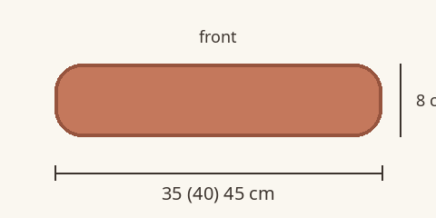
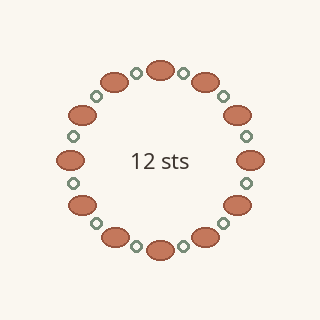
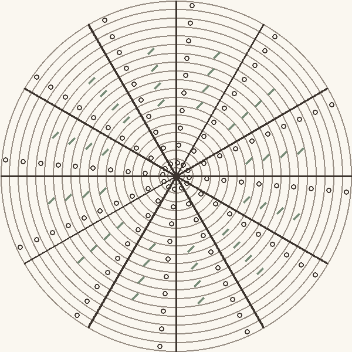
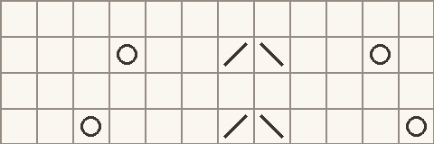
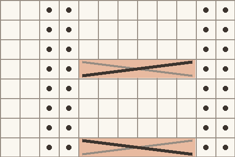
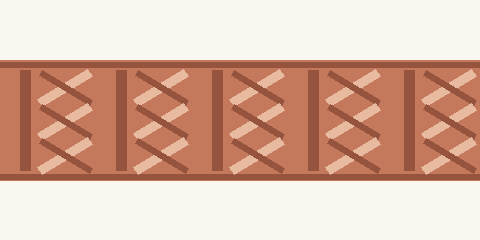
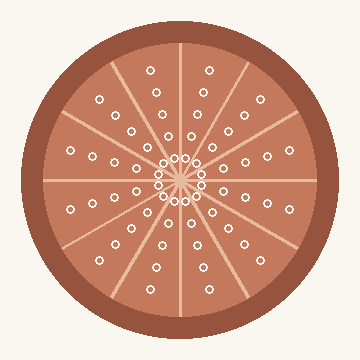

A round cushion cover worked from the centre out: a lace medallion on the front, a cabled side band and a plain back, closed around the insert with a three-needle bind-off.

Every part is worked in the round, so every chart round is read from right to left. Figures are given as S (M) L; a single figure applies to all sizes.

## Échantillon {gauge}

22 sts and 30 rounds = 10 cm in stocking stitch on 4 mm needles, after blocking.

## Fil {yarn}

DK weight wool, about 225 m per 100 g skein: 2 (2) 3 skeins.

## Aiguilles {needles}

4 mm circular needle, 80 cm long, and a set of 4 mm double-pointed needles for the centre of each disc.

## Matériel {materials}

- Round cushion insert, 35 (40) 45 cm across
- 13 stitch markers, one of them in a contrasting colour
- Cable needle
- Spare 4 mm circular needle to hold the back
- Tapestry needle and blocking pins

## Conseils {tips}

- Slip the start-of-round marker on every round: it sits at the start of the first wedge.
- Block the front before working the band, so the lace opens up to its full diameter.
- The band is worked on the live front stitches: no seam, no picking up.

## Techniques {techniques}

### Invisible circular cast-on

Make a loop with the tail, then alternately bring the yarn through the loop and over the needle until you have the stitches you need. Pull the tail to close the centre.

### Three-needle bind-off

Hold two needles parallel, wrong sides together. Knit together one stitch from each needle, then pass the previous stitch over, until one stitch remains.

### Reading the charts

Blank square: k. Dot: p. Circle: yo. Line leaning right: k2tog. Line leaning left: ssk. Crossed bar over 6 squares: C6B or C6F, the solid line on top. Round 1 is at the bottom and stitch 1 on the right.

## Abréviations {abbreviations}

| abr. | définition |
|------|------------|
| k | knit |
| p | purl |
| st | stitch |
| sts | stitches |
| yo | yarn over |
| k2tog | knit 2 stitches together |
| ssk | slip 2 stitches knitwise one at a time, knit them together through the back loops |
| m1L | make 1 left: lift the bar between two stitches from the front and knit it through the back loop |
| pm | place marker |
| sm | slip marker |
| C6B | slip 3 stitches to the cable needle and hold at the back, k3, then k3 from the cable needle |
| C6F | slip 3 stitches to the cable needle and hold at the front, k3, then k3 from the cable needle |

## Tailles {measurements}

| mesure | S | M | L |
|---|---|---|---|
| Insert diameter (cm) | 35 | 40 | 45 |
| Cover diameter, unstretched (cm) | 32 | 37 | 42 |
| Band depth (cm) | 8 | 8 | 8 |
| Stitches around the band | 240 | 276 | 312 |

## Gauge swatch {swatch}

- Cast on 30 sts with the 4 mm needle and work 40 rows in stocking stitch.
- Block the swatch exactly as you will block the cover, then let it dry flat.

> Measure over 10 cm in the centre of the swatch, away from the edges.

## Front medallion {lace}

- Cast on 12 sts with the invisible circular cast-on and divide them over 4 double-pointed needles.
  
- Join in the round, then k 1 round, pm after every st: 12 wedges of 1 st each.

11 m × 20 rangs · forme radial-rond · lecture droite à gauche {rtl}

- Work rounds 1 to 20 of Chart B, repeating the wedge 12 times around: 132 sts.

> Change to the circular needle as soon as the stitches no longer fit on the double-pointed needles.

- × Continue in stocking stitch, increasing as on round 20 of the chart every other round, 9 (12) 15 times: 240 (276) 312 sts.
- Remove all markers except the start-of-round marker.

## Leaf edging {border}

> Sizes M and L only. For size S, go straight to the side band.

12 m × 4 rangs · lecture droite à gauche {rtl} · tailles M, L

- Work rounds 1 to 4 of Chart C once, repeating the 12 chart stitches all around.

## Side band {motif}

- P 1 round: this is the lower fold line.

12 m × 8 rangs · lecture droite à gauche {rtl} · répéter 3 fois

- {×3} Work rounds 1 to 8 of Chart A, repeating the 12 chart stitches all around.
- P 1 round: this is the upper fold line.

> Leave the stitches on the needle: they are joined to the back during finishing.

## Back

- Cast on 12 sts with the invisible circular cast-on and join in the round, pm after every st.
- {cadence 2×17} Increase round: k to marker, m1L, sm, 12 times around. Then k 1 round even.
- × Repeat the last 2 rounds 2 (5) 8 more times: 240 (276) 312 sts.
- K 2 rounds even and slip all stitches onto the spare circular needle.

## Finishing {finishing}

- Weave in the ends at the centre of the front and of the back, pulling the cast-on tails tight.
- Block the back to the same diameter as the front.
- Insert the cushion. Hold the back behind the band, wrong sides together, and join all 240 (276) 312 sts with the three-needle bind-off.

> Steam the two fold lines lightly: they give the band its crisp edges.

## About this example {info}

> This pattern is an original example written for the Rowtine-MD documentation. Copy it, change it and use it to test your own files.

## Galerie {gallery}

