# {app}-Leitfaden

## Was {app} ausmacht

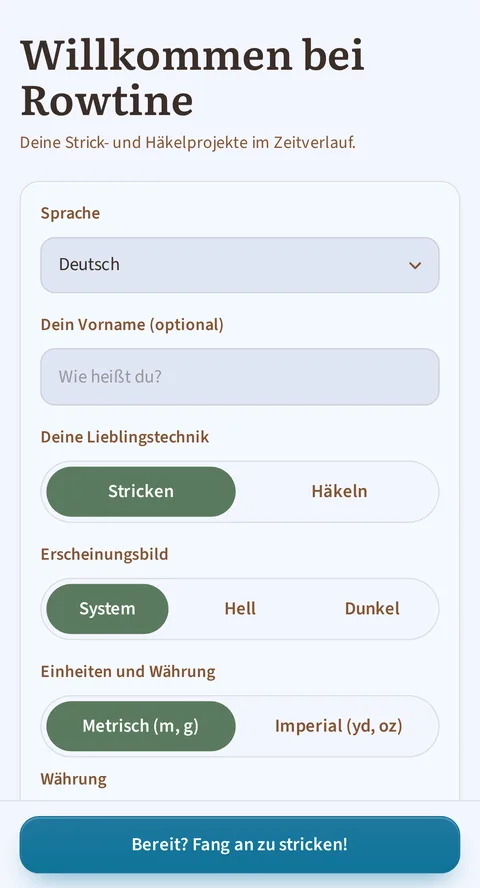

*Der allererste Start: Vorname, Technik, Sprache und Erscheinungsbild.*

{app} hilft dir dabei, alle deine Strick- und Häkelprojekte an einem Ort zu
sammeln: dein Garn, deine an deine Größe angepassten Anleitungen und
deinen Fortschritt. Die App ist **kostenlos und quelloffen, und sie funktioniert
offline**: Deine Daten bleiben auf deinem Gerät, nicht auf einem
Server. Nichts geht aus Versehen verloren: Alles, was du löschst, landet
im Papierkorb.

## 1. Start — deine Übersicht

*Start: Die Kachel „Fortsetzen“ bringt dich zurück zu dem Werkstück, an dem du zuletzt gearbeitet hast, die Übersicht fasst das Wichtigste bis hin zu den letzten Sitzungen zusammen, und die drei Werkzeuge sind in Griffweite.*

Beim Öffnen der App findest du:
- **Dein letztes Projekt**, mit einer Schaltfläche **Fortsetzen**, um
  genau dort weiterzumachen, wo du aufgehört hast. Es handelt sich
  wirklich um das Projekt, an dem du **zuletzt tatsächlich gestrickt oder
  gehäkelt** hast (deine letzte Sitzung), nicht einfach um das zuletzt
  bearbeitete, und es zeigt dir die aktuelle Reihe an.
- Eine **Zusammenfassung**: wie viele Projekte gerade in Arbeit sind, die
  Zeit, die du diese Woche mit Stricken oder Häkeln verbracht hast (mit
  Details unter **Statistik**), und dein **ausgegebenes Budget**: die
  Summe von allem, was du für Garn bezahlt hast, seit du die App nutzt, in
  der von dir gewählten Währung. Diese Zahl sinkt nie von selbst: Wenn du
  ein Knäuel verbrauchst oder ein Projekt abschließt, sinkt sie nicht (nur
  ein neuer Kauf lässt sie steigen); sie kann nur sinken, wenn du
  selbst eine Kaufzeile im Block „Käufe und Geschenke“ einer Garnkarte
  löschst oder korrigierst (Punkt 5). (Hast du mehrere Währungen
  verwendet, hat jede ihre eigene Summe: Die App vermischt sie nie, da
  sie keinen Wechselkurs kennt.) Tippst du auf diese Zahl, öffnest du den
  Bildschirm **Ausgaben**, beschrieben in Punkt 5. Diese Kachel erscheint
  nicht, solange du noch keinen Kauf erfasst hast (zum Beispiel bei einer
  brandneuen Installation); jederzeit bleibt der Bildschirm über das Menü
  erreichbar.
- Diese Zahl unterscheidet sich von deinem **Vorratswert**, angezeigt im
  Bildschirm **Garnvorrat** (Punkt 5): Der zeigt, was aktuell in
  deinem Schrank liegt, und sinkt, wenn du ein Knäuel verbrauchst. Beide
  Zahlen gibt es bewusst nebeneinander: Die eine zeigt, was du
  ausgegeben hast, die andere, was dir noch übrig bleibt.
- Die **letzten Sitzungen**: Sobald du mindestens einmal gestrickt oder
  gehäkelt hast, listet eine Kachel deine zwei jüngsten Sitzungen auf: der
  Name des Projekts, der Tag („Gestern“, „Vor 3 Tagen“…) und die Dauer. Ein
  Antippen darauf öffnet den Bildschirm **Sitzungen** (Punkt 2), der deine
  ganze Historie versammelt.
- Alle deine Projekte, **nach Status gruppiert** (in Arbeit, geplant,
  pausiert, fertig, aufgegeben), mit einer Schaltfläche, um alle
  anzuzeigen oder die Liste einzuklappen.
- Auf einer Projektkarte weist ein **Vegan-Symbol** auf die Projekte hin,
  deren Garne alle vegan sind (es bleibt auch bei abgeschlossenen Projekten
  sichtbar). Es erscheint nur, wenn das Projekt mindestens ein Garn hat und
  alle die Kennzeichnung Vegan tragen.
- Bei einem **fertigen** Projekt zeigt die Karte sein **Enddatum** direkt
  nach Technik und Größe (« Stricken · M · Fertig am 15.07.2026 »), sobald
  ein Datum eingetragen wurde. Es trägt sich von selbst ein, sobald du ein
  Projekt auf Fertig setzt (siehe Punkt 2), und erscheint nie bei einem
  aufgegebenen Projekt.
- Schneller Zugriff auf die **Werkzeuge** (Maschenrechner, freier Zähler,
  Nadel-/Häkelnadelhilfe) und die Schaltfläche **+ Projekt erstellen**.
- Und schließlich bringt dich **das Menü oben rechts** jederzeit zum
  Garnvorrat, zu den Anleitungen, zur Statistik, **zu den Sitzungen**, zu den
  Ausgaben, zu dieser Anleitung, zu den Einstellungen und zum Bildschirm
  „Info“. Es ist auf jedem Bildschirm da: Wo du dich in der App auch
  befindest, du kommst überallhin, ohne erst zur Startseite zurückzugehen.

## 2. Deine Projekte — das Herzstück der App

*Eine Projektkarte: der Gesamtfortschritt, die Schaltfläche „Anleitung folgen“, dann eine Kachel pro Abschnitt mit eigenem Fortschritt und eigenem „Fertig“-Kästchen. Der Timer schwebt unten in allen Reitern.*

### Erstellen, bearbeiten, löschen

Ein Projekt entsteht in wenigen Sekunden: Name, Technik (Stricken oder
Häkeln), verknüpfte Anleitung (oder „Freie Anleitung“, falls du keine
verwendest). Wählst du eine vorhandene Anleitung, **füllt die App
Größen, Stricknadeln oder Häkelnadel, Maschenprobe und Projekttyp
automatisch voraus**: Du musst nur noch anpassen. Ein gelöschtes Projekt geht **nicht sofort
verloren**: Du kannst das Löschen direkt danach rückgängig machen oder
das Projekt später aus dem Papierkorb (Einstellungen) wiederherstellen.

Du kannst auch den **Preis der Anleitung** eintragen, falls du sie gekauft
hast, oder auf **Kostenlos** tippen, falls du sie heruntergeladen hast,
ohne zu bezahlen. Dieser Preis gehört zur **Anleitung**, nicht zum Projekt:
Strickst du dasselbe Modell dreimal, zählt es nur einmal in deinen
Ausgaben. Lässt du das Feld leer, gibst du einfach nichts an. Nutzt dein
Projekt die „Freie Anleitung“, erscheint dieses Feld gar nicht erst: Sie
ist allen deinen Projekten ohne Anleitung gemeinsam und kann deshalb nie
einen eigenen Preis haben.

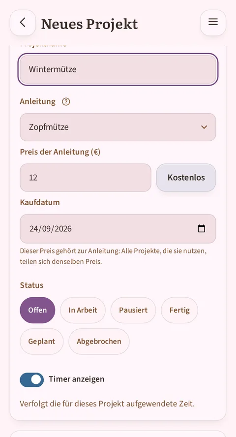

*Unter der Anleitungswahl: ihr Preis, eine Schaltfläche „Kostenlos“ und das Kaufdatum, vorausgefüllt mit heute.*

### Die Projektkarte, mit Reitern

- **Abschnitte**: die Etappen deiner Arbeit (Vorderteil, Rückenteil,
  Ärmel…), jeweils mit einem Status-Abzeichen (geplant / begonnen / in
  Arbeit / fertig) und, sofern die Anleitung ein Diagramm enthält, einer
  Vorschau des zugehörigen Diagramms.
- **Details**: alle Projektinformationen (Technik, Größen, Nadeln oder
  Häkelnadel, Maschenprobe, Start-/Enddatum, deine Bewertung in Sternen
  und eine persönliche Notiz). Das Enddatum trägt sich selbst ein, sobald
  du das Projekt auf Fertig setzt; und wenn du es lieber selbst
  eingibst, beendet die Eingabe eines Enddatums das Projekt für dich.
  Beide stimmen immer überein, keines überschreibt je das andere.
  Du siehst dort auch die **Kosten des Projekts**: den Preis der Garne, die du dafür
  reserviert oder schon verstrickt hast, und in Klammern den Preis der Anleitung, den
  du nur einmal bezahlst, auch wenn du sie dreimal strickst. Fehlt bei einem Garn der
  Preis, sagt dir die App das, statt so zu tun, als wäre es kostenlos.
- **Fotos**: deine eigenen Projektfotos und dazu die Originalfotos der
  Anleitung. Du legst fest, welches als **Cover** dient (Standard: das
  erste Foto der Anleitung). Tippst du auf ein Foto, öffnest du es im
  Vollbild: Du kannst dann zoomen (Zwei-Finger-Zoom oder Doppeltipp),
  dich im vergrößerten Bild verschieben, um ein Maschendetail zu
  studieren, und es mit dem ×-Button wieder schließen.
- **Sitzungen**: der Verlauf deiner Strick-/Häkelsitzungen, mit der Dauer
  jeder einzelnen und der Möglichkeit, eine Sitzung
  manuell hinzuzufügen (falls du ohne geöffnete App gestrickt hast). Auch die
  laufende Sitzung ist dort live zu sehen.

### Live arbeiten — die Sitzung

Überall im Projekt schwebt ein **Timer** am unteren Bildschirmrand: dieselbe
Schaltfläche auf der Projektseite, in welchem Reiter auch immer, und im Lesemodus.
Ein Chevron auf der Schaltfläche öffnet ein kleines Menü mit dem Eintrag „Timer
ausblenden“; zurück kommt sie über das Menü **Aktionen** (senkrechtes
Dreipunkt-Symbol) der Projektseite oder
das Kontrollkästchen „Timer“ im Bearbeitungsformular.
- Ein Timer pro Projekt, und er **startet nie von selbst**: Du tippst ihn an, um
  ihn zu starten, und tippst erneut, um ihn bei einer Unterbrechung zu pausieren
  (die Schaltfläche zeigt dann **Fortsetzen** mit der bereits gezählten Zeit).
- Keine **Stopp**-Schaltfläche: Die Pause ist die einzige Aktion unterwegs. Der
  Timer begleitet alles, was du im Projekt tust (Projektseite, Lesemodus,
  Bearbeitung, Korrektur), und seine Zeit wird laufend festgehalten: Jede Pause
  (Schaltfläche, Sprung in die Korrektur, Verlassen des Projekts) schreibt die
  seit dem letzten Mal verstrichene Zeit nieder. Das Verlassen des Projekts oder
  das Ausblenden des Timers schließt die Sitzung, bestätigt mit „Erfasste Zeit“
  und der Gesamtsumme.
- Einmal gestartet, übersteht er alles: Bildschirm aus, andere App, Gerät neu
  gestartet. Du findest den Faden immer wieder.
- Im Lesemodus **hakst du Reihen ab**, Schritt für Schritt, mit den angezeigten
  Anleitungszeilen (bis zu 8 sichtbare Zeilen; die App bringt dich automatisch
  genau dorthin zurück, wo du aufgehört hast).
- Du verwaltest mehrere **Zähler** pro Projekt (Maschen, Reihen, Wiederholungen…),
  jeweils mit einer +/−-Schaltfläche und einer Korrekturmöglichkeit, falls du dich
  verzählst.
- Die Sitzung lebt im Reiter **Sitzungen** der Projektseite: Ihre Zeile erscheint,
  sobald der Timer startet, und ihre Zeit tickt dort mit, eingefroren mit einem
  „pausiert“-Abzeichen während einer Unterbrechung. Nimmst du innerhalb von zwei
  Stunden nach dem letzten Eintrag wieder auf, läuft die Zeit auf derselben Zeile
  weiter; danach beginnt eine neue Sitzung.

### Alle deine Sitzungen an einem Ort

Der Reiter Sitzungen einer Projektseite erzählt von diesem Projekt, und
nur von ihm. Um deine ganze Historie zu sehen, alle Projekte zusammen,
öffnet das Menü der App den Bildschirm **Sitzungen**, zwischen Statistik
und Ausgaben. Jede Sitzung erscheint dort, von der jüngsten bis zur
ältesten: der Name des Projekts, dann Datum und Dauer. Ein Antippen auf
eine Zeile öffnet die Seite des betroffenen Projekts.

Dieser Bildschirm dient nur dem Nachlesen: Auf der Projektseite, in ihrem
Reiter Sitzungen, wird eine Sitzung berichtigt oder gelöscht. Kein Filter,
keine Gruppierung: Das ist eine erste Version, bewusst einfach gehalten.

## 3. Die Anleitung, die sich dir anpasst — der interaktive Lesemodus

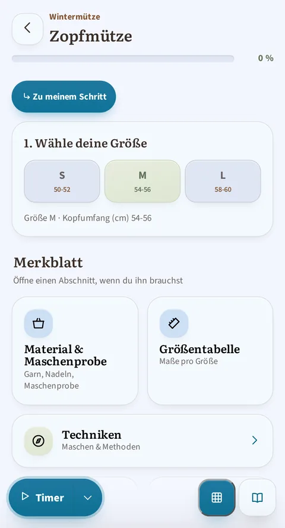

*Oben im Lesemodus: das Inhaltsverzeichnis der Abschnitte, dann die Größenwahl, einmal für die ganze Anleitung, und das Merkblatt (Material, Größentabelle, Techniken, Abkürzungen) in Griffweite.*

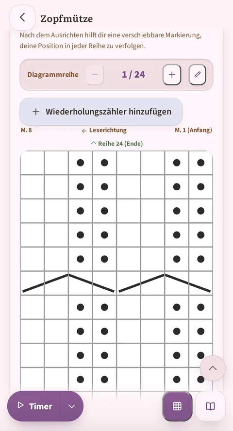

*Weiter unten: Du folgst dem Diagramm Reihe für Reihe, mit eigenem Zähler „Diagrammreihe“, Leserichtung und dem Timer am Bildschirmrand.*

Das ist die Kernfunktion von {app}. Sobald eine Anleitung in das Format
„geführtes Lesen“ gebracht wurde (die 3 Beispielanleitungen liegen bereits so
vor, ebenso jede importierte und geprüfte Anleitung), bekommst du:

- **Die Größenwahl**: Du wählst deine Größe einmal, und **alle Zahlen der
  Anleitung passen sich automatisch deiner Größe an** (Maschen,
  Reihen, Längen): Jede Zeile zeigt dir die Werte deiner Größe, ohne dass du
  eine Notation wie „104 (108) 112…“ entziffern musst.
- **Die Schritt-für-Schritt-Begleitung**: Jeden Schritt kannst du
  abhaken, mit einem Fortschrittsbalken fürs Ganze und einem
  je Abschnitt sowie eingebauten Wiederholungszählern
  („− 3/12 +“), die von selbst verschwinden, falls sie nicht zu deiner
  gewählten Größe gehören.
- **Das interaktive Diagramm**: das Diagramm der Anleitung (unverändert aus
  dem Original-PDF übernommen) mit einer **Markierung, die deiner aktuellen
  Reihe folgt**, bereits abgearbeiteten, ausgegrauten Reihen und einem
  Zähler „Reihe X von 52“. Direkt auf der Seite oder über eine
  schwebende Schaltfläche erreichbar, mit einem Zustand, der zwischen
  allen Abschnitten geteilt wird, die dasselbe Diagramm verwenden.
- **Das Merkblatt**: Die Abkürzungen der Anleitung erscheinen als
  Sprechblase, sobald du sie antippst, ohne dass du deine aktuelle Reihe
  verlässt; ein vollständiges Panel bündelt außerdem die Techniken (mit
  Video-Anleitungen), Material und Maschenprobe, die Größentabelle, die
  Liste der Abkürzungen sowie die von der Anleitung gegebenen **Tipps und
  Tricks**.
- **Das Inhaltsverzeichnis**: eine Reihe von Punkten, einer pro Abschnitt,
  bleibt oben im Fluss des Lesemodus sichtbar. Ein Antippen bringt dich
  direkt zum Abschnitt, und der Punkt deines aktiven Abschnitts markiert
  sich von selbst: Du weißt immer, wo du gerade bist. Eine Anleitung mit
  nur einem Abschnitt zeigt es nicht: Es gäbe nichts zusammenzufassen.
- Eine Anleitung kannst du lesend ansehen (Vorschau aus dem Bildschirm
  „Anleitungen“) **oder** deinen tatsächlichen Fortschritt von einem Projekt aus
  verfolgen. Beide Zugänge bestehen nebeneinander, und dein Fortschritt
  wird immer gespeichert.

### Das Diagramm im Vollbild, und wie du es richtig „ausrichtest“

Das ist der technischste Vorgang der App, daher hier alle Einzelheiten.

Tippst du auf ein Diagramm (oder auf die Schaltfläche „Vergrößern“
daneben), öffnest du es im Vollbild: Du kannst dann zoomen
(Zwei-Finger-Zoom, Doppeltipp oder +/−-Schaltflächen) und dich
verschieben, um jede Masche zu lesen, mit denselben
Reihenverfolgungs-Schaltflächen wie auf der Seite.

Das Problem, das die Ausrichtung löst: Das Original-PDF hat um das
Raster des Diagramms herum oft Ränder (Text, Leerraum). Ohne Einstellung
weiß die App nicht, wo das Raster auf dem Bild beginnt und endet, und das
Band, das dir „hier bist du gerade“ zeigt, könnte an der falschen Stelle
landen.

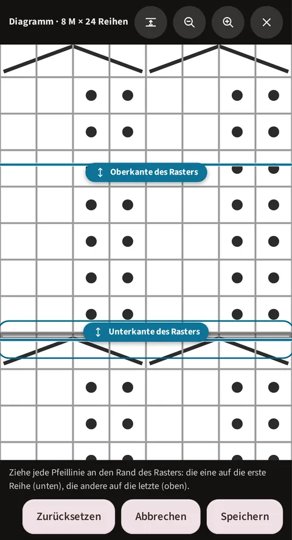

*Der Ausrichtungsmodus: die beiden Pfeillinien, die du auf die Ränder des Rasters ziehst, die Anweisung, und die drei Schaltflächen Zurücksetzen / Abbrechen / Speichern.*

**So richtest du ein Diagramm aus, beim ersten Öffnen:**

1. Tippe im Vollbild, in der oberen Leiste, auf das Symbol **Ausrichten**
   (zwei horizontale Balken, verbunden durch einen senkrechten Pfeil). Es
   ist das erste Symbol nach dem Titel, direkt vor den Zoom- und
   Schließen-Schaltflächen; diese Schaltfläche trägt keinen Text, nur
   dieses Piktogramm.
2. Zwei Pfeillinien erscheinen auf dem Bild, jede mit einer kleinen
   Beschriftung („Oberkante des Rasters“ / „Unterkante des Rasters“).
   Ziehe jede **genau auf den Rand des Rasters**: die Linie „Unterkante
   des Rasters“ auf die allererste **Reihe** des Diagramms, „Oberkante
   des Rasters“ auf die allerletzte. (Nicht auf den Text oder die Ränder
   darum, auch nicht auf den Rand des Fotos selbst: nur auf das Raster.)
3. Während du anpasst, bleibt ein Orientierungsband auf deiner aktuellen
   Reihe sichtbar: Nutze es, um live zu prüfen, ob alles passt, bevor du
   bestätigst.
4. Tippe auf **Speichern**, um abzuschließen. („Abbrechen“ verwirft die
   laufende Einstellung; „Zurücksetzen“ entfernt eine vorhandene
   Ausrichtung und du beginnst wieder beim vollständigen Bild.)

Nach der Ausrichtung bleibt die Reihenverfolgung für den Rest deines
Stücks auf diesem Diagramm präzise, innerhalb **dieses Projekts**. Zu
beachten: Die Ausrichtung wird zusammen mit deinem Projektfortschritt
gespeichert, nicht mit der Anleitung selbst. Beginnst du also ein
zweites Projekt aus derselben Anleitung, musst du sie einmal für das
neue Projekt wiederholen (der Vorgang dauert nur wenige Sekunden).

**Und runde oder eckige Diagramme?** Granny-Raster, rund oder eckig,
richten sich nicht mit zwei Linien aus: Dieselbe Schaltfläche
**Ausrichten** öffnet dann einen **geführten Assistenten**, denn die Form
des Diagramms (ihr Typ, gewählt bei der Korrektur, Abschnitt 4)
entscheidet. Sie lässt dich die beiden Grenzen des Motivs nacheinander
setzen: die erste, die den unteren Rand der ersten Reihe markiert, dann
die Außenseite der letzten Reihe. Jede wird als **Rund** oder **Eckig**
erklärt und lässt sich verschieben und anpassen (Schaltflächen
**Verschieben** und **Vergrößern/Verkleinern**), während das Bild
durchläuft und unter einer festen Lupe wächst. Haben die beiden Grenzen
nicht dieselbe Form, fragt
ein zusätzlicher Schritt, ab welcher Reihe sich das Muster ändert; ein
letzter Bildschirm lässt alles nachbessern, bevor du **Speichern**
antippst. Das Ergebnis wird wie die lineare Ausrichtung gemerkt: mit dem
Fortschritt des Projekts, Diagramm für Diagramm. Und solange ein radiales
Diagramm nicht ausgerichtet ist, bietet dir eine Schaltfläche im Fluss des
Lesemodus, „Platziere die Mitte und die Radien des Motivs“, an, dorthin
zu gehen.

*Die als rund erklärte Grenze: Die Lupe folgt der gewählten Form, und die Schaltflächen Rund und Eckig bestimmen sie bei jedem Schritt.*

Einmal **gespeichert**, trägt das Granny-Diagramm den Fortschritt wie die
linearen Raster: Die bereits fertigen Runden sind von der Mitte her eingekreist,
die aktuelle Runde hebt sich in einem dickeren Ring ab, und die Leiste unten
rückt Runde für Runde vor.

*Das Ergebnis nach dem Kalibrieren: Der Fortschritt liest sich direkt am Diagramm, Runde für Runde.*

**Deine Position in einer langen Reihe verfolgen.**

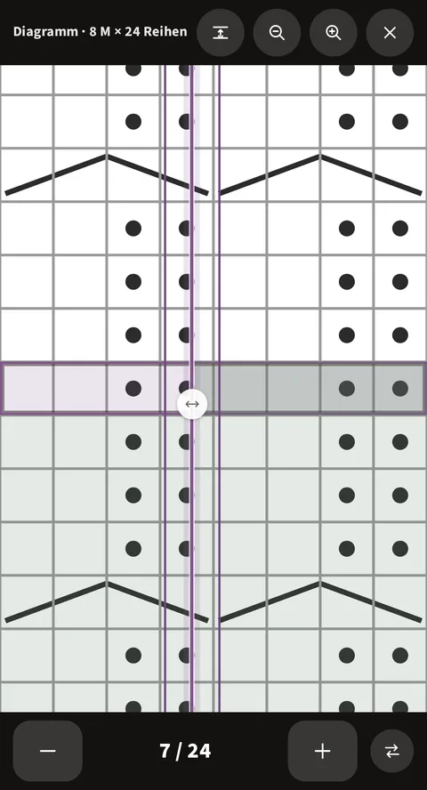

*Der runde Griff, auf der aktuellen Reihe: Rechts davon ist der bereits gearbeitete Teil der Reihe eingefärbt. Er existiert nur auf genau dieser Reihe.*

Bei einem sehr breiten Diagramm ist es nach dem Zoomen leicht, den Faden
zur aktuellen Masche zu verlieren. Im Vollbild erscheint ein **kleiner
runder Griff** auf der aktuellen Reihe, und nur auf ihr. Ziehst du ihn von
rechts nach links (oder umgekehrt) im Takt deiner Maschen, färbt sich der
dahinter liegende Teil der Reihe ein, als Darstellung dessen, was du
bereits gestrickt hast.

Eine Schaltfläche neben dem Reihenzähler kehrt die eingefärbte Seite um
(nützlich, wenn sich die nächste Reihe in die andere Richtung liest).
Der Griff kehrt bei jeder neuen Reihe von selbst an seinen Platz zurück,
und deine Position bleibt auch erhalten, wenn du die App verlässt. Beim
ersten Öffnen eines Diagramms weist dich eine kleine Meldung darauf hin,
damit er dir nicht entgeht.

### Eine Zeile korrigieren, ohne dein Mitzählen zu verlassen

Du folgst deiner Anleitung, und eine Zeile stimmt nicht: der Import hat sie
falsch zerlegt, oder du willst sie neu formulieren. Du musst das Projekt nicht
verlassen, um sie zu reparieren.

**Tippe auf die Karte**, die die Zeile trägt. Ein Schleier legt sich darüber, mit
zwei Schaltflächen: **Korrigieren** und **Schließen**. Der Korrektur-Bildschirm
öffnet sich dann direkt **auf dieser Zeile**: Du musst sie nicht in der ganzen
Anleitung suchen.

Der Schleier stört dein Stricken nicht: er zieht sich nach drei Sekunden von
selbst zurück, und ein Tippen an anderer Stelle schickt ihn weg. Tippst du auf
eine andere Karte, wandert er dorthin. Und kein Tippen auf ein **Bedienelement**
der Karte legt ihn an: eine Reihe abhaken oder eine Abkürzung antippen löst
die erwartete Aktion aus.

**Deine Stoppuhr zählt die Korrekturzeit nicht mit.** Läuft sie, wenn du zum
Korrigieren gehst, wird sie **angehalten**. Bei der Rückkehr **läuft sie von
selbst weiter**. Die Zeit im Editor geht nicht in deine Strickstatistik ein.

Bei der Rückkehr bringt dich der Reader zu dem Teil zurück, den du gerade
korrigiert hast. Die Korrektur läuft im selben Bildschirm ab, der in Abschnitt 4
weiter unten beschrieben wird, mit all seinen Werkzeugen.

### Auf dem Tablet

Ein quer gehaltenes Tablet gibt dir viel mehr Breite als ein Smartphone, und
{app} nutzt sie an zwei Stellen: im Lesemodus einer Anleitung und im
Statistik-Bildschirm.

**Der Lesemodus, in zwei Spalten.**

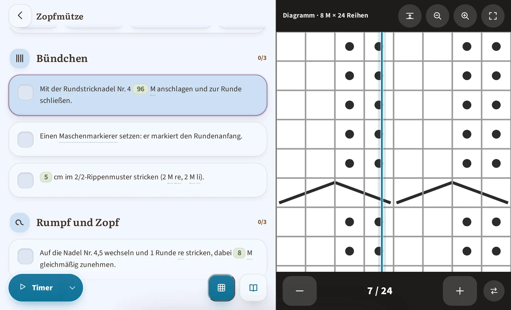

*Auf einem quer gehaltenen Tablet: deine Anleitung links, das Diagramm dauerhaft rechts, ohne dass du noch zwischen beiden scrollen musst.*

Strickst du auf einem quer gehaltenen Tablet, stellt sich der Reader von
selbst auf **zwei Spalten** um: deine Anleitung links, ein dauerhaft
angezeigtes Diagramm rechts. Du musst nicht mehr zwischen beiden hin- und
herscrollen. Du behältst die Kontrolle:

- Bei jedem anderen Diagramm der Anleitung bringt dir die Schaltfläche
  **Rechts anzeigen** es in das Seitenfeld (praktisch, wenn eine
  Anleitung mehrere enthält).
- Die Schaltfläche **Zurück in den Text** schließt das Feld wieder und
  setzt das Diagramm zurück an seinen Platz im Textfluss, falls du
  lieber alles in einer einzigen Spalte liest.
- An der Stelle im Text, an der das Diagramm stand, erinnert dich ein
  Verweis daran, dass es **rechts angezeigt wird**: Nichts verschwindet,
  ohne es dir zu sagen.

Diese Einstellung gilt nur für deine aktuelle Sitzung: Öffnest du die
Anleitung erneut, erscheint das Feld wieder mit dem ersten Diagramm. Auf
dem Smartphone (oder einem hochkant gehaltenen Tablet) bleibt der Reader
einspaltig, wie zuvor. Eine Anleitung ohne Diagramm hat gar kein
Seitenfeld. Das Inhaltsverzeichnis des Lesemodus bleibt dagegen oben in
der Spalte der Anleitung: dieselben Punkte, dieselbe Geste.

**Die Statistik, mit viel Platz.**

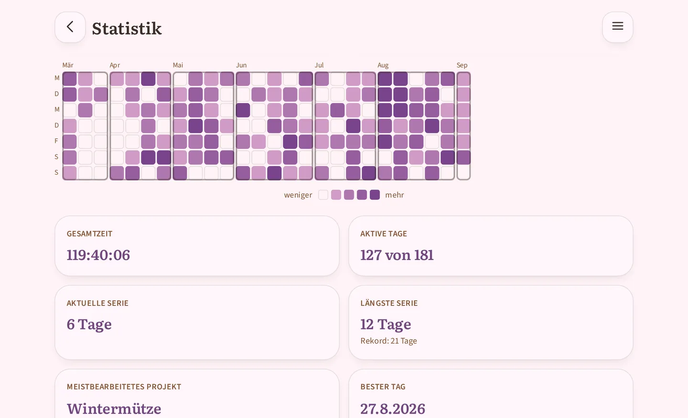

*Die Statistik auf einem quer gehaltenen Tablet, im Fenster Halbjahr: das Kalendergitter zeigt die letzten sechs Monate auf einen Blick, während du auf dem Handy dafür zur Seite wischen musst, und die Zahlenkacheln reihen sich darunter zu zweit auf.*

Auch der Bildschirm **Statistik** (Punkt 7) nutzt den Platz: Sein
Kalendergitter und seine Zahlenkacheln breiten sich aus, statt sich zu
drängen, und in den längsten Fenstern, Halbjahr oder Jahr, siehst du viel mehr
Wochen, bevor du das Gitter seitwärts schieben musst. Es gibt nichts
zusätzlich einzustellen: Es ist derselbe Bildschirm, nur bequemer.

## 4. Deine Anleitungen

*Der Bildschirm „Anleitungen“, mit den drei beim ersten Start mitgelieferten Beispielen.*

*Eine Anleitungskarte, bewusst schlicht gehalten: ein Projekt erstellen oder eine Vorschau ansehen. (Die Korrektur des Imports erreichst du über die Vorschau oder über das Menü eines laufenden Projekts, das diese Anleitung verwendet.)*

- **Ein PDF importieren**: Du legst das PDF deiner Anleitung ab, die App
  liest es und **rekonstruiert automatisch** Größen, Reihen und Abschnitte,
  ohne Internetverbindung: Nichts verlässt dein Gerät. Die Anleitung
  **landet in deiner Bibliothek**, und dort beginnt deine Arbeit: **nimm dir
  dort wirklich Zeit**. Ein Import kommt fast nie beim ersten Mal perfekt
  heraus. Das ist normal: Anleitungs-PDFs sind alle unterschiedlich gesetzt.
  Du liest, prüfst und korrigierst sie **über die Vorschau der Anleitung**,
  so oft du willst, und genau dieser Durchgang macht den Unterschied
  zwischen einer ungefähr richtigen Anleitung und einem Projekt, das die
  richtigen Zahlen und die richtigen Erklärungen anzeigt.
  (Das Lesen erkennt auch die runden und eckigen Raster von
  Granny-Anleitungen, nie perfekt: Das Gegenlesen bleibt Pflicht.)
- **Eine Anleitung wiederfinden**: Die Kategorie-Schaltflächen oben im
  Bildschirm „Anleitungen“ zeigen dir **die Anzahl der Anleitungen** je
  Kategorie, um auf einen Blick zu wissen, wo du suchen musst.
- **Eine Anleitung korrigieren**: Ein Vollbild-Editor lässt dich eine
  importierte Anleitung nachbessern (Text, Größen, Bilder). Das ist ein
  Schritt, mit dem du **rechnen solltest**, keine Notrettung für
  Ausnahmefälle: Das automatische Lesen versteht nie alles perfekt, und eine
  importierte Anleitung muss in der App überarbeitet werden, bevor sie sich
  wirklich angenehm verfolgen lässt. Du kannst dorthin so oft zurückkommen,
  wie du willst, auch lange nach dem Import. Das ist der andere technische
  Vorgang der App, der weiter unten im Detail beschrieben wird.
- **Der Preis der Anleitung**: Die Anleitungskarte trägt auch ihren
  **Preis**, den du eintragen kannst, ohne erst ein Projekt zu beginnen:
  Sobald er da ist, steht er auf der Seite der Anleitung selbst („Am
  7.8.2026 für 18,90 € gekauft“ oder einfach „Kostenlos“) und er zählt
  im Bildschirm **Ausgaben**.
- **Anleitungsansicht**: einfache Leseansicht für Anleitungen ohne
  besondere Formatierung oder Anleitungen, die du vollständig von Hand
  eingegeben hast.
- **3 Beispielanleitungen** bekommst du schon beim ersten Start mit der
  App mitgeliefert, um alle Funktionen zu entdecken, ohne etwas zu
  importieren.

### Der Korrektur-Editor im Detail

Das ist der technischste Vorgang der App neben der Diagrammausrichtung
(siehe oben): So funktioniert er wirklich.

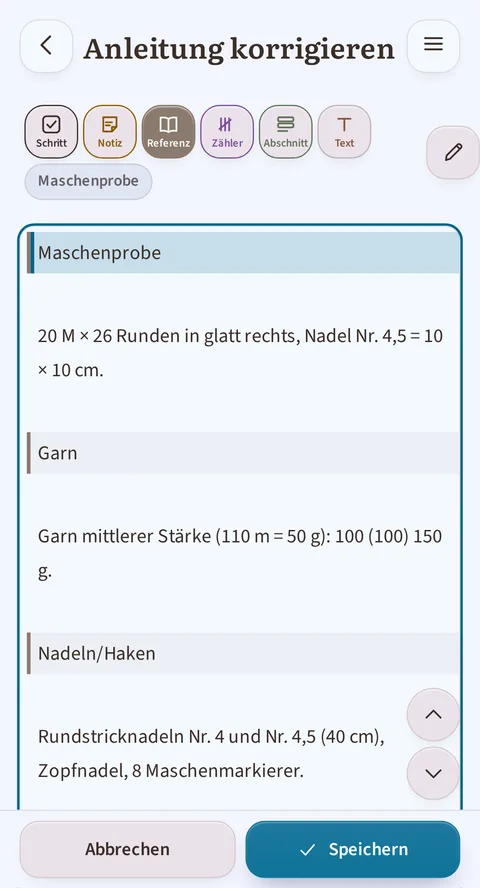

*Der Cursor steht auf einer Referenzzeile: Die Schaltfläche „Referenz…“ ist ausgefüllt, und „Maschenprobe“, ihre Unterkategorie, erscheint kursiv direkt an der Leiste.*

**Die Größen der Anleitung, ganz oben.** Das erste Feld des Korrektur-Bildschirms
heißt **Größen der Anleitung**. Es sagt der App, wie viele Größen deine Anleitung
anbietet: schreibe sie durch Kommas getrennt, „S, M, L“. Diese Zahl bestimmt die
Breite der Größentabelle. Ohne dieses Feld blieb eine Tabelle, die der Import
falsch zerlegt hat, unreparierbar.
Eine Folge, die du kennen solltest: wenn du eine Größe **hinzufügst**, füllt die
App die Maschenzahlen dieser Größe nicht aus. Sie erfindet sie nicht: Die
Anleitung trägt sie nicht. Eine Zeile mit drei Größen, die du auf vier bringst,
erscheint deshalb als „10 (12) 14 ()“, wobei die leere Klammer die Größe ist, die
noch auf ihre Zahlen wartet. Sie einzutragen ist deine Sache.

**Das Prinzip.** Eine Anleitung besteht aus Textzeilen, und **jede Zeile
trägt eine Kategorie**, die der App sagt, wofür sie dient: ein Kästchen
zum Abhaken beim Stricken, ein Abschnittstitel oder eine reine
Referenzinformation? Der automatische Import weist beim Eintreffen
bereits jeder Zeile eine Kategorie zu. Der Editor dient dir dazu, falsch
erratene Zuweisungen zu korrigieren und den Text nachzubessern, falls
ein Satz schlecht getrennt wurde.

**Die möglichen Kategorien:**

| Kategorie | Was daraus in deinem Projekt wird |
|---|---|
| **Schritt** | Ein Kästchen zum Abhaken beim Stricken oder Häkeln — das Herzstück der Schritt-für-Schritt-Verfolgung. |
| **Zähler** | Ein wiederholter Schritt, mit eigenem Zähler. Zwei Varianten: **Wiederholung** (die Zeile N-mal wiederholen) und **Kadenz** (die Zeile alle X Reihen wiederholen, N-mal). |
| **Notiz** | Ein informativer Text an dieser Stelle, ohne Kästchen. |
| **Abschnitt** | Ein Abschnittstitel (Vorderteil, Ärmel, Kragen…), mit automatischem Symbol — er unterteilt deine Anleitung im Reiter Abschnitte. |
| **Referenz** | Eine Information von der Anleitungskarte (Garn, Nadeln, Größen…) — **kein** Bestandteil der Schritt-für-Schritt-Verfolgung. Acht Unterkategorien: **Garn** (Marke, Material, Lauflänge, Mengen), **Nadeln/Haken** (Größe und Art), **Maschenprobe** (das Referenzmaß, z. B. „10 × 10 cm = 22 Maschen“), **Material** (der Rest: Knöpfe, Markierer…), **Tipps** (die Empfehlungen des Entwurfs), **Abkürzungen** (eine pro Zeile), **Maße** (die Tabelle der Endmaße — nicht die Anleitungen je Größe, das sind Abschnitte), **Techniken** (eine erklärte Technik). Diese Blöcke füllen das Merkblatt des interaktiven Readers (Abschnitt 3 oben). |
| **Text** | Ein einfacher Absatz, ohne besondere Rolle — meist der Einleitungs- oder Schlusstext der Anleitung. |
| **Bild** | Ein Foto oder ein Diagramm. |

**Die eingebaute Hilfe.** Der Korrekturbildschirm bringt seine eigene Hilfe
mit, eingeklappt am Kopf des Bildschirms unter dem Titel „Wie du die Anleitung
korrigierst“: drei Schritte, dann dieselben Angaben wie die Tabelle oben (die
Kategorien und die acht Referenz-Unterkategorien). Du kannst sie jederzeit
aufklappen, ohne deine Arbeit zu verlassen und ohne mitten in einer
Korrektur zu dieser Anleitung zurückkehren zu müssen. (Diese
Anleitung liest du dagegen *vor* dem Öffnen des Bildschirms, um zu wissen, ob
du dich darauf einlassen willst.)

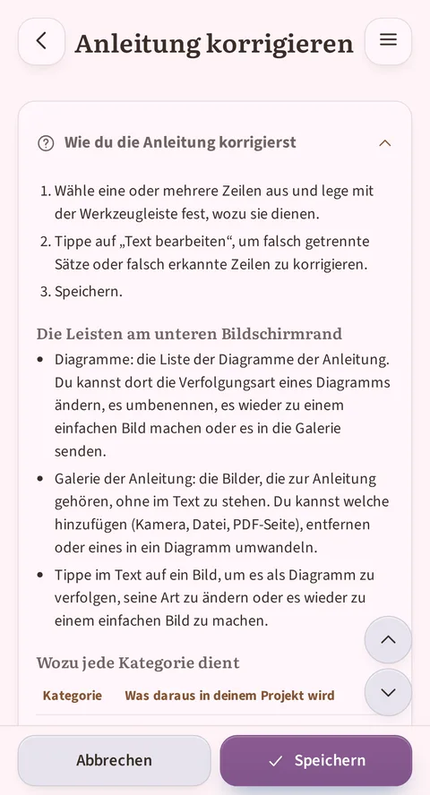

*Die Hilfe „Wie du die Anleitung korrigierst“ aufgeklappt: ihre 3 Schritte, dann der Anfang der Tabelle „Wozu jede Kategorie dient“.*

**Wie du die Kategorie einer Zeile änderst:**

1. Setze deinen Cursor auf die Zeile (oder wähle mehrere Zeilen
   gleichzeitig aus). Die Werkzeugleiste direkt über dem Editor zeigt
   dir die bereits zugewiesene Kategorie hervorgehoben an. Handelt es
   sich um eine Referenz, erscheint zusätzlich ihre **Unterkategorie**,
   kursiv direkt an der Leiste („Garn“, „Maschenprobe“…): Sie sagt dir,
   in welchem Block der Anleitungskarte die Zeile landet.
2. Drei kompakte Schaltflächen wenden Schritt (ein angehaktes
   Kästchen), Notiz (ein Blatt) oder Text (ein „T“) direkt an; jede
   zeigt eine kurze Beschriftung unter dem Piktogramm. Drei weitere,
   breitere Schaltflächen öffnen ein Menü mit Unterkategorien, ihre
   Auslassungspunkte zeigen es an: **Zähler…**, **Teil…**,
   **Referenz…**. Tippe auf diejenige, die dem entspricht, was die
   Zeile werden soll.
3. Farbe und Darstellung der Zeile ändern sich sofort zur Bestätigung.

**Text ins Merkblatt schicken.** Das Menü **Referenz…** kennzeichnet die Zeile
nicht nur: es **verschiebt** den ausgewählten Text in die gewählte
Unterkategorie, und du findest ihn im entsprechenden Reiter des Merkblatts im
Reader wieder. So räumst du auf, was der Import quer durch die Anleitung liegen
gelassen hat: ein Glossar, eine Materialliste, eine Maßtabelle.
Diese Geste verschiebt den Text, den du ausgewählt hast, und nur diesen. Sie
rührt die Nachbarzeilen nicht an, und du entscheidest über die Unterkategorie:
die App räumt dorthin, wohin du es ihr sagst.

**In mehreren Durchgängen kategorisieren.** Schickst du eine zweite Auswahl in eine
Unterkategorie, die es schon gibt, wird sie dem vorhandenen Block **hinzugefügt**,
statt einen zweiten anzulegen. Ein Glossar, das über drei Seiten der Anleitung
verstreut ist, kategorisierst du so in drei Durchgängen, ohne von Hand etwas
umzustellen.

**Was die App allein zerlegen kann.** Beim Ankommen in der Unterkategorie wird
der Text gesetzt, sobald seine Form erkennbar ist. „M - Masche(n)“ wird zu einem
Glossareintrag, mit der Abkürzung auf der einen und der Erklärung auf der anderen
Seite. „Brustumfang 90 (100) 110“ wird zu einer Zeile der Größentabelle, eine
Spalte je Größe. Wenn die App eine Zeile nicht zerlegen kann, wirft sie sie nie
weg: sie legt eine leere **Vorlage** mit den richtigen Spalten an, die du von
Hand ausfüllst.

**Zwei Textansichten.** Standardmäßig zeigt dir der Editor eine
**Leseansicht**: Bilder erscheinen als Miniaturen, Zähler als
Pillen, Reihen mit ihrem Kästchen: eine Vorschau, die dem echten
Ergebnis nahekommt. Die Schaltfläche **Text bearbeiten** wechselt zum
reinen Text (die Auszeichnung wird sichtbar) und öffnet die Tastatur:
nützlich, um eine Formulierung, einen Tippfehler oder einen vom Import
schlecht in zwei Zeilen getrennten Satz zu korrigieren.

**Umsortieren ohne Ausschneiden und Einfügen.** Zwei Pfeile (nach
oben/unten) verschieben die Zeile, in der dein Cursor steht, praktisch,
falls der Import einen Schritt oder einen Abschnittstitel an die
falsche Stelle gesetzt hat.

**Ein Foto in ein verfolgbares Diagramm verwandeln (oder umgekehrt).** Zwei
Wege dorthin: auf ein Bild im Text tippen, oder das Band **Diagramme** unten
im Editor aufklappen. Dieses Band listet jeden Abschnitt der Anleitung, der
ein Bild trägt: die bereits verfolgten Diagramme ebenso wie die noch nicht
umgewandelten Fotos. Die Zahl in Klammern, zum Beispiel „Diagramme (2)“,
zählt all diese Abschnitte, Fotos mitgerechnet: sie sagt nicht, wie viele
Diagramme schon verfolgt werden. Bei einem noch nicht umgewandelten
Bild öffnet die Schaltfläche **Als Diagramm verfolgen** eine Typauswahl,
jeweils klar erklärt: Standardreihen, radial quadratisch, radial rund oder
Pfad, um sie an die tatsächliche Form deines Motivs anzupassen (ein
Granny-Square liest sich nicht wie Standardreihen). Bei einem Bild, das
bereits als Diagramm verfolgt wird, nennt eine Kennzeichnung **Interaktives
Diagramm** den aktuellen Stand, daneben eine Schaltfläche **Typ ändern**
(dieselbe Auswahl, um einen falsch geratenen Typ zu korrigieren) und eine
Schaltfläche **Nur ein Bild**, um zu einem einfachen Foto zurückzukehren,
praktisch, falls der Import ein Diagramm übersehen hat oder umgekehrt
ein einfaches Foto ein einfaches Foto bleiben soll.

**Bilder hinzufügen: drei Türen.** In der Galerie einer Anleitung, von
ihrer Karte oder aus dem Korrektur-Editor, bietet die Schaltfläche
**Bild hinzufügen** drei Quellen: **Kamera oder Galerie** (ein Blatt
lässt dich wählen, ob du ein Foto aufnimmst oder aus deinen Bildern
nimmst), **Dateien durchsuchen** (die Dateiauswahl deines Geräts, für
ein Bild, das anderswo liegt), und **Aus dem PDF der Anleitung**, wenn
es eines gibt: Dort wählst du die Seite, und die App lässt sie dich
zuschneiden. Das ist die einzige Quelle, die durch diesen Zuschnitt
geht. Jedes Bild landet in der Galerie der Anleitung, bereit zum Einfügen oder
Verfolgen.

**Das Menü eines Bildes.** Im Text des Editors öffnet ein Antippen auf
ein Bild ein kleines Direktmenü: es **als Diagramm verfolgen**, falls es
noch keins ist, sonst seinen **Typ ändern**, es auf ein bloßes Bild
zurückstufen (**Nur ein Bild**), oder es **in die Galerie der Anleitung
schicken**. Im Band „Galerie der Anleitung“ lässt sich jedes Bild
löschen, in den Text einfügen oder als Diagramm verfolgen: die drei
Gesten an einem Ort.

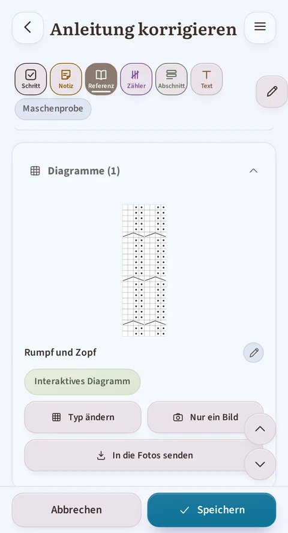

*Das Band „Diagramme (1)“ aufgeklappt: der Abschnitt „Rumpf und Zopf“, sein aktueller Stand („Interaktives Diagramm“) und die Schaltflächen „Typ ändern“ und „Nur ein Bild“.*

**Speichern.** Die Schaltflächen **Abbrechen** / **Speichern** sind
unten am Bildschirm fixiert. Versuchst du, mit ungespeicherten
Änderungen zu verlassen, stoppt dich die App und bittet um eine
Bestätigung: Auch hier geht dir nichts aus Versehen verloren.

## 5. Dein Garnvorrat

*Der Vorrat: die Summen oben (Knäuel, Länge, Gewicht, Wert), dann eine Karte pro Garn mit ihrem Status, frei oder für ein Projekt reserviert.*

- **Ein Knäuel hinzufügen**: Marke, Stärke (mit einer Hilfe zum
  Verständnis der Stärkekategorien), Material (aus einer Liste gewählt;
  fehlt dir ein Material, lässt dich „Andere“ es selbst eingeben, und es
  wird danach wie die übrigen angeboten), Farbe (aus einer Palette
  gewählt, mit eigenem Farbwähler bei Bedarf), Menge, Preis, Länge und
  Gewicht je Knäuel, sowie Kaufdatum und Färbebadnummer.
  **Sobald du speicherst, erfasst die App sofort den entsprechenden
  Kauf**, und dein ausgegebenes Budget (Punkt 1) steigt um den
  angegebenen Betrag. Als Datum wird dir der heutige Tag vorgeschlagen:
  Hast du dieses Garn schon früher gekauft, kannst du das direkt im
  Formular korrigieren. (Diese beiden Felder erscheinen nur bei der
  Erstellung. Bei einer bereits gespeicherten Karte übernimmt der Block
  **Käufe und Geschenke**, mit einer Zeile pro Erwerb.)
- **Garn, das nicht einfarbig ist**: Ein Feld **Farbtyp** (uni,
  Farbverlauf, selbststreifend, gesprenkelt, handgefärbt) und ein Feld
  **Beschreibung der Farbstellung** („blau, grün, gelb gesprenkelt mit
  Schwarz“) ergänzen die Farbmarkierung, weil ein einziger Farbton nicht
  ausreicht, um ein mehrfarbiges Garn zu beschreiben. Der Farbtyp taucht
  auch in der Suche und im Tabellenexport auf.
- **Die Eigenschaften deines Garns**: acht Kennzeichnungen zum Ankreuzen, in
  zwei Gruppen, die nicht dasselbe bedeuten. Eine **Selbstverpflichtung** ist
  das, was du selbst über dein Garn weißt; eine **Zertifizierung** ist ein
  Siegel, das eine außenstehende Stelle vergibt.
  - **Selbstverpflichtungen**: Vegan · Recycelt · Ethisch · Mulesing-frei.
  - **Zertifizierungen**: Ohne Schadstoffe (OEKO-TEX) · Biologische Fasern
    (GOTS) · Schafwohl (RWS) · Zertifiziert recycelt (GRS).
  - **Die Herkunft ergibt sich von selbst** aus der Zusammensetzung, ohne dass
    du etwas ankreuzt: „Tierische Faser“, „Pflanzliche Faser“, „Synthetische
    Faser“, „Mischung aus tierisch und pflanzlich“. Kann die App nicht für
    alle eingegebenen Fasern zu einem Schluss kommen, sagt sie es
    („Unvollständige Herkunft“), statt zu raten: Das ist Absicht.
  - **Die Vegan-Warnung**: Kreuzt du Vegan bei einem Garn an, das eine
    tierische Faser enthält, weist dich die App darauf hin („Dieses Garn
    enthält … (tierische Faser). Das Vegan-Label wirkt widersprüchlich —
    prüfe die Zusammensetzung.“), ohne dich am Speichern zu hindern: Sie
    warnt dich, sie entscheidet nicht an deiner Stelle.
  - **Deine Garne wiederfinden**: Diese Kennzeichnungen findest du im Filter
    des Vorrats (das Kriterium „Label“) und in der Textsuche wieder.
  - Diese Eigenschaften erscheinen auch im **Tabellenexport**.

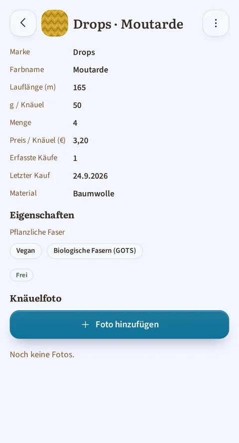

*Die Karte eines Garns: seine Zusammensetzung, der Hinweis „Pflanzliche Faser“ und seine beiden Kennzeichnungen „Vegan“ und „Biologische Fasern (GOTS)“.*

- **Die Zusammenfassung** oben im Bildschirm: Anzahl der Knäuel,
  Gesamtlänge und -gewicht (die sich von selbst in km und kg umschalten,
  sobald die Summen groß werden), sowie der Gesamtwert deines Vorrats.
- **Suchen, filtern, sortieren**: ein Suchfeld und die Schaltflächen
  **Filtern** und **Sortieren** oben im Vorrat. Filtern öffnet ein Fenster
  mit zwei Ebenen: die Liste der sechs Kriterien (**Marke**, **Label**,
  **Stärke**, **Gewicht pro Knäuel**, **Farbe**, **Material**) und dann, für
  das angetippte Kriterium, seine Werte. Eine Wahl je Kriterium, aber die
  Kriterien lassen sich kombinieren; eine Markierung an der Schaltfläche
  Filtern zählt die aktiven Filter, und **Zurücksetzen** löscht sie mit
  einer Geste. Sortieren bietet **Marke** (der Standard), **Stärke** oder
  **Kaufdatum**. Nichts davon wird gemerkt: Jede Rückkehr zum Vorrat beginnt
  ohne Filter, sortiert nach Marke. Liste oder visuelles Raster, wie du
  willst.
- **Bearbeiten, duplizieren oder löschen** einer Karte über das Menü
  **Aktionen** (senkrechtes Dreipunkt-Symbol) auf ihrer Karte.
  „Duplizieren“ ist praktisch für dasselbe Garn in einer anderen
  Farbstellung: alles wird übernommen, du musst nur noch die Farbe
  ändern.
- **Der Knäuelpool**: Für jedes Garn siehst du auf einen Blick, wie
  viele Knäuel für ein Projekt **reserviert** und wie viele **frei**
  sind. Du kannst die Menge nicht unter das bereits Reservierte senken
  (die App zeigt dir an, wie viele Knäuel zurückgehalten werden); und
  sie warnt dich, falls das Wiederherstellen eines Projekts aus dem
  Papierkorb deine Garnreservierungen infrage stellt. Das Projekt kommt
  trotzdem zurück, aber mit einer verringerten Reservierung und einer
  Meldung, die es dir erklärt.
- **Detailkarte eines Garns**: eine vollständige Übersicht (Knäuel,
  Meter, Projekte, die es verwenden), und ein Block **Käufe und
  Geschenke**, der jeden Erwerb dieses Garns für dich nachhält:
  - Jede Zeile trägt eine Menge, einen Preis, ein Datum und ein
    Färbebad und gibt an, ob es sich um einen **Kauf** oder ein
    **Geschenk** handelte (ein Geschenk zählt nie zu deinem
    ausgegebenen Budget). Die drei jüngsten Zeilen siehst du sofort,
    den Rest klappst du mit einer Geste auf.
  - Eine Zeile kannst du jederzeit **hinzufügen, bearbeiten oder
    löschen**.
  - **Erhöhst du die Menge** über die Garnkarte, bietet dir die App an,
    den entsprechenden Kauf zu erfassen, datiert auf heute: Du kannst
    ihn übernehmen, als Geschenk kennzeichnen oder verwerfen, falls du
    ihn nicht behalten willst. **Eine Menge zu verringern rührt dagegen
    nie an dein ausgegebenes Budget**: Nur eine Erhöhung kann einen
    Kauf anlegen.
  - Stimmt die Knäuelanzahl der Karte nicht mit dem im Verlauf
    Erfassten überein (etwa nach einer manuellen Vorratskorrektur),
    weist dich ein Hinweis darauf hin, und eine Schaltfläche
    **Korrigieren** bietet dir zwei Lösungen an: den fehlenden Kauf
    hinzufügen oder die angezeigte Menge anpassen.
  - Ein Kauf behält seine Bezeichnung, selbst wenn du die Garnkarte
    endgültig löschst: kein Garnkauf verschwindet, er bleibt im
    Bildschirm **Ausgaben** sichtbar.

### Der Ausgaben-Bildschirm

*Die Menüs Jahr und Art oben, die Gesamtsumme mit ihrer Aufteilung Garn / Anleitungen, dann die Aufschlüsselung nach Monat.*

Erreichbar, indem du das ausgegebene Budget auf dem Startbildschirm
antippst (Punkt 1), fasst dir dieser Bildschirm alles zusammen, was du
für dein Stricken oder Häkeln bezahlt hast, **Garn** und
**Anleitungen**:
- Die **Gesamtausgabe**, nach Währung, falls du mehrere verwendet hast.
  Solange du keinen Anleitungspreis eingetragen hast, bleibt diese Summe
  genau wie gewohnt; sobald eine Anleitung darin auftaucht, wird sie in
  zwei Unterzeilen aufgeteilt: was in Garn und was in Anleitungen ging.
- Zwei Menüs oben: **Jahr** zeigt dir nur das gewählte Jahr an (oder
  „Alle Jahre“), **Art** zeigt dir nur eine Kategorie an (oder alles).
  Die Summen werden entsprechend neu berechnet. Käufe, deren Datum du
  nicht erfasst hast, landen unter „Unbekanntes Datum“, das dem Menü
  Jahr hinzugefügt wird, sobald es welche gibt.
- Eine **Aufschlüsselung nach Jahr, dann nach Monat**, Garn und
  Anleitungen in der Reihenfolge des Kalenders gemischt: Du siehst auf
  einen Blick, was dich ein Monat gekostet hat.
- Sobald eine Anleitung in der Liste auftaucht, trägt jede Zeile
  zusätzlich ihre Kennzeichnung, **Garn** oder **Anleitung**. Eine
  Anleitung, die du als kostenlos angegeben hast, erscheint mit dem
  Vermerk **Kostenlos**: Das ist die Spur, dass du geprüft hast, kein
  Versehen.
- Die **vollständige Liste** all deiner Käufe und Geschenke,
  einschließlich jener, deren Garnkarte du inzwischen gelöscht hast
  (gekennzeichnet mit „Garn gelöscht“).
- Die Möglichkeit, eine Garn-Zeile direkt von diesem Bildschirm aus zu
  **löschen**, mit der Möglichkeit, es bei einem Versehen gleich danach
  **rückgängig** zu machen. Eine Anleitungs-Zeile änderst du dagegen
  über die Anleitungskarte: Ein Antippen bringt dich dorthin.

> **Gut zu wissen**: Ein Garnkauf übersteht das Löschen seiner Karte und
> bleibt hier sichtbar. Der Preis einer Anleitung dagegen gehört zur
> Anleitung: Löschst du die Anleitung, verschwindet ihre Ausgabe mit ihr.

## 6. Eigenständige Werkzeuge

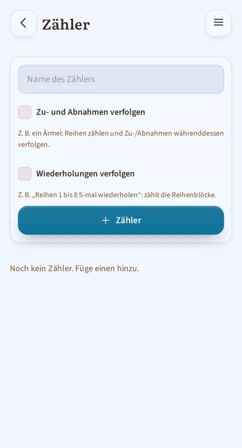

*Der freie Zähler, ohne Projekt nutzbar: du benennst ihn und wählst, ob er Zu-/Abnahmen oder Wiederholungen verfolgt.*

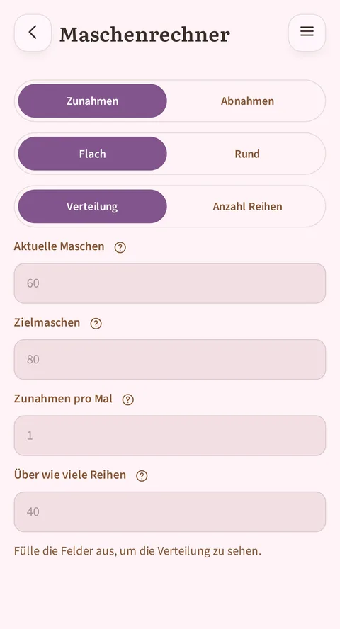

*Der Maschenrechner: Zu- oder Abnahmen über eine Reihenzahl verteilen oder herausfinden, wie viele Reihen du bei einem bestimmten Rhythmus brauchst, flach oder in Runden.*

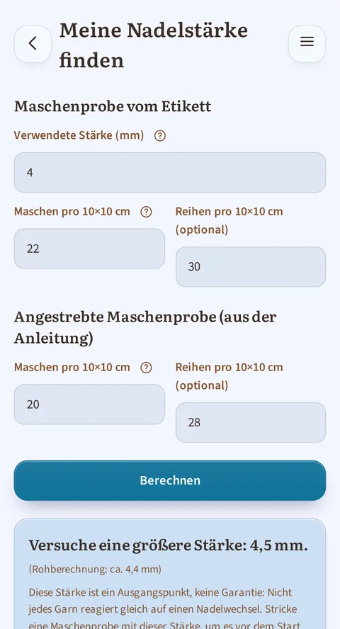

*Meine Nadelstärke finden, mit ausgefüllten Feldern: was auf der Banderole deines Knäuels steht, die von der Anleitung verlangte Maschenprobe und direkt darunter die Antwort der App. Beim Häkeln spricht derselbe Bildschirm von Häkelnadeln.*

Diese Werkzeuge funktionieren, ohne an ein bestimmtes Projekt gebunden
zu sein, erreichbar vom Start aus:
- **Maschenrechner**: er rechnet in beide Richtungen. Entweder gibst du ihm
  eine Reihenzahl, und er sagt dir, wie du deine Zu- oder Abnahmen darauf
  verteilst; oder du gibst ihm deinen Rhythmus („alle 4 Reihen“), und er sagt
  dir, wie viele Reihen du bis zu deiner Zielmaschenzahl brauchst und auf
  welche Reihe die letzte Änderung fällt. Ein Feld gibt an, wie viele Maschen
  du jedes Mal zu- oder abnimmst: meistens 1, bei einem Ärmel 2, wo du auf
  jeder Seite eine Masche zunimmst. Lässt sich dein Ziel nicht genau erreichen,
  schlägt er dir die beiden Möglichkeiten davor und danach vor, statt still zu
  runden. Flach spricht er von Reihen, in Runden von Runden.
- **Freier Zähler**: ein oder mehrere unabhängige Zähler (+/−, ein zu
  erreichendes Ziel, Zurücksetzen), für alles, was nicht zu einem
  gespeicherten Projekt gehört.
- **Deine eigene Nadel- (oder Häkelnadel-)größe finden**: Du gibst ein,
  was auf der Banderole deines Garnknäuels steht (empfohlene
  Nadelgröße und Maschenzahl für 10 × 10 cm oder 4 × 4 Zoll), danach
  die von der Anleitung verlangte Maschenprobe, und die App sagt dir,
  mit welcher Größe du beginnen solltest: eine Nummer größer, eine
  kleiner oder dieselbe. Sie warnt dich auch, wenn der Unterschied zu
  groß ist, um ihn auszugleichen (dieses Garn passt nicht zu dieser
  Anleitung), und erinnert dich stets daran, dass dir eine Maschenprobe
  zur Kontrolle bleibt: ein Ausgangspunkt, keine Garantie. Das Feld für
  die Reihen ist optional.

## 7. Statistik

*Der Auswähler oben legt ein Beobachtungsfenster fest (Monat, Quartal, Halbjahr oder Jahr), und der ganze Bildschirm richtet sich danach; hier das Fenster Quartal. Der Reiter „Kalender“, standardmäßig angezeigt, zeigt das Gitter und die neun Zahlenkacheln.*

Der Auswähler oben auf dem Bildschirm legt nicht mehr nur eine
Anzeigedauer fest: Er legt ein **Beobachtungsfenster** fest (Monat,
Quartal, Halbjahr oder Jahr), und alles, was folgt, richtet sich danach,
von der Gesamtzeit bis zu den neun Zahlenkacheln. Direkt darunter
schränkt ein Filter **Alle / Stricken /
Häkeln** den ganzen Bildschirm auf eine einzige Technik ein; er wird nicht
gespeichert und springt jedes Mal auf „Alle“ zurück, wenn du auf diesen
Bildschirm zurückkehrst, genau wie die Seitenleiste im Lesemodus. Dieser
Filter erscheint nur, wenn deine Projekte **beide Techniken** abdecken:
Sind sie alle gestrickt (oder alle gehäkelt), würde er nichts bringen und
nimmt deshalb keinen Platz weg.

Eine Feinheit, solange ein Filter aktiv ist: die Kachel **Durchschnitt pro
aktivem Tag** zeigt einen Gedankenstrich. Die gezählten Tage können Tage
enthalten, an denen du in der anderen Technik weitergekommen bist (das
Journal merkt sich nur das Datum, nicht was du an diesem Tag gemacht
hast), und eine Zeit durch diese Tage zu teilen ergäbe eine exakte, aber
irreführende Zahl.

Der Rest des Bildschirms teilt sich in **zwei Reiter**, die durch **Tippen**
gewechselt werden (nie durch Wischen: Das Gitter selbst scrollt in
Halbjahr und Jahr horizontal, damit die beiden Gesten nicht verwechselt
werden):
- **Kalender** (standardmäßig angezeigt, der im Screenshot oben): das Gitter
  und die neun Zahlenkacheln.
- **Rhythmus**: die Balken nach Zeitraum, dann sieben Balken, einer pro
  Wochentag, und ein Satz, der deinen beständigsten Tag über deine ganze
  Historie nennt.

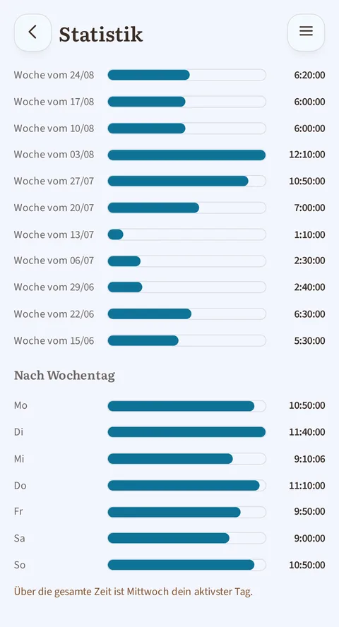

*Der Reiter „Rhythmus“: die Balken der verbrachten Zeit nach Zeitraum, die sieben Balken nach Wochentag und der Satz, der deinen beständigsten Tag nennt.*

Das **Gitter** zeigt ein Kästchen pro Tag, vom ersten Tag deiner Woche
(oben) bis zum letzten (unten), über das ganze gewählte Fenster; dieser
erste Tag ist standardmäßig Montag, oder Sonntag, wenn du das in den
Einstellungen (§8) so gewählt hast. Seine Farbe folgt dem in den
Einstellungen (§8) gewählten Akzentton, und ihre Intensität hängt davon
ab, wie lange du an diesem Tag gestrickt oder gehäkelt hast, in fünf
Stufen: nichts, weniger als 30 Minuten, 30 Minuten bis 1 Stunde, 1 bis
2 Stunden, 2 Stunden und mehr. Die Schwellenwerte sind
**fest**: Ein dunkles Kästchen bedeutet immer dasselbe, Monat für Monat,
auch in einem ruhigeren Quartal als sonst. Ein kräftigerer Rahmen umschließt
die Spalten desselben Monats, damit du sie auf einen Blick erkennst.

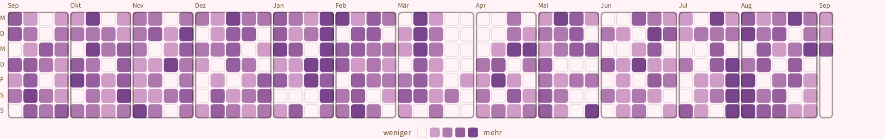

*Das Gitter im Fenster Jahr: ein ganzes Jahr auf einen Blick, eine Spalte pro Woche und ein Kästchen pro Tag, mit den Rahmen, die die Monate trennen. Tippe auf das Bild, um es zu vergrößern und im Detail zu lesen.*

Ein Tippen auf ein Kästchen **markiert** es (es bleibt sichtbar ausgewählt)
und zeigt unter dem Gitter sein Datum, seine Dauer und, wenn an diesem Tag
mehr als ein Projekt vorangekommen ist, die Liste jedes einzelnen mit der
Zeit, die darauf entfiel. Ein zweites Tippen auf dasselbe Kästchen hebt
die Auswahl wieder auf.

Was die **Serie** zählt, sind die Tage, an denen du **mindestens eine
Aktion** erfasst hast: eine Sitzung, gestoppt oder manuell hinzugefügt,
eine abgehakte Reihe, ein weiterbewegter Projektzähler. Und die App zu
öffnen, ohne etwas darin zu tun, zählt nicht: Es braucht eine **erfasste**
Aktion.

## 8. Einstellungen

*Oben in den Einstellungen: Vorname, Standardtechnik, Erscheinungsbild, Stimmungsfarbe, erster Wochentag, Sprache, Einheiten und Währung. Weiter unten liegen der Sicherungsordner und der Papierkorb.*

- **Profil**: dein Vorname (für die Begrüßung am Start) und deine
  Standardtechnik (Stricken oder Häkeln).
- **Erscheinungsbild**: helles Design, dunkles Design, oder passend zur
  Einstellung deines Geräts.
- **Stimmungsfarbe**: zehn Töne auf einen Tipp, oder ein beliebiger auf dem
  durchgehenden Regler. Solange du nichts gewählt hast, folgt die Farbe
  **deinem Erscheinungsbild** und wechselt von selbst zwischen hell und
  dunkel; sobald du wählst, hat deine Wahl Vorrang und bleibt in beiden Modi
  dieselbe. Dieser Ton färbt die Schaltflächen, die Auswahlen, die
  Fortschrittsbalken und das Statistikgitter (§7).
- **Erster Wochentag**: Montag (Standard) oder Sonntag. Diese Wahl
  bestimmt das Kalendergitter und die sieben Balken pro Wochentag auf dem
  Statistik-Bildschirm, ebenso wie die wöchentliche Nullstellung der
  Summe „diese Woche“ auf der Startseite.
- **Sprache**: Französisch, Englisch, Deutsch oder Spanisch. Jede
  Sprache erscheint in der Liste in ihrer eigenen Sprache geschrieben
  („Deutsch“, „Español“), damit du deine Sprache leicht wiederfindest.
- **Einheiten und Währung**:
  - **Metrisch** (Meter, Gramm) oder **imperial** (Yards, Unzen, Pfund);
    alles folgt: die Eingabe deiner Knäuel, die Vorratssummen, die
    Maschenprobe (10 × 10 cm oder 4 × 4 Zoll). Wechselst du das System,
    ändert das keine gespeicherten Zahlen, es zeigt sie dir nur in der
    anderen Einheit erneut an.
  - **Währung** aus fünf Möglichkeiten (€, $, £, CHF, CA$). Beachte: Es
    handelt sich nur um eine Beschriftung. Bereits eingegebene Preise
    werden **nicht umgerechnet**, sondern nur mit dem anderen Symbol
    angezeigt, und die App weist dich vor der Bestätigung darauf hin.
  - Beide Einstellungen werden dir **schon auf dem ersten Bildschirm**
    beim Öffnen der App angeboten, vorausgefüllt nach der Sprache
    deines Geräts; du kannst sie hier jederzeit ändern.
- **Daten**:
  - Export deines Vorrats, deiner Projekte oder Anleitungen als Tabelle
    (CSV), um sie andernorts anzusehen oder zu sichern. Die Spalten
    folgen deinen aktuellen Einstellungen: Längen und Gewichte im
    gewählten Einheitensystem, Preise mit dem gewählten Währungssymbol.
  - Ein universeller **Papierkorb**: Jedes gelöschte Projekt, Garn oder
    jede gelöschte Anleitung landet dort und lässt sich jederzeit
    wiederherstellen (bis du ihn absichtlich leerst).
- **{app}-Ordner**: Alles, was du strickst oder häkelst, existiert nur in
  dieser App, auf deinem Gerät, nirgendwo sonst. Der Sicherungsordner bewahrt
  davon eine Kopie auf, **fortlaufend** geschrieben (du musst nie etwas
  auslösen oder daran denken), damit du sie zurückbekommst, wenn du dein
  Gerät verlierst, es kaputtgeht oder du die App neu installierst. Du legst
  ihn ein einziges Mal fest, beim allerersten Start; später kannst du ihn in
  den Einstellungen wechseln, mit der Schaltfläche **Ordner ändern**.
  - **Ein Sicherungsordner bedient genau ein Gerät.** Ihn in einen
    synchronisierten Ordner zu legen, um eine Kopie anderswo zu haben,
    ist eine gute Idee; denselben Ordner von einem Smartphone **und**
    einem Tablet aus zu benutzen, ist es nicht: Jedes Gerät würde die
    Arbeit des anderen löschen. Ein zweites Gerät braucht seinen eigenen
    Ordner.
- **Mitwirken**: ein Link zum Quellcode (die App ist quelloffen), und zwei
  weitere Links im selben Block der Einstellungen:
  - **{app} unterstützen** führt zu einer Spendenseite, **freiwillig**:
    Nichts wird im Gegenzug freigeschaltet, keine Funktion ist denen
    vorbehalten, die spenden.
  - **Verbesserung vorschlagen** öffnet dir einen Weg, eine Anmerkung zu
    senden.

### Was beim allerersten Start passiert

Der Reihe nach, wenn du {app} das erste Mal öffnest: Der Willkommensbildschirm
fragt nach deinem Vornamen, deiner Technik, deiner Sprache, deinem
Erscheinungsbild, deinen Einheiten und deiner Währung; dann kommt der
Bildschirm für den Sicherungsordner, der direkt darüber beschrieben ist.
Danach begrüßen dich drei kleine Meldungen, **jeweils genau einmal**: Du
siehst sie danach nicht wieder.

- Ein **Willkommensgruß**, mitten auf dem Startbildschirm, sobald dein
  Sicherungsordner steht: Er sagt dir, dass alles bereit ist, und lädt dich
  ein, die Beispielprojekte und -anleitungen zu öffnen, um dich einzufinden.
  Seine Schaltfläche schließt ihn, und er kommt nicht wieder.
- Ein **Hinweis zu importierten Anleitungen**, wenn du zum ersten Mal deine
  Anleitungen öffnest: Er erinnert dich daran, dass die App deine PDF ganz
  allein liest und sich manchmal irrt (eine übersprungene Reihe, zwei
  vermischte Größen, eine schlecht getrennte Tabelle), und dass eine
  importierte Anleitung gegengelesen wird, bevor du ihr folgst. Die
  Schaltfläche „Verstanden“ schließt ihn; „Wie du korrigierst“ öffnet dir den
  Abschnitt dieser Anleitung über deine Anleitungen.
- Ein **Navigationstipp**, wenn du zum ersten Mal ein Projekt öffnest, in
  deine Anleitungen gehst oder in deinen Garnvorrat gehst, was von den dreien
  zuerst kommt: Er erklärt dir, dass du nach rechts wischen kannst, um
  zurückzugehen, und dass du eine Reihe von Reitern oder Kategorien, die
  breiter als der Bildschirm ist, mit dem Finger schieben kannst. Er erscheint
  **nur ein einziges Mal insgesamt**, nicht einmal pro Bildschirm; die
  Schaltfläche „Verstanden“ schließt ihn.

## 9. Unter der Haube — was {app} dir garantiert

- **Standardmäßig offline**: Keine deiner Daten verlässt jemals dein
  Gerät, außer dem Sicherungsordner, den **du selbst wählst**.
- **Kein Konto, keine Bezahlschranke**: Alle oben genannten Funktionen
  sind kostenlos, ohne gesperrte Kernfunktion.
- **Nichts geht aus Versehen verloren**: Jedes Löschen kannst du sofort
  rückgängig machen, und es landet ohnehin im Papierkorb.
- **Für alle lesbar gestaltet**: ausreichende Kontraste, groß genug zum
  leichten Antippen geratene Schaltflächen, kompatibel mit
  Bildschirmlesern.
- **Auf jedem Bildschirm angenehm**: Auf einem kleinen Smartphone läuft
  nichts über oder wird abgeschnitten; auf einem Tablet nutzt die App
  den zusätzlichen Platz: Deine Projekt- und Anleitungslisten
  verteilen sich auf mehrere Spalten statt eines einzigen langen
  Stapels, und der Reader kann das Diagramm neben dem Text behalten.
  Die App berücksichtigt die reservierten Bereiche deines Bildschirms
  (Statusleiste, Notch, Navigationsleiste): Inhalte schieben sich nicht
  mehr darunter.
- **Eine Datenschutzerklärung in klaren Worten**: Vom Bildschirm „Info“ aus
  sagt sie, wo deine Daten leben, was dein Telefon verlassen kann und in
  welchen Fällen, was beim Deinstallieren der App geschieht, und wer dafür
  die Verantwortung trägt: Die verantwortliche Person und die
  Kontaktadresse werden dort genannt. Sie ist in deiner Sprache geschrieben.
- **In vier Sprachen**: Französisch, Englisch, Deutsch und Spanisch.
