# {app} Guide

## The spirit of {app}

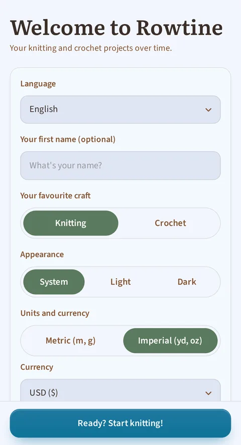

*The very first launch: first name, craft, language and theme.*

{app} helps you keep all your knitting and crochet projects in one
place: your yarn, your patterns adjusted to your size, and your
progress. It's **free, open-source and works offline**: your data
stays on your device, not on a server. Nothing is ever lost by mistake:
everything you delete ends up in a trash bin.

## 1. Home — your dashboard

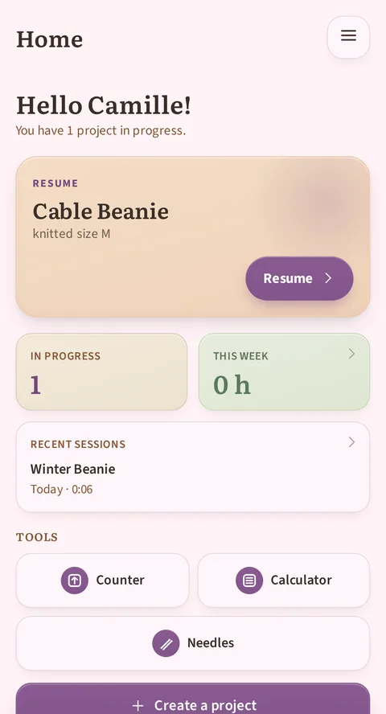

*Home: the "Resume" tile jumps back to the last piece you worked on, the dashboard sums up the essentials, recent sessions included, and the three tools are within thumb's reach.*

Opening the app, you'll find:
- **Your last project**, with a **Resume** button to pick up exactly
  where you left off. It really is the last project you **actually
  knitted or crocheted on** (your last session), not just the last one
  you edited, and it shows you the current row.
- A **summary**: how many projects you have in progress, the time
  you've spent knitting or crocheting this week (with details in
  **Statistics**), and your **money spent**: the total of everything
  you've paid for yarn since you started using the app, in the
  currency you chose. This figure never goes down by itself: using up
  a skein or finishing a project doesn't lower it (only a new purchase
  raises it); it can only go down if you delete or correct a purchase
  line yourself in the "Purchases and gifts" block of a yarn's page
  (point 5). (If you've used more than one currency, each keeps its
  own total: the app never mixes them, since it has no exchange rate
  to rely on.) Tapping this figure opens the **Expenses** screen,
  described in point 5. This tile doesn't appear until you've recorded
  at least one purchase (for example on a brand-new install); the
  screen stays reachable from the menu at any time.
- This figure is different from your **stash value**, shown in the
  **Yarn stash** screen (point 5): that one tracks what's currently on
  your shelves and drops when you use a skein. The two figures live
  side by side on purpose: one tells you what you've spent, the other
  what you have left.
- **Recent sessions**: as soon as you've knitted or crocheted at least once,
  a tile lists your two most recent sessions: the project's name, the day
  ("Yesterday", "3 days ago"…) and the duration. Tapping it opens the
  **Sessions** screen (point 2), which brings together your whole history.
- All your projects, **grouped by status** (in progress, to do, on
  hold, finished, abandoned), with a button to show them all or
  collapse the list.
- On a project card, a **vegan icon** marks the projects whose yarns are
  all vegan (it stays shown on finished projects). It only appears if the
  project has at least one yarn and they all carry the Vegan label.
- On a **Finished** project, the card shows its **end date** right after
  the craft and size (« Knitting · M · Finished 07/15/2026 ») as soon as
  a date has been entered. It fills in on its own when you mark the
  project Finished (see point 2), and never appears on an Abandoned project.
- Quick access to the **tools** (stitch calculator, free counter,
  needle/hook helper) and the **+ Create a project** button.
- Finally, **the menu at the top right** takes you at any time to your yarn
  stash, your pattern library, the statistics, **your sessions**, the expenses,
  this guide, the settings and the About screen. It is on every screen:
  wherever you are in the app, you can head somewhere else without going back
  to the home screen.

## 2. Your projects — the heart of the app

*A project's page: overall progress, the "Follow the pattern" button, then one tile per section with its own progress and its "done" checkbox. The timer floats at the bottom of every tab.*

### Create, edit, delete

Creating a project takes a few seconds: name, craft (knitting or
crochet), linked pattern (or "Free-form pattern" if you're not using
one). Choose an existing pattern and the app **pre-fills** sizes,
needles or hook, gauge and type for you: you just need to adjust from
there. A deleted project is **never lost right away**: you can still
undo it immediately after, or restore it later from the trash
(Settings).

You can also note the **pattern's price** if you bought it, or tap
**Free** if you downloaded it without paying. This price belongs to the
**pattern**, not the project: if you knit the same design three times,
it only counts once in your expenses. Leaving the field empty simply
means not declaring anything. If your project uses the "Free-form
pattern", this field doesn't even show up: it's shared by all your
patternless projects, so it can never have a price of its own.

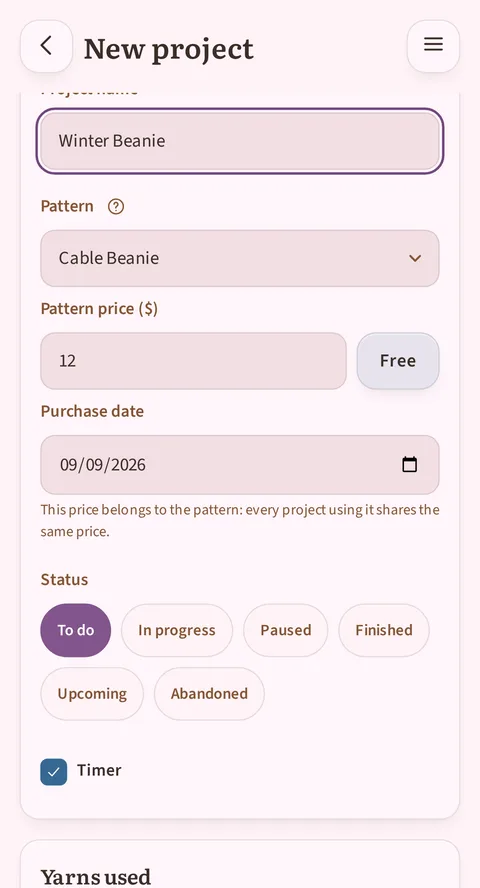

*Below the pattern choice: its price, a "Free" button and the purchase date, pre-filled to today.*

### The project page, in tabs

- **Sections**: the stages of your piece (front, back, sleeve…), each
  with a status badge (to do / started / in progress / finished) and,
  when the pattern has a chart, a preview of the matching diagram.
- **Details**: all the project's information (craft, sizes, needles
  or hook, gauge, start/end dates, your star rating and a personal
  note). The end date fills itself in as soon as you set the project to
  Finished; and if you'd rather type it yourself, entering an end date
  finishes the project for you. The two always agree, neither ever
  overwrites the other.
  You also see the **project cost**: the price of the yarns you reserved for it or already
  knitted, and in brackets the pattern price, which you only pay once, even if you
  knit it three times. If a yarn has no price recorded, the app says so instead of
  pretending it was free.
- **Gallery**: your project photos, plus the pattern's original photos
  below them. You choose which one to use as the **cover photo** (by
  default, the pattern's first photo). Tap a photo to open it full
  screen: you can then zoom (pinch with two fingers or double-tap) to
  study a stitch detail, pan around the zoomed image, then close it
  with the × button.
- **Sessions**: the history of your knitting/crochet sessions, with the
  length of each one, and the option to add a
  session manually (for time you spent without the app open). A session in
  progress shows up there live, too.

### Working live — a session

Anywhere in the project, a **timer** floats at the bottom of the screen: the same
pill on the project sheet, whichever tab you're on, and in the reader. A chevron
on the pill opens a small menu whose "Hide timer" entry tucks it away; the
**Actions** menu (vertical three-dot icon) on the project sheet or the "Timer"
checkbox in the edit form brings it back.
- One timer per project, and it **never starts on its own**: you tap it to start
  it, and tap it again to pause for an interruption (the button then shows
  **Resume** with the time already counted).
- No **Stop** button: pausing is the only gesture along the way. The timer follows
  everything you do inside the project (sheet, reader, editing, correcting), and
  its time is written down as you go: every pause (the button, a trip into
  correcting, leaving the project) adds what has elapsed since the last write.
  Leaving the project or hiding the timer closes the session, with a "Time saved"
  note showing the total.
- Once started, it survives everything: screen off, another app opened, device
  restarted. It always picks the thread back up for you.
- In the reader, you **check off rows** one by one, with the instructions shown
  (up to 8 lines visible, automatically resuming right where you left off).
- Several **counters** per project (stitches, rows, repeats…), each with a + and −
  button and a way to correct a mistaken tap.
- The session lives in the **Sessions** tab of the project sheet: its line appears
  as soon as the timer starts, its time ticking along, frozen under a "paused"
  badge during an interruption. Resuming within two hours of the last write picks
  the same line back up, where time keeps adding up; any later, a new session
  begins.

### All your sessions, in one place

A project sheet's Sessions tab tells the story of that project, and that
project only. To go back over your whole history, every project together, the
app's menu opens the **Sessions** screen, between Statistics and Expenses.
Each session shows up there, from the most recent to the oldest: the project's
name, then the date and the duration. Tapping a line opens the page of the
project it belongs to.

This screen is for viewing only: it's on the project sheet, in its Sessions
tab, that a session gets corrected or erased. No filters, no grouping: it's a
first version, deliberately simple.

## 3. The pattern that adapts to you — the interactive reader

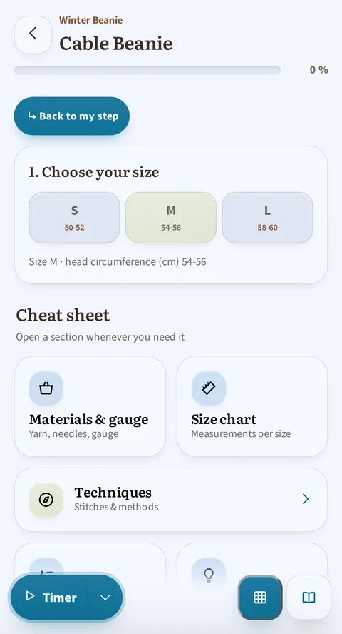

*Top of the reader: the contents of the sections, then the size choice, made once for the whole pattern, and the cheat sheet (materials, size table, techniques, abbreviations) within reach.*

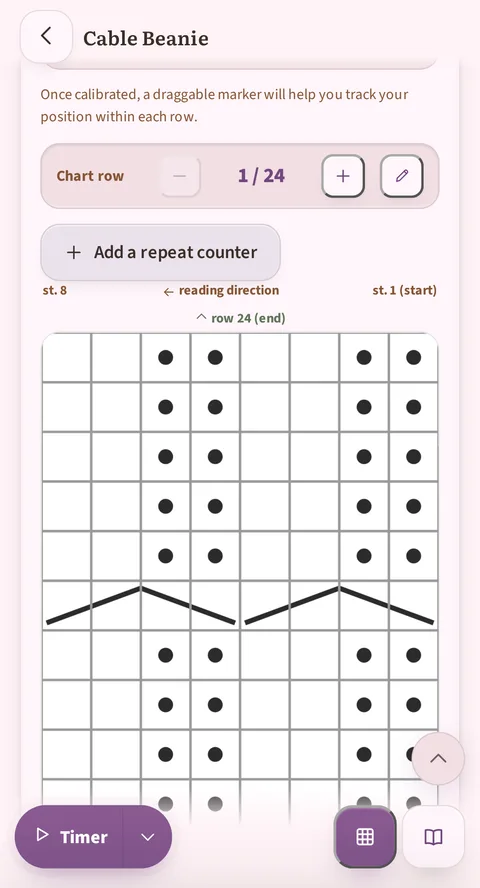

*Further down: you follow the chart row by row, with its own "Chart row" counter, its reading direction, and the timer at the bottom of the screen.*

This is {app}'s flagship feature. Once a pattern has been put into
"guided reading" format (the 3 sample patterns already are, as is any
imported and checked pattern), it gives you:

- **The size picker**: pick your size once, and **every number in the
  pattern filters itself automatically** for you (stitches, rows,
  lengths). Every line shows the figures for your size, with no
  "104 (108) 112…" to decode.
- **Step-by-step tracking**: check off each step, with an overall and
  per-section progress bar, and built-in repeat counters
  ("− 3/12 +") that disappear on their own if they don't apply to your
  chosen size.
- **The interactive chart**: the pattern's diagram (lifted straight
  from the original PDF) with a **band that follows your current
  row**, rows already done shown greyed out, and a "Row X of 52"
  counter. Reachable directly on the page or through a floating
  button, with its state shared across every section using the same
  chart.
- **The cheat sheet**: the pattern's abbreviations pop up as a tooltip
  as soon as you tap them, without leaving your current row; a full
  panel also groups the techniques (with video tutorials), materials
  and gauge, the size table, the list of abbreviations, and the
  **tips and tricks** given by the pattern.
- **The contents**: a row of dots, one per section, stays visible at
  the top of the reader's flow. Tapping one takes you straight to that
  section, and the dot of your active section marks itself: you always know
  where you are. A single-section pattern doesn't show it: there would be
  nothing to summarise.
- You can read a pattern (previewed from the library) **or** follow
  your real progress from a project. Both paths exist, and your
  progress is always saved.

### The full-screen chart, and how to align it well

This is the most technical operation in the app, so here's the detail.

Tap a chart (or the "expand" button next to it) and it opens full
screen: you can then zoom (pinch with two fingers, double-tap, or +/−
buttons) and pan around to read every stitch, with the same
row-tracking buttons as on the page.

The problem alignment solves: the original PDF often has margins
(text, white space) around the chart's grid. Without a setting, the
app doesn't know where the grid starts and ends on the image, and the
band showing you "here's where you are" could land in the wrong spot.

*Alignment mode: the two arrow handles you drag onto the edges of the grid, the instruction, and the three buttons Reset / Cancel / Save.*

**How to align a chart, the first time you open it:**

1. Full screen, in the top bar, tap the **Align** icon (two horizontal
   bars linked by a vertical arrow). It's the first icon after the
   title, right before the zoom and close buttons; this button carries
   no text, only that pictogram.
2. Two arrow handles appear on the image, each with a small label
   ("Top of the grid" / "Bottom of the grid"). Drag each one onto
   **exactly the edge of the grid**: the "Bottom of the grid" line
   onto the very **first row** of the chart, the "Top of the grid" one
   onto the very **last**. (Not onto the surrounding text or margins,
   nor onto the edge of the photo itself: onto the grid alone.)
3. While you adjust, a guide band stays visible on your current row:
   use it to check live that things line up, before you confirm.
4. Tap **Save** to finish. ("Cancel" abandons the adjustment in
   progress; "Reset" removes any existing alignment and you start over
   from the full image.)

Once aligned, row tracking stays accurate for the rest of your piece on
that chart, within **that project**. Worth noting: the alignment is
saved together with your progress on the project, not with the
pattern itself. If you start a second project from the same
pattern, you'll need to do it again once for the new project (the
operation only takes a few seconds).

**And round or square charts?** Granny grids, round or square, don't get
aligned with two lines: the same **Align** button opens a **guided assistant**
there, because the chart's shape (its type, chosen during correcting, section
4) is what decides. It has you place, one after the other, the motif's two
boundaries: the first, which marks the bottom of the first row, then the
outside of the last row. Each one is declared **Round** or **Square**, moved
and adjusted (**Move** and **Resize** buttons) while the picture scrolls and
grows under a fixed loupe. When the two boundaries don't share the same shape, one
extra step asks from which row the motif changes; a last screen lets you touch
everything up before you **Save**. The result is remembered just like linear
alignment: with the project's progress, chart by chart. And as long as a
radial chart isn't aligned, a button in the reader's flow, "Set the motif's
center and radii", offers to take you there.

*The boundary declared round: the loupe follows the chosen shape, and the Round and Square buttons set it at every step.*

Once **saved**, the granny chart carries the progression like the linear
grids: the rounds already done are circled from the centre out, the current
round stands out in a thicker ring, and the bar at the bottom moves along
round by round.

*The result once calibrated: the progression reads straight off the chart, round after round.*

**Keeping track of your position on a long row.**

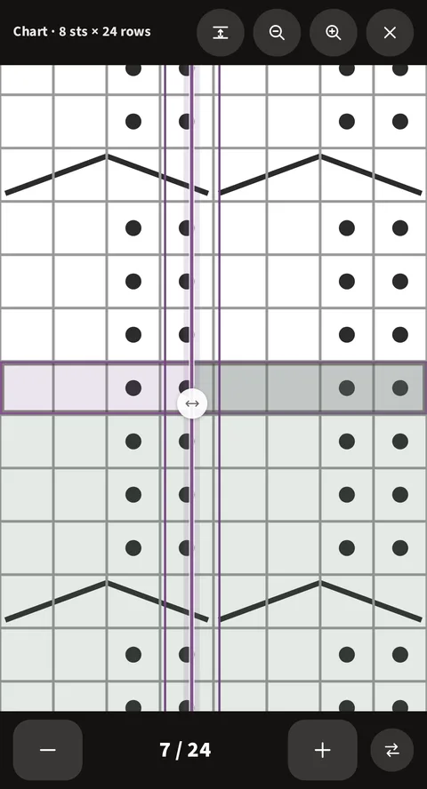

*The round handle, sitting on the current row: to its right, the part of the row already done is tinted. It only exists on that one row.*

On a very wide chart, once you've zoomed in, it's easy to lose track of
which stitch you're on. Full screen, a **small round handle** appears
on the current row, and on that row alone. Drag
it left to right (or the other way) following your stitches: the
portion of the row it leaves behind gets tinted, standing for what
you've already knitted.

A button next to the row counter flips the tinted side (useful when
the next row reads in the other direction). The handle returns to its
own place at each new row, and its position is kept even after you
leave the app. The first time you open a chart, a small message points
out that it's there, so you don't miss it.

### Correcting a line without leaving your tracking

You're following your pattern and a line is wrong: the import cut it badly, or
you want to reword it. You don't have to leave the project to repair it.

**Tap the card** carrying the line. A veil settles over it, with two buttons:
**Fix** and **Close**. The correction screen then opens straight **on that
line**: you don't have to hunt for it through the whole pattern.

The veil doesn't get in the way of your knitting: it withdraws on its own after
three seconds, and a tap anywhere else sends it away. Tapping another card moves
it there. And no tap on a **control** of the card puts it up: ticking a row or
touching an abbreviation triggers the expected action.

**Your timer doesn't count the time spent correcting.** If it's running when you
leave to correct, it **pauses**. On your return it **starts again** by itself.
Time spent in the editor doesn't enter your knitting statistics.

On your return, the reader brings you back to the section you were correcting.
The correction happens in the same screen as the one described in section 4
below, with all its tools.

### On tablets

A tablet held sideways gives you far more width than a phone, and {app} puts
it to use in two places: in the pattern reader, and on the statistics screen.

**The reader, in two panes.**

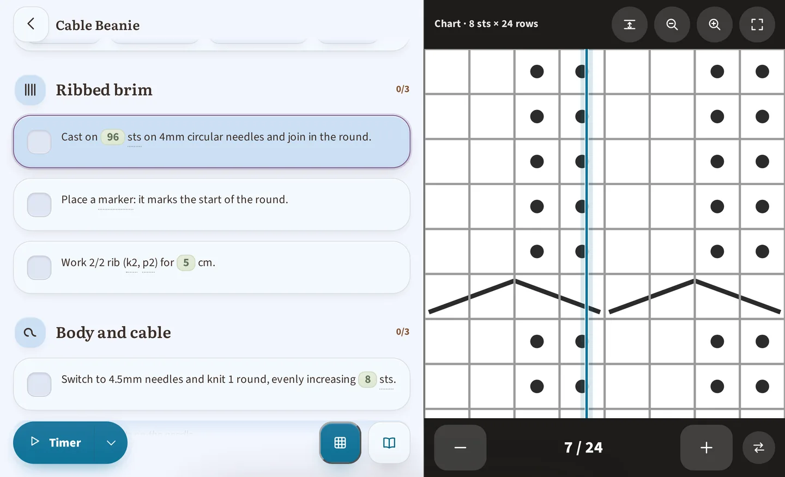

*On a tablet held sideways: your instructions on the left, the chart permanently on the right, with no more scrolling between the two.*

Knit on a tablet held sideways and the reader switches on its own to
**two columns**, your instructions on the left and a chart displayed
permanently on the right: no more scrolling back and forth between
the two. You keep control:

- On any other chart in the pattern, the **Show on the right** button
  moves it into the side panel (handy when a pattern contains
  several).
- The **Move back into the text** button closes the panel and puts the
  chart back in its place in the flow, if you'd rather read everything
  in a single column.
- At the spot in the text where the chart used to sit, a note reminds
  you that it's **shown on the right**: nothing disappears without
  telling you.

This setting only lasts for your current session: reopening the
pattern brings back the panel with the first chart. On a phone (or a
tablet held upright), the reader stays in a single column, as before.
A pattern with no chart has no side panel at all. The reader's contents
stay, for their part, at the top of the instructions column, same
dots, same gesture.

**Statistics, with room to breathe.**

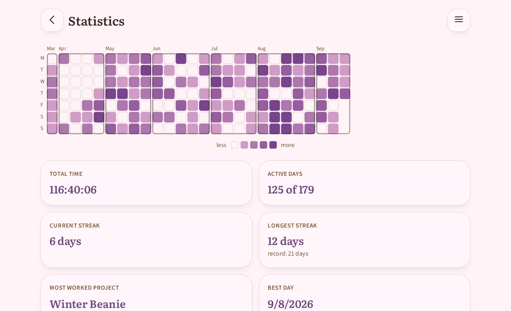

*Statistics on a tablet held sideways, in the Half-year window: the calendar grid shows the last six months at a glance, where a phone makes you swipe sideways to see them, and the number tiles line up two by two below it.*

The **Statistics** screen (point 7) makes use of the space too: its calendar
grid and its number tiles spread out instead of squeezing together, and on the
longest windows, Half-year or Year, you see far more weeks before you have to
drag the grid sideways. There is nothing extra to set: it's the same screen,
just more comfortable.

## 4. Your pattern library

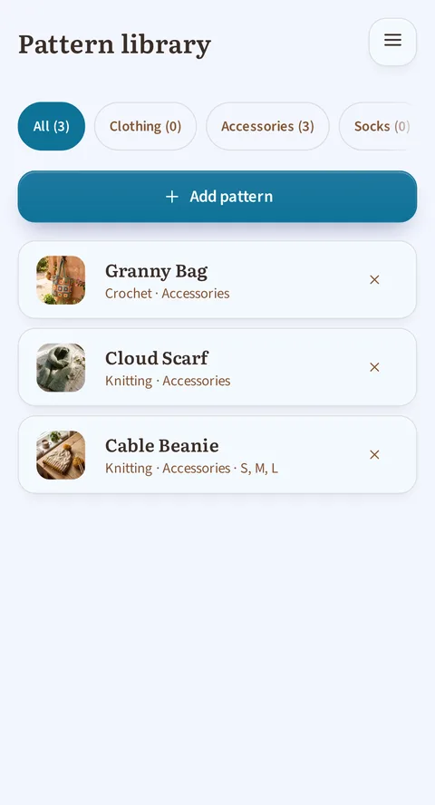

*The library, with the three sample patterns provided on first launch.*

*A pattern's page, deliberately spare: create a project, or preview. (Correcting the import is reached from the preview, or from the menu of an in-progress project that uses this pattern.)*

- **Import a PDF**: drop your pattern's PDF, and the app reads it and
  **automatically rebuilds** the sizes, rows and sections for you, without
  an internet connection: nothing leaves your device. The pattern
  **joins your library**, and that's where your work begins: **plan on
  spending real time on it**. An import almost never comes out perfect the
  first time. That's normal: pattern PDFs are all laid out differently.
  You read it over, check it and fix it **from the pattern's preview**, as
  many times as you like, and that pass is what makes the difference
  between a roughly-right pattern and a project that shows the right
  figures and the right explanations.
  (The reading also recognises the round and square grids of granny patterns,
  never perfectly: the read-through remains essential.)
- **Find a pattern**: category buttons at the top of the library show
  you **how many patterns** each one holds, for an instant sense of
  where to look.
- **Correct a pattern**: a full-screen editor lets you touch up an
  imported pattern (text, sizes, images). This is a step **to plan
  for**, not an exceptional rescue: automatic reading never understands
  everything perfectly, and an imported pattern needs working over in the
  app before it is really pleasant to follow. You can come back to it as
  often as you like, including long after the import. This is the app's
  other technical operation, detailed below.
- **The pattern's price**: a pattern's page also carries its **price**,
  which you can fill in without waiting to start a project: as soon as
  it is there, it shows on the pattern's own page ("Bought for £18.90 on
  8/7/2026", or simply "Free") and it counts in the **Expenses** screen.
- **Pattern view**: simple reading for patterns without special
  formatting, or patterns you've typed in entirely by hand.
- **3 sample patterns** ship with the app from the very first launch,
  so you can explore every feature without importing anything.

### The correction editor, in detail

This is the most technical operation in the app alongside chart
alignment (above): here's how it really works.

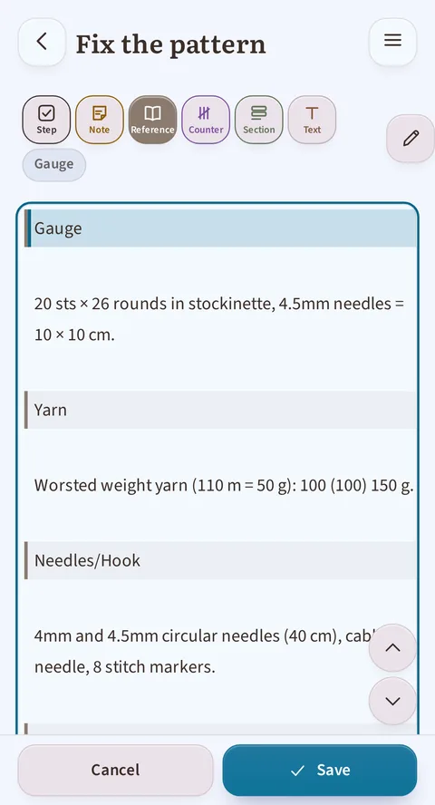

*The cursor sits on a reference line: the "Reference…" button is filled in, and "Gauge", its sub-category, shows in italics right beside it.*

**Pattern sizes, at the top of the screen.** The first field of the correction
screen is called **Pattern sizes**. It tells the app how many sizes your pattern
offers: write them separated by commas, "S, M, L". That number sets the width of
the size table. Without this field, a table the import cut badly stayed beyond
repair.
One consequence to know about: if you **add** a size, the app does not fill in
that size's stitch counts. It does not invent them: the pattern doesn't carry
them. A line with three sizes that you take to four therefore shows as
"10 (12) 14 ()", the empty bracket being the size still waiting for its figures.
Typing them in is up to you.

**The principle.** A pattern is made of lines of text, and **each line
carries a category** that tells the app what it's for: a checkbox
during knitting, a section title, or a plain reference note? Automatic
import already assigns a category to every line as it comes in. The
editor lets you correct the ones it guessed wrong, and fix the text if
a sentence got cut awkwardly.

**The possible categories:**

| Category | What it becomes in your project |
|---|---|
| **Step** | A checkbox during knitting or crochet — the heart of step-by-step tracking. |
| **Counter** | A repeated step, with its own counter. Two variants: **Repeat** (redo the line N times) and **Cadence** (redo the line every X rows, N times). |
| **Note** | Informative text shown at that spot, with no checkbox. |
| **Section** | A section title (Front, Sleeve, Collar…), with its automatic icon — this is what splits your pattern into the Sections tab. |
| **Reference** | Information from the pattern's page (yarn, needles, sizes…) — **not** step-by-step tracking. Eight sub-categories: **Yarn** (brand, fibre, yardage, quantities), **Needles/Hook** (size and type), **Gauge** (the reference measurement, e.g. "10 × 10 cm = 22 stitches"), **Materials** (everything else: buttons, markers…), **Tips** (the designer's recommendations), **Abbreviations** (one per line), **Sizes** (the table of finished measurements — not the per-size instructions, which are Sections), **Techniques** (a technique explained). These are the blocks that fill the interactive reader's cheat sheet (section 3 above). |
| **Text** | A plain paragraph, with no particular role — usually the pattern's introduction or closing text. |
| **Image** | A photo or a chart. |

**The built-in help.** The correction screen carries its own help, folded away
at the top of the screen under the heading "How to correct the pattern": three
steps, then the same information as the table above (the categories, and the
eight reference sub-categories). You can unfold it at any moment without
leaving your work, without having to come back to this guide in the
middle of a correction. (This guide, for its part, is meant to be read *before*
you open the screen, to decide whether you want to take it on.)

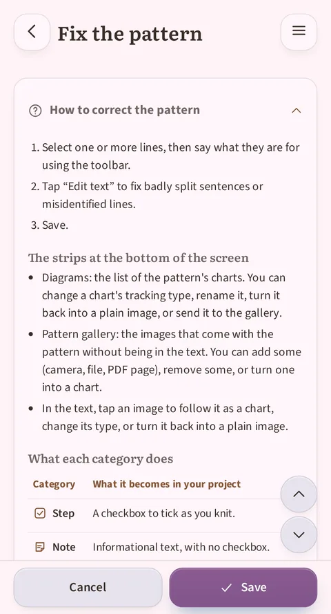

*The "How to correct the pattern" help unfolded: its 3 steps, then the start of the "What each category does" table.*

**Changing a line's category:**

1. Put your cursor on the line (or select several lines at once). The
   toolbar just above the editor highlights the category already
   applied. If it's a reference, its **sub-category** shows as well, in
   italics right beside the toolbar ("Yarn", "Gauge"…): that's what
   tells you which block of the pattern's page the line will land in.
2. Three compact buttons apply Step (a ticked box), Note (a sheet of
   paper) or Text (a "T") directly; each shows a short label under the
   icon. Three other buttons, wider, open a menu of sub-categories,
   their ellipsis says as much: **Counter…**, **Section…**,
   **Reference…**. Tap the one matching what you want the line to
   become.
3. The line's colour and rendering change right away to confirm.

**Sending text into the cheat sheet.** The **Reference…** menu does more than
label the line: it **moves** the selected text into the chosen sub-category, and
you find it again in the matching tab of the reader's cheat sheet. That is how
you tidy away what the import left scattered through the pattern: a glossary, a
list of materials, a table of measurements.
The gesture moves only the selection you made, never the neighbouring lines;
and you are the one who judges the sub-category: the app files
things where you tell it to.

**Categorising in several passes.** If you send a second selection to a
sub-category that already exists, it is **added** to the existing block instead
of creating a second one. A glossary scattered over three pages of the pattern
is categorised in three passes, with nothing to reorganise by hand.

**What the app can split up on its own.** As it lands in the sub-category, the
text is laid out whenever its shape is recognisable. "st - stitch(es)" becomes a
glossary entry, its abbreviation on one side and its definition on the other.
"Bust 90 (100) 110" becomes a row of the size table, one column per size. When
the app cannot split a line, it never throws it away: it lays down an empty
**template** with the right columns, for you to fill in by hand.

**Two ways to view the text.** By default, the editor shows you a
**rich view**: images appear as thumbnails, counters as pills, rows
with their checkbox, a preview close to how it will actually look.
The **Edit text** button switches to raw text (the markup becomes
visible) and opens the keyboard: useful for fixing a wording, a typo,
or a sentence that the import cut awkwardly in two lines.

**Reordering without cut and paste.** Two arrows (up/down) move the
line where your cursor is, handy if the import placed a step or a
section title in the wrong spot.

**Turning a photo into a followable chart (or back again).** Two ways to get
there: tap an image in the text, or unfold the **Diagrams** banner at the
bottom of the editor. That banner lists every section of the pattern that
carries an image, charts already being followed as well as photos not
converted yet. The number in brackets, for example "Diagrams (2)", counts
all of those sections, photos included: it doesn't tell you how many charts
are already being followed. For an image not converted yet, a
**Follow as a chart** button opens a choice of type, each explained in plain
language: standard rows, radial square, radial round, or path, to match
the real shape of your motif (a granny square doesn't read like standard
rows). For an image already followed as a chart, an **Interactive chart**
tag states where it currently stands, next to a **Change type** button (the
same choice, to fix a wrongly guessed type) and a **Just an image** button
to go back to a plain photo, handy if the import missed a chart or if
you'd rather a plain photo stayed a plain photo.

**Adding images: three doors.** In a pattern's gallery, from its page or
from the correction editor, the **Add an image** button offers three
sources: **Camera or gallery** (a sheet lets you choose between taking a
photo and picking one from your own images), **Browse files** (your device's
picker, for an image stored elsewhere), and **From the pattern's PDF** when
it exists: you pick the page there and the app has you crop it, the
only source that goes through that cropping. Every image joins the pattern's
gallery, ready to be inserted or followed.

**An image's menu.** In the editor's text, tapping an image opens a small
immediate menu: **follow it as a chart** if it isn't one yet, or
**change its type** otherwise, bring it back down to a mere illustration (**Just an
image**), or **send it to the pattern's gallery**. In the "Pattern gallery"
band, every image can be deleted, inserted into the text, or followed as a
chart: the three gestures in the same place.

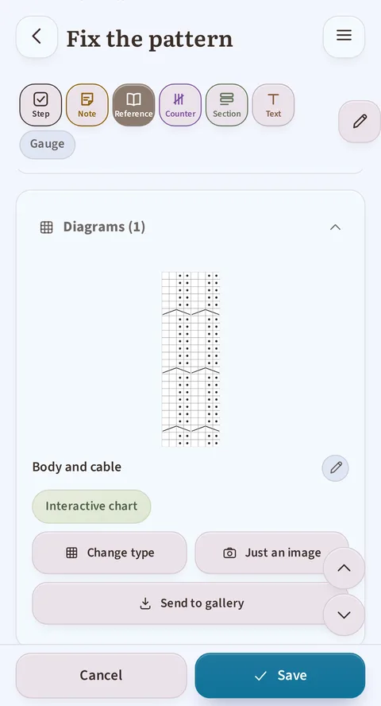

*The "Diagrams (1)" banner unfolded: the "Body and cable" section, where it currently stands ("Interactive chart") and the "Change type" and "Just an image" buttons.*

**Saving.** The **Cancel** / **Save** buttons are fixed at the bottom
of the screen. Try to leave with unsaved changes and the app stops you
and asks for confirmation: nothing gets lost by mistake here either.

## 5. Your yarn stash

*The stash: totals up top (skeins, length, weight, value), then one card per yarn with its status, free or reserved by a project.*

- **Add a skein**: brand, weight (with help understanding the weight
  categories), fibre content (picked from a list; if your fibre isn't
  listed, "Other" lets you type it in, and it's then offered like any
  other), colour (picked from a palette, with a custom shade picker if
  you need one), quantity, price, length and weight per skein, plus
  the purchase date and dye lot number.
  **As soon as you save it, the app immediately records the matching
  purchase**, and your money spent (point 1) goes up by the amount you
  entered. The date it suggests is today's: if you bought the yarn
  earlier, you can correct it directly in the form. (These two fields
  only appear when you create the entry. On an already-saved yarn
  page, the **Purchases and gifts** block takes over, with one line
  per acquisition.)
- **Yarn that isn't a single colour**: a **Colour type** field (solid,
  gradient, self-striping, speckled, hand-dyed) and a **Colourway
  description** field ("blue, green, yellow speckled with black")
  complete the colour swatch: a single shade isn't enough to
  describe a multicoloured yarn. Colour type shows up in search and in
  the spreadsheet export.
- **Your yarn's characteristics**: eight labels to tick, in two groups that
  don't mean the same thing. A **commitment** is what you know about your
  yarn yourself; a **certification** is a label awarded by an outside body.
  - **Commitments**: Vegan · Recycled · Ethical · Mulesing-free.
  - **Certifications**: No harmful substances (OEKO-TEX) · Organic fibres
    (GOTS) · Sheep welfare (RWS) · Certified recycled (GRS).
  - **The origin works itself out** from the fibre content, with nothing to
    tick: "Animal fibre", "Plant fibre", "Synthetic fibre", "Animal and
    plant blend". When the app can't conclude for every fibre you entered,
    it says so ("Incomplete origin") instead of guessing: that's
    deliberate.
  - **The vegan warning**: tick Vegan on a yarn that contains an animal
    fibre and the app points it out ("This yarn contains … (animal fibre).
    The vegan label looks contradictory — check the composition.") without
    stopping you from saving: it warns you, it doesn't decide for you.
  - **Finding your yarn again**: these labels turn up again in the stash
    filter (the "Label" criterion) and in the text search.
  - These characteristics also come out in the **spreadsheet export**.

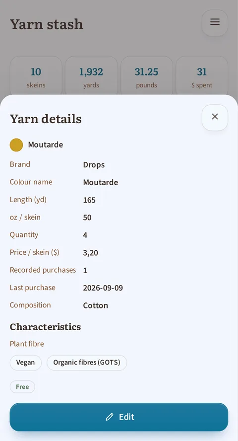

*A yarn's page: its fibre content, the "Plant fibre" note, and its two labels "Vegan" and "Organic fibres (GOTS)".*

- **The summary** at the top of the screen: number of skeins, total
  length and weight (switching on their own to km and kg once your
  totals get large), and your stash's total value.
- **Search, filter, sort**: a search field and the **Filter** and **Sort**
  buttons at the top of the stash. Filter opens a two-level window: the list
  of six criteria (**Brand**, **Label**, **Weight**, **Skein weight**,
  **Colour**, **Composition**), then, for the criterion you tapped, its
  values. One choice per criterion, but criteria combine; a badge on the
  Filter button counts the active filters, and **Reset** clears them in one
  gesture. Sort offers **Brand** (the default), **Weight** or **Purchase
  date**. None of this is remembered: every return to the stash starts
  again with no filter, sorted by brand. List or visual grid, your choice.
- **Edit, duplicate or delete** an entry from its card's **Actions**
  menu (vertical three-dot icon). "Duplicate" is handy for the same
  yarn in a different colourway: everything carries over, you just
  need to change the colour.
- **The skein pool**: for each yarn, you can see at a glance how many
  skeins are **reserved** for a project and how many are **free**. You
  can't lower the quantity below what's already reserved (the app
  tells you how many skeins are held back); and it warns you if
  restoring a project from the trash puts your yarn reservations at
  risk. The project comes back regardless, with a reduced
  reservation and a message explaining it to you.
- **A yarn's detail page**: a full summary (skeins, metres, projects
  using it), and a **Purchases and gifts** block that keeps a record
  of every acquisition of that yarn for you:
  - Each line carries a quantity, a price, a date and a dye lot, and
    states whether it was a **purchase** or a **gift** (a gift never
    counts towards your money spent). The three most recent lines are
    visible right away, the rest unfolds with a tap.
  - You can **add, edit or delete** a line at any time.
  - **Increase the quantity** of a yarn from its page and the app
    offers to record the matching purchase, dated today: you can
    accept it, mark it as a gift, or ignore it if you don't want to
    keep it. **Decreasing a quantity, however, never touches your
    money spent**: only an increase can create a purchase.
  - If the number of skeins on the page doesn't match what the
    history recorded (for example after you manually corrected the
    stash), an alert points it out and a **Fix** button offers you two
    solutions: add the missing purchase, or adjust the displayed
    quantity.
  - A purchase keeps its label even after you permanently delete the
    yarn's page: no yarn purchase disappears, it stays visible in the
    **Expenses** screen.

### The Expenses screen

*The Year and Type menus at the top, the total with its yarn / pattern breakdown, then the detail by month.*

Reached by tapping the money spent on Home (point 1), this screen
summarises everything you've paid for your knitting, **yarn** and
**patterns** alike:
- The **total spent**, by currency if you've used more than one. As
  long as you haven't noted any pattern price, this total stays
  exactly as you know it; as soon as a pattern shows up in it, it
  breaks down into two sub-lines: what went to yarn, what went to
  patterns.
- Two menus at the top: **Year** shows only the year you choose (or
  "All years"), **Type** shows only one category (or all). Totals
  recalculate accordingly. Purchases you haven't dated end up under
  "Unknown date", which is added to the Year menu whenever there are
  any.
- A **breakdown by year then by month**, yarn and patterns mixed in
  calendar order: you see at a glance what a given month cost you.
- As soon as a pattern shows up in the list, each line also carries
  its label, **Yarn** or **Pattern**. A pattern you've declared free
  shows up with the **Free** tag: that's proof you checked, not an
  oversight.
- The **full list** of every purchase and gift, including those whose
  yarn page you've since deleted (marked "Deleted yarn").
- The option to **delete** a yarn line directly from this screen, with
  a chance to **undo** right after in case of a mistake. A pattern
  line, on the other hand, is edited from the pattern's page: tapping
  it takes you there.

> **Good to know**: a yarn purchase survives the deletion of its page and
> stays visible here. A pattern's price, though, belongs to the
> pattern: if you delete the pattern, its expense goes with it.

## 6. Standalone tools

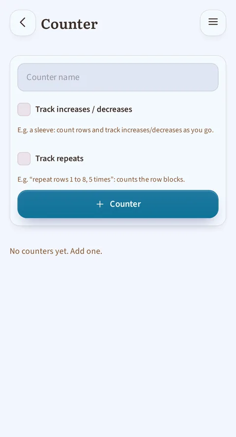

*The free counter, usable without a project: name it, and choose whether it tracks increases/decreases or repeats.*

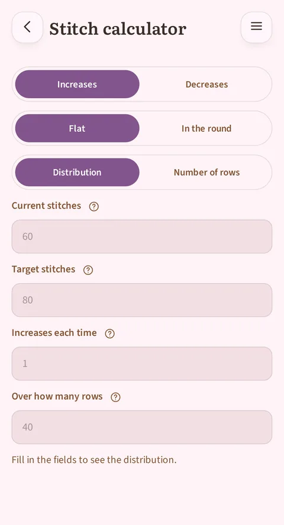

*The stitch calculator: spreading increases or decreases over a number of rows, or working out how many rows you need at a given rate, flat or in the round.*

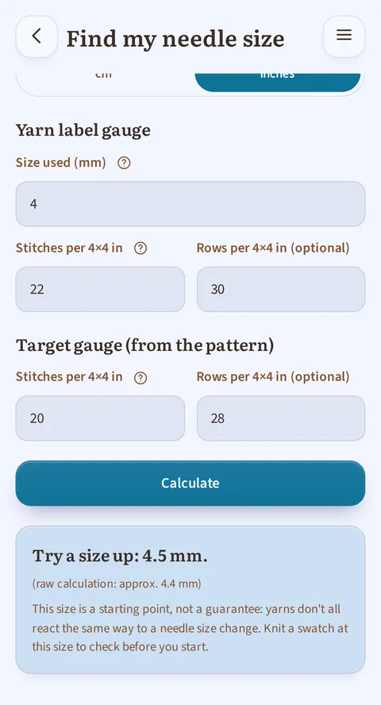

*Find my needle size, with the fields filled in: what your ball band says, the gauge your pattern asks for, then the app's answer just below. In crochet, the same screen talks about hooks.*

These tools work without being tied to a specific project, reachable
from Home:
- **Stitch calculator**: it answers both ways round. Either you give it a
  number of rows and it tells you how to spread your increases or decreases
  over them; or you give it your rate ("every 4 rows") and it tells you how
  many rows you need to reach your target stitch count, and which row the last
  change falls on. One field says how many stitches you add or remove each
  time: usually 1, or 2 for a sleeve where you increase one stitch on each
  side. When your target can't be reached exactly, it offers the two options
  either side of it rather than rounding silently. Flat it talks in rows, in
  the round in rounds.
- **Free counter**: one or more independent counters (+/−, a target to
  reach, reset), for anything that isn't part of a saved project.
- **Find my needle (or hook) size**: enter what's written on your
  skein label (recommended needle size and stitch count for
  10 × 10 cm, or 4 × 4 inches) then the gauge your pattern asks for,
  and the app tells you which size to start with: one size up, one
  down, or the same. It also warns you when the gap is too large to
  make up (this yarn won't work with this pattern), and always
  reminds you that a swatch still needs knitting to check: it's a
  starting point, not a guarantee. The rows field is optional.

## 7. Statistics

*The selector at the top picks an observation window (Month, Quarter, Half-year or Year), and the whole screen follows it; here, the Quarter window. The "Calendar" tab, shown by default, shows the grid and the nine number tiles.*

The selector at the top of the screen no longer just picks a display span:
it picks an **observation window** (Month, Quarter, Half-year or Year).
Everything below follows it, from the total time to the nine number tiles.
Just below it, an **All / Knitting / Crochet**
filter restricts the whole screen to a single technique; it isn't remembered
and goes back to "All" every time you come back to this screen, just like
the reader's side panel. This filter only shows up if your projects cover
**both techniques**: if they're all knitting (or all crochet), it wouldn't
add anything, so it doesn't take up space.

One subtlety while a filter is on: the **Average per active day** tile shows
a dash. The days being counted may include days when you moved forward in
the other technique (the log only keeps the date, not what you did that
day), and dividing a time by those days would give a figure that is exact
but misleading.

The rest of the screen splits into **two tabs**, switched by **tapping**
(never by swiping: the grid itself scrolls horizontally in Half-year and
Year, so the two gestures don't get confused):
- **Calendar** (shown by default, the one in the screenshot above): the grid
  and the nine number tiles.
- **Rhythm**: the bars by period, then seven bars, one per day of the week,
  and a sentence naming your most consistent day across your whole
  history.

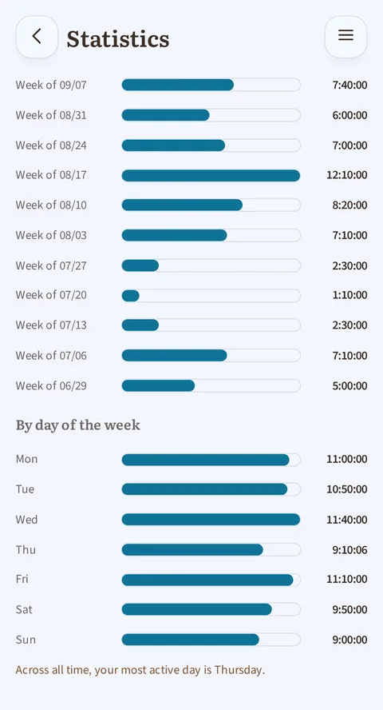

*The "Rhythm" tab: the bars of time spent per period, the seven bars per day of the week, and the sentence naming your most consistent day.*

The **grid** shows one square per day, from the first day of your week
(top) to the last (bottom), across the whole window you picked; that first
day is Monday by default, or Sunday if you picked it in Settings (§8). Its
colour follows the accent shade chosen in Settings (§8), and its intensity
depends on how long you knitted or crocheted that day, on five levels:
nothing, less than 30 minutes, 30 minutes to 1 hour, 1 to 2 hours, 2 hours
or more. The thresholds
are **fixed**: a dark square always means the same thing, month after month,
even in a quieter quarter than usual. A bolder outline frames the columns
that belong to the same month, so you can spot them at a glance.

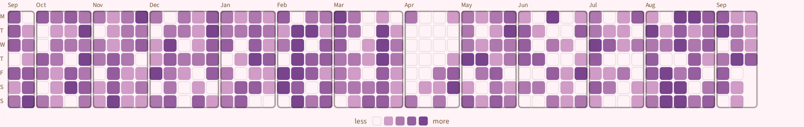

*The grid in the Year window: a complete year at a single glance, one column per week and one square per day, with the outlines separating the months. Tap the image to enlarge it and read the detail.*

Tapping a square **marks** it (it stays visibly selected) and shows, below
the grid, its date, its duration and, when more than one project moved
forward that day, a list of each one with the time it got.
Tapping the same square again clears it.

What the **streak** counts is the days on which you logged **at least one
action**: a session, timed or added by hand, a row checked off, a project
counter moved forward. And opening the app without doing anything in it
doesn't count: it takes a **logged** action.

## 8. Settings

*Top of Settings: first name, default craft, theme, ambience color, first day of the week, language, units and currency. Further down are the backup folder and the trash.*

- **Profile**: your first name (used for the Home greeting) and your
  default craft (knitting or crochet).
- **Appearance**: light theme, dark theme, or matching your device's
  own setting.
- **Ambience color**: ten shades offered in one tap, or any at all on the
  continuous slider. As long as you haven't chosen anything, the colour
  **follows your theme** and changes on its own with light or dark mode; as
  soon as you choose, your choice wins out and stays the same in both modes.
  That shade colours the buttons, the selections, the progress bars and the
  statistics grid (§7).
- **First day of the week**: Monday (default) or Sunday. This choice
  governs the calendar grid and the seven weekday bars on the Statistics
  screen, as well as the weekly reset of the "this week" total on Home.
- **Language**: French, English, German or Spanish. Each language is
  written in its own language in the list ("Deutsch", "Español"), so
  you find your own language easily.
- **Units and currency**:
  - **Metric** (metres, grams) or **imperial** (yards, ounces, pounds);
    everything follows: entering your skeins, stash totals, gauge
    (10 × 10 cm or 4 × 4 inches). Switching systems doesn't change any
    of your saved numbers, it just redisplays them in the other unit.
  - **Currency** among five (€, $, £, CHF, CA$). Note that it's a
    plain label: prices you've already entered **aren't converted** and
    appear with the other symbol; the app warns you about this before
    confirming.
  - Both settings are offered to you **right from the first screen**
    when you open the app, pre-filled from your device's language; you
    can change them here at any time.
- **Data**:
  - Export your stash, projects or patterns to a spreadsheet (CSV), to
    view or back them up elsewhere. Columns follow your current
    settings: lengths and weights in your chosen unit system, prices
    with your chosen currency symbol.
  - A universal **Trash**: any project, yarn or pattern you delete
    ends up there and can be restored at any time (until you empty it
    on purpose).
- **{app} folder**: everything you knit or crochet only exists inside this
  app, on your device, nowhere else. The backup folder keeps a copy of it,
  written **continuously** (there is never anything for you to trigger or
  think about), so you can get it back if you lose your device, if it breaks,
  or if you reinstall the app. You designate it once, at the very first
  launch; it can be changed later in Settings, with the **Change folder**
  button.
  - **A backup folder serves one device only.** Putting it in a synced
    folder so you have a copy elsewhere is a good idea; using it from a
    phone **and** a tablet is not: each would wipe out the other's work.
    A second device needs a folder of its own.
- **Contribute**: a link to the source code (the app is open source), and
  two other links in the same settings block:
  - **Support {app}** leads to a donations page, **freely**: nothing is
    unlocked in exchange, no feature is reserved for those who give.
  - **Suggest an improvement** opens a way for you to send a remark.

### What happens at the very first launch

In order, the first time you open {app}: the welcome screen asks for your
first name, your craft, your language, your theme, your units and your
currency; then the backup folder screen, described just above. After that,
three small messages greet you, **once each**: you won't see them again.

- A **word of welcome**, set in the middle of the Home screen as soon as your
  backup folder is in place: it tells you everything is ready and invites you
  to open the sample projects and patterns to get your bearings. Its button
  closes it, and it doesn't come back.
- A **warning about imported patterns**, the first time you open your pattern
  library: it reminds you that the app reads your PDF on its own and gets
  things wrong sometimes (a skipped row, two sizes mixed up, a badly split
  table), and that an imported pattern needs a read-through before you follow
  it. Its "Got it" button closes it; "How to fix it" opens the section of this
  guide about your pattern library.
- A **navigation tip**, the first time you open a project, visit your pattern
  library, or visit your yarn stash, whichever of the three comes first: it
  explains that you can swipe right to go back, and drag a row of tabs or
  categories that is too wide for the screen. It appears **only once in
  total**, not once per screen; the "Got it" button closes it.

## 9. Under the hood — what {app} guarantees you

- **Offline by default**: none of your data ever leaves your device,
  except the backup folder **you choose yourself**.
- **No account, no paywall**: every feature above is free, with no
  core feature locked away.
- **Nothing is lost by mistake**: every deletion can be undone
  instantly, and ends up in the trash regardless.
- **Designed to be readable by everyone**: sufficient contrast, buttons
  large enough to tap easily, compatible with screen readers.
- **Comfortable on every screen**: on a small phone, nothing overflows
  or gets cut off; on a tablet, the app makes use of the extra space:
  your lists of projects and patterns spread across several columns
  instead of one long stack, and the reader can keep the chart next
  to the text. The app accounts for your screen's reserved areas
  (status bar, notch, navigation bar): content no longer slides
  underneath them.
- **A privacy policy in plain words**: from the About screen, it tells you
  where your data lives, what may leave your phone and in which cases, what
  happens if you uninstall the app, and who answers for it: the person
  responsible and the contact address are named there. It is written in your
  language.
- **In four languages**: French, English, German and Spanish.
