# Guía de {app}

## El espíritu de {app}

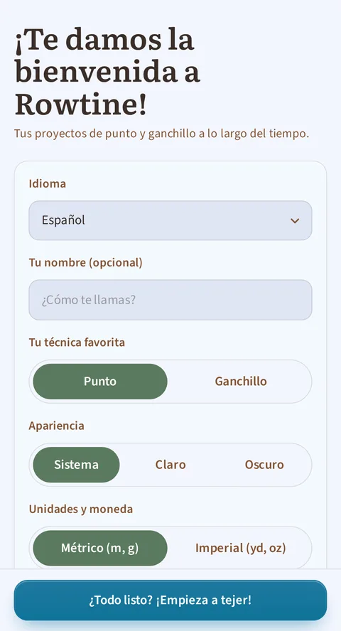

*El primer inicio: nombre, técnica, idioma y tema.*

{app} te ayuda a tener todos tus proyectos de punto y ganchillo en un
solo sitio: tu lana, tus patrones adaptados a tu talla y tu progreso. Es
**gratuita, de código abierto y funciona sin conexión**: tus datos se
quedan en tu dispositivo, no en un servidor. Nada se pierde nunca por
error: todo lo que borras acaba en una papelera.

## 1. Inicio: tu panel de control

*Inicio: la ficha «Continuar» te lleva a la última pieza en la que trabajaste, el panel resume lo esencial hasta las últimas sesiones, y las tres herramientas están a mano.*

Al abrir la app encuentras:
- **Tu último proyecto**, con un botón **Continuar** para retomarlo justo
  donde lo dejaste. Es realmente el proyecto en el que **de verdad
  tejiste o ganchillaste** por última vez (tu última sesión), no simplemente
  el último que modificaste, y la ficha te muestra la fila en curso.
- Un **resumen**: cuántos proyectos tienes en curso, el tiempo que has
  dedicado a tejer o ganchillar esta semana (con el detalle en
  **Estadísticas**), y tu **presupuesto gastado**: el total de todo lo
  que has pagado por lana desde que usas la app, en la moneda que
  elegiste. Esta cifra nunca baja sola: usar un ovillo o terminar un
  proyecto no la reduce (solo una compra nueva la aumenta); solo puede
  bajar si tú borras o corriges una línea de compra en el bloque
  «Compras y regalos» de una ficha de lana (punto 5). (Si has usado
  varias monedas, cada una tiene su propio total: la app nunca las
  mezcla, porque no conoce un tipo de cambio.) Al tocar esta cifra abres
  la pantalla **Gastos**, descrita en el punto 5. Esta ficha no aparece
  hasta que hayas registrado al menos una compra (por ejemplo en una
  instalación recién hecha), pero la pantalla sigue siendo accesible
  desde el menú en todo momento.
- Esta cifra es distinta de tu **valor del stock**, mostrado en la
  pantalla **Stock de lana** (punto 5): ese sigue lo que tienes
  actualmente en el armario y baja cuando usas un ovillo. Las dos cifras
  conviven a propósito: una cuenta lo que has gastado, la otra lo que
  te queda.
- Las **últimas sesiones**: en cuanto hayas tejido o ganchillado al menos
  una vez, una ficha lista tus dos sesiones más recientes: el nombre del
  proyecto, el día («Ayer», «Hace 3 días»…) y la duración. Al tocarla se
  abre la pantalla **Sesiones** (punto 2), que reúne todo tu historial.
- Todos tus proyectos, **agrupados por estado** (en curso, pendiente, en
  pausa, terminado, abandonado), con un botón para verlos todos o
  plegar la lista.
- En la tarjeta de un proyecto, un **icono vegano** señala los proyectos cuyas
  lanas son todas veganas (sigue mostrándose en los proyectos terminados).
  Solo aparece si el proyecto tiene al menos una lana y todas llevan la
  etiqueta Vegano.
- En un proyecto **Terminado**, la tarjeta muestra su **fecha de fin** justo
  después de la técnica y la talla (« Punto · M · Terminado el 15/07/2026 »)
  en cuanto se ha introducido una fecha. Se rellena sola en cuanto marcas el
  proyecto como Terminado (ver punto 2), y nunca aparece en un proyecto
  Abandonado.
- Acceso rápido a las **herramientas** (calculadora de puntos, contador
  libre, ayuda de agujas o ganchillo) y al botón **+ Crear un proyecto**.
- Por último, **el menú arriba a la derecha** te lleva en todo momento al
  stock de lana, a la biblioteca de patrones, a las estadísticas, **a las
  sesiones**, a los gastos, a esta guía, a los ajustes y a la pantalla
  Acerca de. Está en todas las
  pantallas: estés donde estés en la app, puedes ir a otro sitio sin volver al
  inicio.

## 2. Tus proyectos, el corazón de la app

*La ficha de un proyecto: su progreso global, el botón «Seguir el patrón», y luego una ficha por sección con su propio avance y su casilla de «hecha». El cronómetro flota en la parte de abajo de todas las pestañas.*

### Crear, editar, eliminar

Un proyecto se crea en unos segundos: nombre, técnica (punto o
ganchillo), patrón asociado (o «Patrón libre» si no usas ninguno). Si
eliges un patrón existente, la app te **rellena de antemano** las
tallas, las agujas o el ganchillo, la muestra y el tipo: solo te queda
ajustar. Un proyecto eliminado **nunca se pierde de inmediato**: puedes
deshacerlo justo después, o restaurarlo más tarde desde la papelera
(ajustes).

También puedes anotar el **precio del patrón** si lo has comprado, o
pulsar **Gratis** si lo descargaste sin pagar. Este precio pertenece al
**patrón**, no al proyecto: si tejes tres veces el mismo modelo, solo
cuenta una vez en tus gastos. Dejar el campo vacío significa simplemente
no declarar nada. Si tu proyecto usa el «Patrón libre», este campo ni
siquiera aparece: es común a todos tus proyectos sin patrón, así que
nunca puede tener un precio propio.

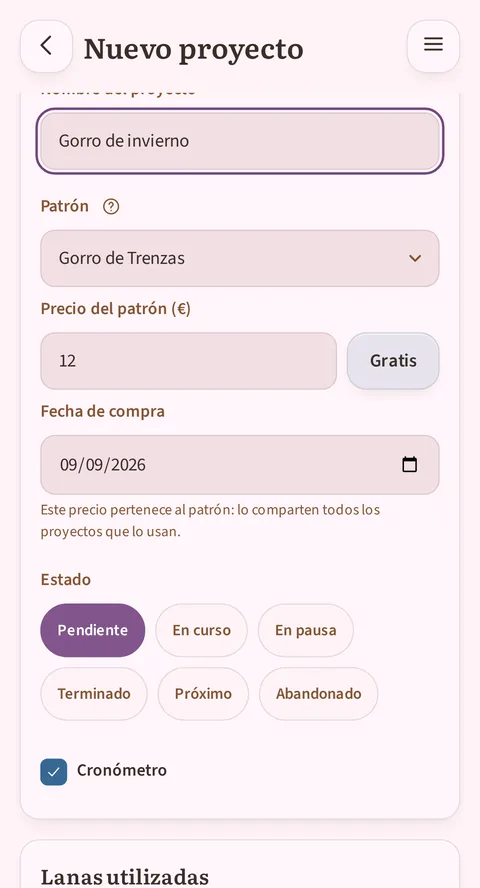

*Debajo de la elección del patrón: su precio, un botón «Gratis» y la fecha de compra, prerrellenada con hoy.*

### La ficha de proyecto, por pestañas

- **Secciones**: las etapas de tu pieza (delantero, espalda, manga…),
  con una etiqueta de estado (pendiente / empezada / en curso /
  terminada) y, cuando el patrón tiene un diagrama, una vista previa
  del diagrama correspondiente.
- **Detalles**: toda la información del proyecto (técnica, tallas,
  agujas o ganchillo, muestra, fechas de inicio/fin, tu valoración en
  estrellas y una nota personal). La fecha de fin se rellena sola en
  cuanto marcas el proyecto como Terminado; y si prefieres escribirla
  tú misma, introducir una fecha de fin termina el proyecto por ti.
  Las dos siempre están de acuerdo, ninguna sobrescribe nunca a la
  otra.
  También ves el **coste del proyecto**: el precio de las lanas que le has reservado o ya
  tejido, y entre paréntesis el precio del patrón, que solo pagas una vez aunque tejas el
  mismo patrón tres veces. Si una lana no tiene precio anotado, la app te lo dice en lugar
  de hacer como si fuera gratis.
- **Galería**: tus fotos del proyecto, más las fotos originales del
  patrón debajo. Eliges cuál sirve de **foto de portada** (por defecto,
  la primera foto del patrón). Toca una foto para abrirla a pantalla
  completa: entonces puedes hacer zoom (pellizcar con dos dedos o doble
  toque) para estudiar un detalle del punto, desplazarte por la imagen
  ampliada, y cerrarla con el botón ×.
- **Sesiones**: el historial de tus sesiones de punto o ganchillo, con
  la duración de cada una, y la posibilidad de
  añadir una sesión manualmente (si tejiste sin la app abierta). La sesión en
  curso también se ve ahí, en directo.
- **Estadísticas**: las cifras de este proyecto en concreto (tiempo total, número de
  sesiones, ovillos usados, periodo, mejor racha de días activos) y su cuadrícula de
  calendario, y luego el botón **Compartir**, que abre el creador de insignias descrito
  un poco más abajo.

### Trabajar en directo: la sesión

En cualquier rincón del proyecto, un **cronómetro** flota en la parte de abajo de
la pantalla: la misma pastilla en la ficha, en cualquiera de sus pestañas, y en el
lector. Una flecha en la pastilla abre un pequeño menú cuya entrada «Ocultar el
cronómetro» la esconde; vuelve gracias al menú **Acciones** (icono vertical de
tres puntos) de la ficha o a la
casilla «Cronómetro» del formulario de edición.
- Un solo cronómetro por proyecto, y **nunca se pone en marcha solo**: lo tocas
  para empezar, y vuelves a tocarlo para pausarlo en una interrupción (el botón
  muestra entonces **Reanudar** con el tiempo ya contado).
- No hay botón de **Detener**: la pausa es el único gesto por el camino. El
  cronómetro te acompaña en todo lo que haces dentro del proyecto, ficha,
  lector, edición o corrección, y su tiempo se escribe sobre la marcha: cada
  pausa (el botón, una ida a corrección, salir del proyecto) anota lo
  transcurrido desde la última escritura. Salir del proyecto u ocultar el cronómetro cierra la sesión,
  confirmada con un «Tiempo guardado» y su total.
- Una vez en marcha, sobrevive a todo: pantalla apagada, cambio de app,
  dispositivo reiniciado. Siempre recupera el hilo.
- En el lector, **vas marcando las filas** una a una, con las instrucciones
  mostradas (hasta 8 líneas visibles, con vuelta automática justo donde te
  quedaste).
- Llevas varios **contadores** por proyecto (puntos, filas, repeticiones…), cada
  uno con un botón + y − y una forma de corregir un toque equivocado.
- La sesión vive en la pestaña **Sesiones** de la ficha del proyecto: su línea
  aparece en cuanto arranca el cronómetro y su tiempo corre allí, congelado con
  un distintivo «en pausa» durante una interrupción. Reanudar menos de dos horas
  después de la última escritura retoma la misma línea, donde el tiempo se
  acumula; más tarde, empieza una sesión nueva.

### Todas tus sesiones, en un mismo lugar

La pestaña Sesiones de la ficha de un proyecto registra todo el tiempo
dedicado a ese proyecto. Para repasar todo tu historial, con todos los
proyectos juntos, el menú de la app abre la pantalla **Sesiones**, entre
Estadísticas y Gastos.
Cada sesión aparece allí, de la más reciente a la más antigua: el nombre del
proyecto, y luego la fecha y la duración. Al tocar una línea se abre la
ficha del proyecto al que pertenece.

Esta pantalla solo sirve para consultar: es en la ficha del proyecto, en su
pestaña Sesiones, donde se corrige o se borra una sesión. Sin filtros, sin
agrupaciones: es una primera versión, deliberadamente sencilla.

### Compartir una insignia de tu proyecto

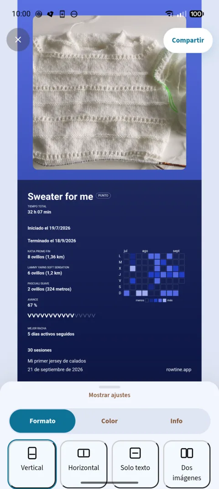

*La pantalla para compartir, abierta desde la pestaña Estadísticas o el menú de la ficha del proyecto.*

Desde la pestaña **Estadísticas** de un proyecto, el botón **Compartir** (o la entrada
**Compartir** del menú de la ficha, arriba a la derecha, desde cualquier pestaña) compone
una imagen para enviar a quien quieras: tu labor, sus cifras, con los colores que elijas.
La pantalla muestra por defecto la imagen de portada del proyecto y, abajo, un cajón de
ajustes.

El cajón de ajustes tiene tres pestañas:
- **Formato**: cuatro plantillas. **Vertical** (la foto arriba y las cifras debajo),
  **Horizontal** (la foto a la izquierda y las cifras a la derecha), **Solo texto** (sin
  foto, útil para un proyecto que todavía no tiene ninguna) y **Dos imágenes** (dos fotos
  una junto a otra, por ejemplo un antes y un después). Si tu proyecto tiene foto de
  portada, la insignia se abre en Vertical con ella; si no, en Solo texto.
- **Color**: una paleta de tonos, un botón + para elegir otro libremente y, encima, los
  últimos colores que has usado de verdad en una insignia.
- **Info**: lo que la insignia debe contener. Cada pastilla muestra el valor real del
  proyecto (tiempo total, fechas de inicio y de fin, lanas usadas con sus ovillos, avance
  mientras el proyecto está en curso, mejor racha, número de sesiones, técnica punto o
  ganchillo): tócala para incluirla o quitarla. La pastilla **Mapa de calendario** añade la
  cuadrícula de los días trabajados. Ahí eliges también el **Idioma** del texto de la
  insignia, independiente del de la app (práctico para enviársela a alguien que no habla
  el tuyo), y una línea de **Texto libre (opcional)**, de 80 caracteres como máximo.

Para cambiar una foto, tócala en la vista previa: aparece un botón **Editar**, que te
propone una foto del proyecto o una imagen de tu galería, el formato (cuadrado, horizontal
o vertical) y luego el recorte.

El botón **Compartir**, arriba de la pantalla, genera la imagen, la guarda en la
**Galería** del proyecto y luego abre el menú de compartir de tu teléfono. Puedes cerrarlo
sin enviar nada: la insignia se queda en la galería. Y si cambias un ajuste y vuelves a
compartir, la insignia anterior de esa misma apertura se sustituye, no se duplica.

## 3. El patrón que se adapta a ti: el lector interactivo

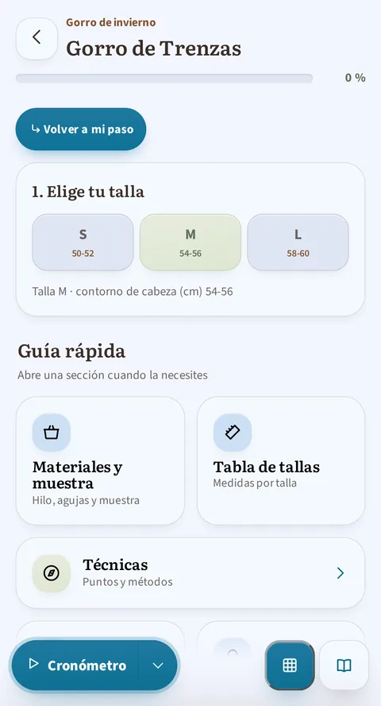

*Arriba del lector: el índice de las secciones, y luego la elección de talla, una sola vez para todo el patrón, y la guía rápida (materiales, tabla de tallas, técnicas, abreviaturas) a mano.*

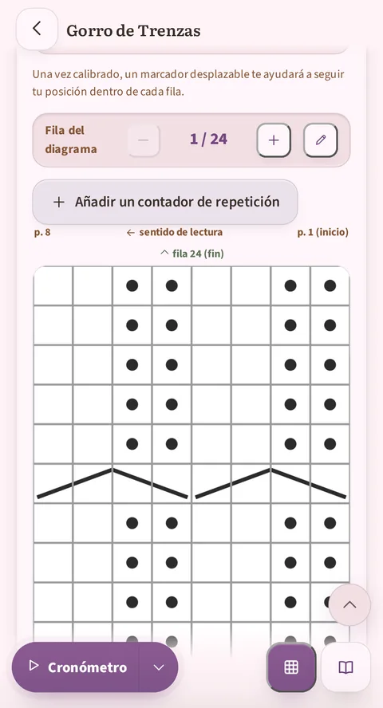

*Más abajo: sigues el diagrama fila a fila, con su propio contador «Fila del diagrama», su sentido de lectura, y el cronómetro al pie de la pantalla.*

Esta es la función estrella de {app}. Cuando un patrón se ha puesto en
formato «lectura guiada» (los 3 patrones de ejemplo ya lo están, igual
que cualquier patrón importado y verificado), te ofrece:

- **El selector de talla**: eliges tu talla una vez, y **todas las
  cifras del patrón se filtran automáticamente** en consecuencia
  (puntos, filas, largos): cada línea muestra las cifras de tu talla,
  sin las notaciones «104 (108) 112…» que había que descifrar.
- **El seguimiento paso a paso**: cada paso lo puedes marcar, con una
  barra de progreso global y por sección, y contadores de repetición
  integrados («− 3/12 +») que desaparecen solos si no corresponden a tu
  talla elegida.
- **El diagrama interactivo**: el diagrama del patrón (extraído tal cual
  del PDF original) con una **banda que sigue tu fila en curso**, las
  filas ya hechas en gris, y un contador «Fila X de 52». Accesible
  directamente en la página o mediante un botón flotante, con su estado
  compartido entre las secciones que usan el mismo diagrama.
- **La guía rápida**: las abreviaturas del patrón aparecen en una
  burbuja en cuanto las tocas, sin que salgas de tu fila en curso; un
  panel completo agrupa además las técnicas (con tutoriales en vídeo),
  los materiales y la muestra, la tabla de tallas, la lista de
  abreviaturas, y los **consejos y trucos** que da el patrón.
- **El índice**: una fila de puntos, uno por sección, sigue visible arriba
  del hilo del lector. Un toque te lleva directamente a esa sección, y el
  punto de tu sección activa se marca solo: siempre sabes dónde estás. Un
  patrón de una sola sección no lo muestra: no habría nada que resumir.
- Un patrón lo puedes consultar en modo lectura (vista previa desde la
  biblioteca) **o** seguir tu progreso real desde un proyecto. Los dos
  accesos existen, y tu progreso siempre se guarda.

### El diagrama a pantalla completa, y cómo «calibrarlo» bien

Esta es la operación más técnica de la app, así que aquí va el detalle.

Al tocar un diagrama (o el botón «ampliar» de al lado) se abre a
pantalla completa: entonces puedes hacer zoom (pellizcar con dos dedos,
doble toque, o botones +/−) y desplazarte para leer cada punto, con los
mismos botones de seguimiento de fila que en la página.

El problema que resuelve la calibración: el PDF original suele tener
márgenes (texto, espacio en blanco) alrededor de la cuadrícula del
diagrama. Sin un ajuste, la app no sabe dónde empieza y dónde termina la
cuadrícula en la imagen, y la banda que te muestra «vas por aquí» podría
caer en el lugar equivocado.

*El modo de calibración: las dos líneas con flecha que arrastras a los bordes de la cuadrícula, la instrucción, y los tres botones Restablecer / Cancelar / Guardar.*

**Cómo calibrar un diagrama, la primera vez que lo abres:**

1. En pantalla completa, en la barra superior, toca el icono
   **Calibrar** (dos barras horizontales unidas por una flecha
   vertical). Es el primer icono después del título, justo antes de
   los botones de zoom y de cerrar; este botón no lleva texto, solo ese
   pictograma.
2. Aparecen dos líneas con flecha sobre la imagen, cada una con una
   pequeña etiqueta («Parte superior de la cuadrícula» / «Parte
   inferior de la cuadrícula»). Arrastra cada una hasta que quede
   **exactamente sobre el borde de la cuadrícula**: la línea «Parte
   inferior de la cuadrícula» sobre la primerísima **fila** del
   diagrama, la de «Parte superior de la cuadrícula» sobre la última.
   (Ni sobre el texto ni los márgenes de alrededor, ni sobre el borde
   de la propia foto: solo sobre la cuadrícula.)
3. Mientras ajustas, una banda de referencia se queda visible sobre tu
   fila en curso: te sirve para comprobar en directo que encaja bien,
   antes de confirmar.
4. Toca **Guardar** para dejarlo listo. («Cancelar» abandona el ajuste
   en curso; «Restablecer» quita la calibración existente y vuelves a
   empezar desde la imagen completa.)

Una vez calibrado, el seguimiento de fila se mantiene preciso durante el
resto de esa pieza en ese diagrama, dentro de **ese proyecto**. Un
detalle importante: la calibración se guarda junto con el progreso del
proyecto, no con el patrón en sí. Así que si empiezas un segundo
proyecto con el mismo patrón, tendrás que repetirla una vez para el
proyecto nuevo (la operación solo lleva unos segundos).

**¿Y los diagramas redondos o cuadrados?** Las rejillas granny, redondas o
cuadradas, no se calibran con dos líneas: el mismo botón **Calibrar** abre
entonces un **asistente guiado**, porque es la forma del diagrama (su tipo,
elegido en la corrección, sección 4) la que decide. Te hace colocar una tras
otra las dos fronteras del motivo: la primera, que marca la base de la
primera vuelta, y luego el exterior de la última vuelta. Cada una se
declara **Redondo** o **Cuadrado**, se mueve y se ajusta (botones **Mover**
y **Ampliar/Reducir**) mientras el dibujo desfila y crece bajo una lupa fija.
Cuando las dos fronteras no tienen la misma forma, un paso más pregunta a
partir de qué vuelta cambia el motivo; una última pantalla lo deja retocar
todo antes de **Guardar**. El resultado se memoriza igual que la calibración
lineal: con el progreso del proyecto, diagrama a diagrama. Y mientras un
diagrama radial no esté calibrado, un botón en el hilo del lector, «Coloca
el centro y los radios del motivo», te propone ponerte a ello.

*El límite declarado redondo: la lupa sigue la forma elegida, y los botones Redondo y Cuadrado la deciden en cada paso.*

Una vez **guardado**, el diagrama granny lleva el progreso como las rejillas
lineales: las vueltas ya hechas quedan rodeadas desde el centro, la vuelta
en curso resalta en un anillo más grueso, y la barra de abajo avanza vuelta
a vuelta.

*El resultado una vez calibrado: el progreso se lee directamente en el diagrama, vuelta a vuelta.*

**Seguir tu posición en una fila larga.**

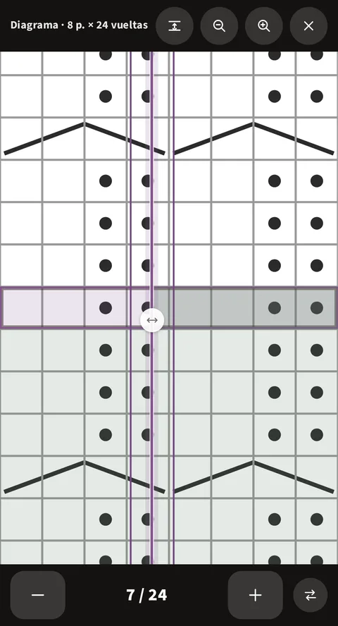

*El mando redondo, situado sobre la fila en curso: a su derecha, la parte de la fila ya hecha aparece teñida. Solo existe en esa fila.*

En un diagrama muy ancho, una vez hecho zoom, es fácil perder de vista
en qué punto vas. En pantalla completa aparece un **pequeño mando
redondo** sobre la fila en curso, y solo sobre ella. Lo arrastras de
derecha a izquierda (o al revés) siguiendo tus puntos: la parte de la
fila que deja atrás se tiñe, representando lo que ya has tejido.

Un botón junto al contador de fila invierte el lado teñido (útil cuando
la siguiente fila se lee en el otro sentido). El mando vuelve solo a su
sitio en cada fila nueva, y su posición se conserva incluso si sales de
la app. La primera vez que abres un diagrama, un pequeño aviso te
señala que está ahí, para que no se te pase.

### Corregir una línea sin salir de tu seguimiento

Estás siguiendo tu patrón y una línea está mal: la importación la cortó mal, o
quieres reformularla. No hace falta salir del proyecto para arreglarla.

**Toca la tarjeta** que lleva la línea. Sobre ella se pone un velo, con dos
botones: **Corregir** y **Cerrar**. La pantalla de corrección se abre entonces
directamente **en esa línea**: no tienes que buscarla por todo el patrón.

El velo no estorba tu labor: se retira solo al cabo de tres segundos, y un toque
en cualquier otro sitio lo hace desaparecer. Tocar otra tarjeta lo desplaza allí.
Y ningún toque en un **control** de la tarjeta lo pone: marcar una vuelta o tocar
una abreviatura desencadena la acción esperada.

**Tu cronómetro no cuenta el tiempo de la corrección.** Si está en marcha cuando
te vas a corregir, se **pausa**. A la vuelta, **arranca** de nuevo él solo. El
tiempo pasado en el editor no entra en tus estadísticas de labor.

A la vuelta, el lector te devuelve a la sección que acababas de corregir. La
corrección se hace en la misma pantalla que se describe en la sección 4 de más
abajo, con todas sus herramientas.

### En tableta

Una tableta sujeta en horizontal te da mucho más ancho que un teléfono, y
{app} lo aprovecha en dos sitios: en el lector de patrones y en la pantalla de
estadísticas.

**El lector, en dos paneles.**

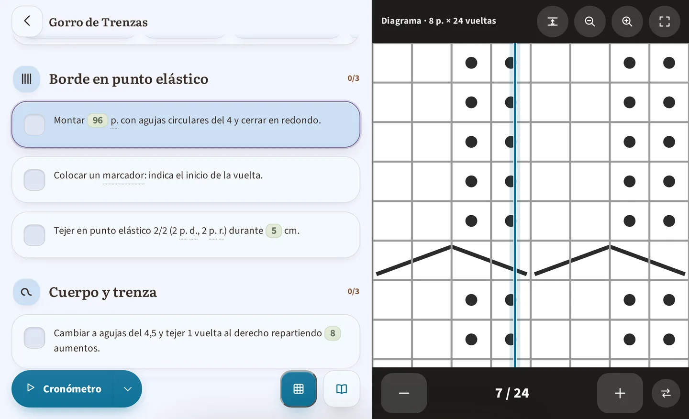

*En una tableta sujeta en horizontal: tus instrucciones a la izquierda, el diagrama mostrado de forma permanente a la derecha, sin tener que desplazarte entre los dos.*

Si tejes con una tableta sujeta en horizontal, el lector cambia solo a
**dos columnas**, tus instrucciones a la izquierda y un diagrama que
queda mostrado de forma permanente a la derecha: ya no tienes que
desplazarte entre los dos. Mantienes el control:

- En cualquier otro diagrama del patrón, el botón **Mostrar a la
  derecha** lo pasa al panel lateral (útil cuando un patrón contiene
  varios).
- El botón **Devolver al texto** cierra el panel y coloca de nuevo el
  diagrama en su sitio dentro del texto, por si prefieres leer todo en
  una sola columna.
- En el punto del texto donde estaba el diagrama, una nota te recuerda
  que **se muestra a la derecha**: nada desaparece sin avisarte.

Este ajuste solo dura mientras consultas el patrón: al volver a
abrirlo, aparece de nuevo el panel con el primer diagrama. En teléfono
(o en una tableta sujeta en vertical), el lector se queda en una sola
columna, como antes. Un patrón sin diagrama no tiene panel en absoluto.
El índice del lector, por su parte, sigue arriba de la columna de las
instrucciones, con los mismos puntos y el mismo gesto.

**Las estadísticas, con espacio.**

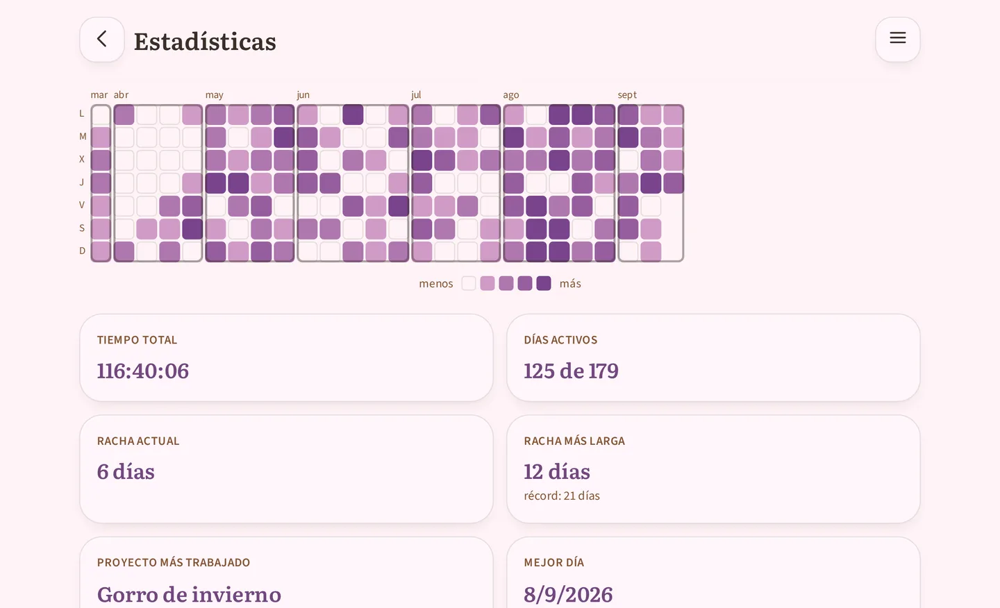

*Las estadísticas en una tableta sujeta en horizontal, en la ventana Semestre: la cuadrícula del calendario muestra los últimos seis meses de un vistazo, cuando en el teléfono hay que deslizarla con el dedo, y las casillas numéricas se colocan de dos en dos debajo.*

La pantalla **Estadísticas** (punto 7) también aprovecha el espacio: su
cuadrícula del calendario y sus casillas numéricas se despliegan en vez de
apretarse, y en las ventanas más largas, Semestre o Año, ves muchas más
semanas antes de tener que arrastrar la cuadrícula de lado. No hay nada más
que ajustar: es la misma pantalla, simplemente más cómoda.

## 4. Tu biblioteca de patrones

*La biblioteca, con los tres patrones de muestra incluidos desde el primer inicio.*

*La ficha de un patrón, deliberadamente sencilla: crear un proyecto, o previsualizar. (La corrección del import se abre desde la vista previa, o desde el menú de un proyecto en curso que use este patrón.)*

- **Importar un PDF**: sueltas el PDF de tu patrón y la app lo lee y
  **reconstruye automáticamente** las tallas, las filas y las secciones,
  sin conexión a internet: nada sale de tu dispositivo. El
  patrón **se une a tu biblioteca**, y ahí empieza tu trabajo: **cuenta
  con dedicarle un buen rato**. Un import casi nunca sale perfecto a la
  primera. Es normal: los PDF de patrones están maquetados cada uno a su
  manera. Lo relees, lo compruebas y lo corriges **desde la vista previa
  del patrón**, tantas veces como quieras, y es ese repaso el que marca la
  diferencia entre un patrón más o menos correcto y un proyecto que
  muestra las cifras y las explicaciones correctas.
  (La lectura también reconoce las rejillas redondas y cuadradas de los
  patrones granny, nunca perfectamente: el repaso sigue siendo obligado.)
- **Encontrar un patrón**: las etiquetas de categoría en la parte
  superior de la biblioteca te muestran **cuántos patrones** hay en
  cada una, para saber de un vistazo dónde buscar.
- **Corregir un patrón**: un editor a pantalla completa te permite
  retocar un patrón importado (texto, tallas, imágenes). Es un paso **con
  el que hay que contar**, no un rescate excepcional: la lectura automática
  nunca lo entiende todo perfectamente, y un patrón importado se retoma en la
  app antes de resultar de verdad agradable de seguir. Puedes volver a ello
  tantas veces como quieras, incluso mucho después del import. Es la otra
  operación técnica de la app, detallada más abajo.
- **El precio del patrón**: la ficha de un patrón también lleva su
  **precio**, que puedes indicar sin esperar a empezar un proyecto: en
  cuanto está ahí, aparece en la propia ficha del patrón («Comprado por
  18,90 € el 7/8/2026», o simplemente «Gratis») y cuenta en la
  pantalla **Gastos**.
- **Vista de patrón**: lectura sencilla para patrones sin formato
  especial, o patrones que has escrito enteramente a mano.
- **3 patrones de muestra** vienen con la app desde el primer inicio,
  para que descubras todas las funciones sin importar nada.

### El editor de corrección, en detalle

Es la operación más técnica de la app junto con la calibración de
diagramas (arriba): así es como funciona de verdad.

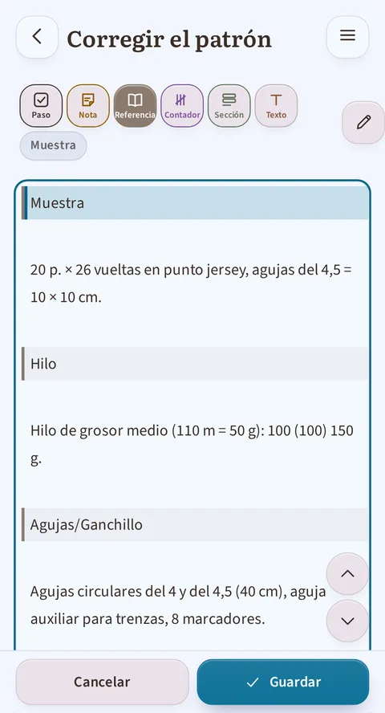

*El cursor está sobre una línea de referencia: el botón «Referencia…» aparece relleno, y «Muestra», su subcategoría, se muestra en cursiva justo al lado.*

**Las tallas del patrón, al principio de la pantalla.** El primer campo de la
pantalla de corrección se llama **Tallas del patrón**. Es el que le dice a la app
cuántas tallas ofrece tu patrón: escríbelas separadas por comas, «S, M, L». Ese
número manda sobre el ancho de la tabla de tallas. Sin este campo, una tabla que
la importación cortó mal se quedaba sin arreglo posible.
Una consecuencia que conviene saber: si **añades** una talla, la app no rellena
los números de puntos de esa talla. No se los inventa: el patrón no los lleva.
Una línea con tres tallas que pasas a cuatro se muestra por tanto como
«10 (12) 14 ()», siendo el paréntesis vacío la talla que aún espera sus cifras.
Escribirlas es cosa tuya.

**El principio.** Un patrón está formado por líneas de texto, y **cada
línea lleva una categoría** que le dice a la app para qué sirve: ¿una
casilla que marcar mientras tejes, un título de parte, o una simple
información de referencia? El import automático ya asigna una
categoría a cada línea al llegar. El editor te sirve para corregir las
que ha adivinado mal, y para retocar el texto si una frase se ha
cortado mal.

**Las categorías posibles:**

| Categoría | Qué da en tu proyecto |
|---|---|
| **Paso** | Una casilla que marcar al tejer o ganchillar, el corazón del seguimiento paso a paso. |
| **Contador** | Un paso repetido, con su propio contador. Dos variantes: **Repetición** (repetir la línea N veces) y **Cadencia** (repetir la línea cada X filas, N veces). |
| **Nota** | Un texto informativo mostrado en ese punto, sin casilla. |
| **Sección** | Un título de parte (Delantero, Manga, Cuello…), con su icono automático: es lo que divide tu patrón en la pestaña Secciones. |
| **Referencia** | Información de la ficha del patrón (hilo, agujas, tallas…), **no** forma parte del seguimiento paso a paso. Ocho subcategorías: **Hilo** (marca, material, metraje, cantidades), **Agujas/Ganchillo** (talla y tipo), **Muestra** (la medida de referencia, ej. «10 × 10 cm = 22 puntos»), **Material** (el resto: botones, marcadores…), **Consejos** (las recomendaciones del creador), **Abreviaturas** (una por línea), **Tallas** (la tabla de medidas finales, no las instrucciones por talla, que son Secciones), **Técnicas** (una técnica explicada). Estos bloques son los que rellenan la guía rápida del lector interactivo (sección 3 arriba). |
| **Texto** | Un párrafo simple, sin ningún rol particular, generalmente el texto de introducción o de cierre del patrón. |
| **Imagen** | Una foto o un diagrama. |

**La ayuda integrada.** La pantalla de corrección lleva su propia ayuda,
plegada en la parte superior bajo el título «Cómo corregir el patrón»: tres
pasos, y luego la misma información que la tabla de arriba (las categorías, y
las ocho subcategorías de referencia). Puedes desplegarla en cualquier
momento sin dejar tu trabajo, sin tener que volver a esta guía
en plena corrección. (Esta guía, en cambio, se lee *antes* de abrir la
pantalla, para saber si quieres lanzarte.)

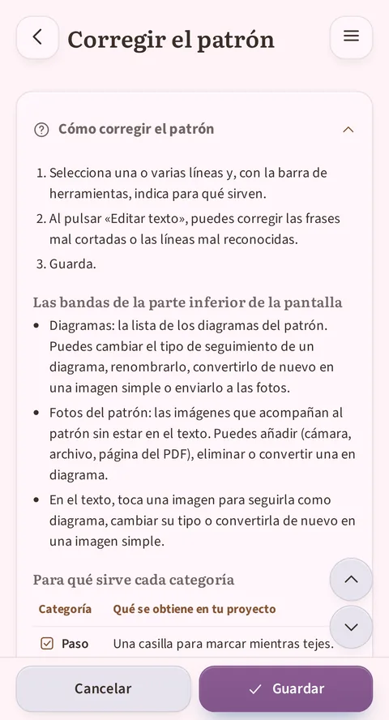

*La ayuda «Cómo corregir el patrón» desplegada: sus 3 pasos, y luego el comienzo de la tabla «Para qué sirve cada categoría».*

**Cómo cambiar la categoría de una línea:**

1. Pones el cursor en la línea (o seleccionas varias líneas a la vez).
   La barra de herramientas justo encima del editor resalta la
   categoría ya aplicada. Si es una referencia, se muestra además su
   **subcategoría**, en cursiva justo al lado de la barra («Hilo»,
   «Muestra»…): es lo que te dice en qué bloque de la ficha del patrón
   va a aterrizar la línea.
2. Tres botones compactos aplican directamente Paso (una casilla
   marcada), Nota (una hoja) o Texto (una «T»); cada uno muestra una
   breve etiqueta bajo el icono. Otros tres botones, más anchos, abren
   un menú de subcategorías, sus puntos suspensivos lo indican:
   **Contador…**, **Sección…**, **Referencia…**. Toca el que
   corresponda a lo que deba pasar a ser la línea.
3. El color y el aspecto de la línea cambian al instante para
   confirmarlo.

**Enviar texto a la guía rápida.** El menú **Referencia…** no se limita a marcar
la línea: **traslada** el texto seleccionado a la subcategoría elegida, y lo
vuelves a encontrar en la pestaña correspondiente de la guía rápida del lector.
Así es como ordenas lo que la importación dejó suelto a lo largo del patrón: un
glosario, una lista de material, una tabla de medidas.
Este gesto traslada el texto que has seleccionado, y solo ese. No toca las líneas
vecinas, y eres tú quien juzga la subcategoría: la app ordena donde tú le dices.

**Categorizar en varias pasadas.** Si envías una segunda selección a una subcategoría
que ya existe, **se añade** al bloque existente en vez de crear un segundo. Un
glosario repartido por tres páginas del patrón se categoriza así en tres pasadas, sin
reorganizar nada a mano.

**Lo que la app sabe separar sola.** Al llegar a la subcategoría, el texto se
compone siempre que su forma sea reconocible. «p - punto(s)» pasa a ser una
entrada de glosario, con su abreviatura a un lado y su definición al otro.
«Contorno de pecho 90 (100) 110» pasa a ser una fila de la tabla de tallas, una
columna por talla. Cuando la app no sabe separar una línea, nunca la tira: pone
una **plantilla** vacía con las columnas correctas, para que la rellenes a mano.

**Dos formas de ver el texto.** Por defecto, el editor te muestra una
**vista enriquecida**: las imágenes aparecen en miniatura, los
contadores como píldoras, las filas con su casilla: una vista previa
cercana a lo que verás de verdad. El botón **Editar texto** cambia al
texto plano (el marcado se hace visible) y abre el teclado: útil para
corregir una formulación, una errata, o una frase que el import cortó
mal en dos líneas.

**Reordenar sin cortar y pegar.** Dos flechas (subir/bajar) mueven la
línea donde tienes el cursor, práctico si el import colocó un paso o
un título de sección en el sitio equivocado.

**Convertir una foto en diagrama seguible (o al revés).** Dos formas de
hacerlo: tocar una imagen en el texto, o desplegar el panel **Diagramas** al
final del editor. Este panel lista cada sección del patrón que lleva una
imagen, los diagramas ya seguidos tanto como las fotos aún sin convertir.
El número entre paréntesis, por ejemplo «Diagramas (2)», cuenta todas esas
secciones, fotos incluidas: no dice cuántos diagramas se siguen ya. Para una
imagen aún sin
convertir, un botón **Seguir como diagrama** abre una elección de tipo, cada
uno explicado en lenguaje claro: filas estándar, radial cuadrado, radial
redondo o trazado, para adaptarlo a la forma real de tu motivo
(un granny cuadrado no se lee como filas estándar). Para una imagen que ya
se sigue como diagrama, una etiqueta **Diagrama interactivo** indica el
estado actual, junto a un botón **Cambiar tipo** (la misma elección, para
corregir un tipo mal adivinado) y un botón **Solo una imagen** para volver a
una simple foto, práctico si el import se ha saltado un diagrama, o al
revés, si quieres que una simple foto siga siendo una simple foto.

**Añadir imágenes: tres puertas.** En la galería de un patrón, desde su
ficha o desde el editor de corrección, el botón **Añadir una imagen**
ofrece tres fuentes: **Cámara o galería** (una hoja te deja elegir entre
hacer una foto y escoger entre tus imágenes), **Buscar archivos** (el
selector de tu dispositivo, para una imagen guardada en otro sitio), y
**Desde el PDF del patrón** cuando existe: allí eliges la página, y la app
te la hace recortar, la única fuente que pasa por ese recorte. Cada
imagen se une a la galería del patrón, lista para insertarse o seguirse.

**El menú de una imagen.** En el texto del editor, un toque sobre una
imagen abre un pequeño menú inmediato: **seguirla como diagrama** si aún
no lo es, o **cambiar su tipo** en caso contrario, rebajarla a simple
ilustración (**Solo una imagen**), o **enviarla a la galería** del patrón.
En la banda «Galería del patrón», cada imagen se elimina, se inserta en el
texto o se sigue como diagrama: los tres gestos en el mismo sitio.

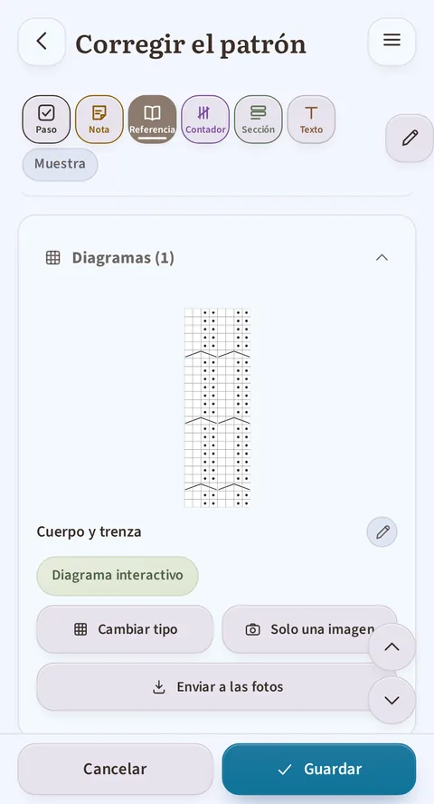

*El panel «Diagramas (1)» desplegado: la sección «Cuerpo y trenza», su estado actual («Diagrama interactivo») y los botones «Cambiar tipo» y «Solo una imagen».*

**Guardar.** Los botones **Cancelar** / **Guardar** están fijos al pie
de la pantalla. Si intentas salir con cambios sin guardar, la app
detiene la salida y te pide confirmación: tampoco aquí se te pierde
nada por error.

## 5. Tu stock de lana

*El stock: los totales arriba (ovillos, longitud, peso, valor), y luego una ficha por lana con su estado, libre o reservada por un proyecto.*

- **Añadir un ovillo**: marca, grosor (con una ayuda para entender las
  categorías de grosor), composición (elegida en una lista; si un
  material no aparece, «Otro» te permite escribirlo, y a partir de ahí
  se te ofrece como los demás), color (elegido en una paleta, con un
  selector de tono personalizado si hace falta), cantidad, precio,
  longitud y peso por ovillo, más la fecha de compra y el número de
  baño de tinte.
  **En cuanto guardas, la app registra al instante la compra
  correspondiente**, y tu presupuesto gastado (punto 1) sube por el
  importe indicado. La fecha que te propone es la de hoy: si compraste
  esa lana hace más tiempo, puedes corregirla directamente en el
  formulario. (Estos dos campos solo aparecen al crear la ficha. En una
  ficha ya guardada, es el bloque **Compras y regalos** el que se
  encarga, con una línea por adquisición.)
- **Las lanas que no son de un solo color**: un campo **Tipo de color**
  (liso, degradado, autorrayado, jaspeado, teñido a mano) y un campo
  **Descripción del color** («azul, verde, amarillo jaspeado de negro»)
  completan la pastilla de color: un solo tono no basta para
  describir una lana multicolor. El tipo de color aparece también en
  la búsqueda y en la exportación a hoja de cálculo.
- **Las características de tu lana**: ocho etiquetas que marcar, en dos
  grupos que no quieren decir lo mismo. Un **compromiso** es lo que tú sabes
  de tu lana; una **certificación** es un sello que otorga un organismo
  externo.
  - **Compromisos**: Vegano · Reciclada · Ética · Sin mulesing.
  - **Certificaciones**: Sin sustancias nocivas (OEKO-TEX) · Fibras
    biológicas (GOTS) · Bienestar ovino (RWS) · Reciclado certificado (GRS).
  - **El origen se deduce solo** de la composición, sin marcar nada: «Fibra
    animal», «Fibra vegetal», «Fibra sintética», «Mezcla animal y vegetal».
    Cuando la app no puede concluir con todas las fibras introducidas, lo
    dice («Origen incompleto») en vez de adivinar: es intencionado.
  - **El aviso vegano**: si marcas Vegano en una lana que contiene una fibra
    animal, la app te lo señala («Esta lana contiene … (fibra animal). La
    etiqueta vegana parece contradictoria: revisa la composición.») sin
    impedirte guardar: te avisa, no decide por ti.
  - **Encontrar tus lanas**: estas etiquetas se encuentran en el filtro del
    stock (el criterio «Etiqueta») y en la búsqueda por texto.
  - Estas características salen también en la **exportación a hoja de
    cálculo**.

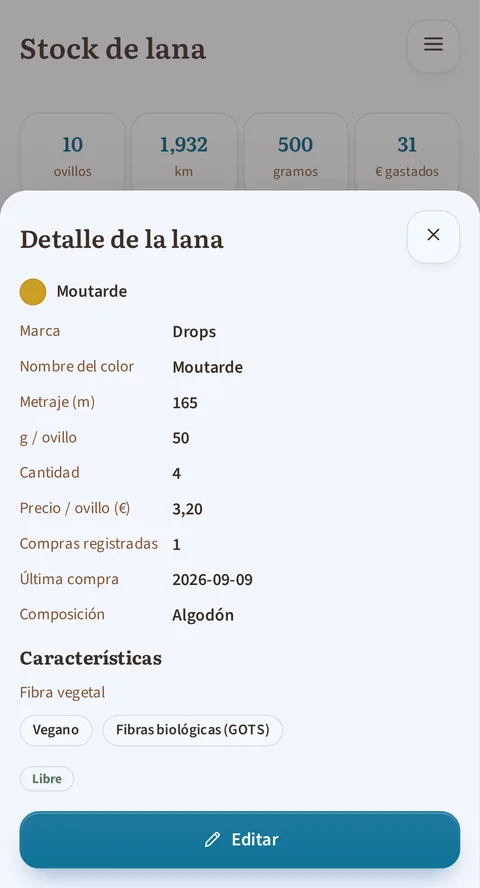

*La ficha de una lana: su composición, la mención «Fibra vegetal», y sus dos etiquetas «Vegano» y «Fibras biológicas (GOTS)».*

- **El resumen** en la parte superior de la pantalla: número de
  ovillos, longitud y peso acumulados (que cambian solos a km y kg
  cuando los totales crecen), y el valor total de tu stock.
- **Buscar, filtrar, ordenar**: un campo de búsqueda y los botones
  **Filtrar** y **Ordenar** en la parte superior del stock. Filtrar abre una
  ventana de dos niveles: la lista de seis criterios (**Marca**,
  **Etiqueta**, **Grosor**, **Peso del ovillo**, **Color**, **Composición**),
  y luego, para el criterio tocado, sus valores. Una sola elección por
  criterio, pero los criterios se acumulan; una pastilla en el botón Filtrar
  cuenta los filtros activos, y **Restablecer** los borra de un gesto.
  Ordenar propone **Marca** (por defecto), **Grosor** o **Fecha de compra**.
  Nada de esto se memoriza: cada vuelta al stock parte sin filtro, ordenado
  por marca. Lista o cuadrícula visual, a elegir.
- **Editar, duplicar o eliminar** una ficha desde el menú **Acciones**
  (icono vertical de tres puntos) de su tarjeta. «Duplicar» te resulta
  útil para la misma lana en otro color: se copia todo, solo te queda
  cambiar el color.
- **El fondo común de ovillos**: ves de un vistazo, para cada lana,
  cuántos ovillos tienes **reservados** para un proyecto y cuántos
  **libres**. No puedes bajar la cantidad por debajo de lo ya
  reservado (la app te indica cuántos ovillos quedan retenidos); y te
  avisa si restaurar un proyecto desde la papelera pone en duda tus
  reservas de lana. El proyecto vuelve igualmente, con una
  reserva reducida y un mensaje que te lo explica.
- **Ficha de detalle** de una lana: un resumen completo (ovillos,
  metros, proyectos que la usan), y un bloque **Compras y regalos** que
  guarda para ti el registro de cada adquisición de esa lana:
  - Cada línea lleva una cantidad, un precio, una fecha y un baño de
    tinte, e indica si fue una **compra** o un **regalo** (un regalo
    nunca cuenta en tu presupuesto gastado). Las tres líneas más
    recientes las ves de inmediato, el resto se despliega con un
    gesto.
  - Una línea la puedes **añadir, editar o eliminar** en cualquier
    momento.
  - **Si aumentas la cantidad** de una lana desde su ficha, la app te
    propone registrar la compra correspondiente, fechada hoy: puedes
    aceptarla, marcarla como regalo, o descartarla si no quieres
    conservarla. **Disminuir una cantidad, en cambio, nunca toca tu
    presupuesto gastado**: solo un aumento puede crear una compra.
  - Si el número de ovillos de la ficha no coincide con lo que
    registra el historial (por ejemplo tras una corrección manual del
    stock), un aviso te lo señala y un botón **Corregir** te ofrece
    dos soluciones: añadir la compra que falta, o ajustar la cantidad
    mostrada.
  - Una compra conserva su etiqueta aunque elimines definitivamente la
    ficha de la lana: ninguna compra de lana desaparece, sigue visible
    en la pantalla **Gastos**.

### La pantalla Gastos

*Los menús Año y Tipo arriba, el total con su desglose lana / patrones, y luego el detalle por mes.*

Accesible tocando el presupuesto gastado en el inicio (punto 1), esta
pantalla te resume todo lo que has pagado por tejer o ganchillar, tanto la
**lana** como los **patrones**:
- El **total gastado**, por moneda si has usado más de una. Mientras no
  hayas anotado ningún precio de patrón, este total sigue siendo
  exactamente el que conoces; en cuanto aparece un patrón en él, se
  desglosa en dos sublíneas: lo que fue a lana, lo que fue a patrones.
- Dos menús arriba: **Año** solo muestra el año elegido (o «Todos los
  años»), **Tipo** solo muestra una categoría (o todo). Los totales se
  recalculan en consecuencia. Las compras cuya fecha no hayas
  registrado acaban bajo «Fecha desconocida», que se añade al menú
  Año cuando las hay.
- Un **desglose por año y luego por mes**, lana y patrones mezclados en
  el orden del calendario: ves de un vistazo lo que te costó un mes.
- En cuanto aparece un patrón en la lista, cada línea lleva además su
  etiqueta, **Lana** o **Patrón**. Un patrón que has declarado gratuito
  aparece con la mención **Gratis**: es la huella de que lo has
  comprobado, no un olvido.
- La **lista completa** de todas tus compras y regalos, incluidos
  aquellos cuya ficha de lana hayas eliminado después (marcados como
  «Lana eliminada»).
- La posibilidad de **eliminar** una línea de lana directamente desde
  esta pantalla, con opción de **deshacerlo** justo después si fue un
  error. Una línea de patrón, en cambio, se modifica desde la ficha del
  patrón: un toque te lleva allí.

> **Para que lo sepas**: una compra de lana sobrevive a la eliminación
> de su ficha y sigue visible aquí. El precio de un patrón, en cambio,
> pertenece al patrón: si eliminas el patrón, su gasto desaparece con
> él.

## 6. Herramientas independientes

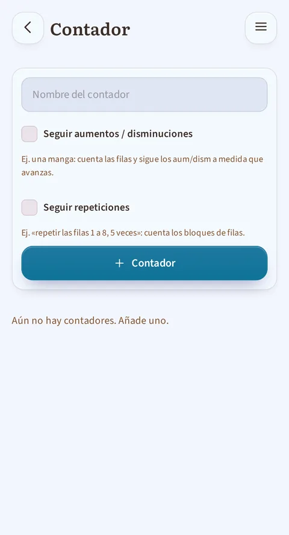

*El contador libre, utilizable sin proyecto: le das un nombre y eliges si sigue aumentos/disminuciones o repeticiones.*

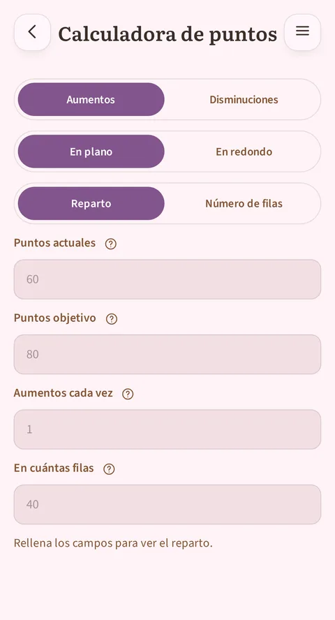

*La calculadora de puntos: repartir aumentos o disminuciones entre un número de filas, o averiguar cuántas filas necesitas a un ritmo dado, en plano o en redondo.*

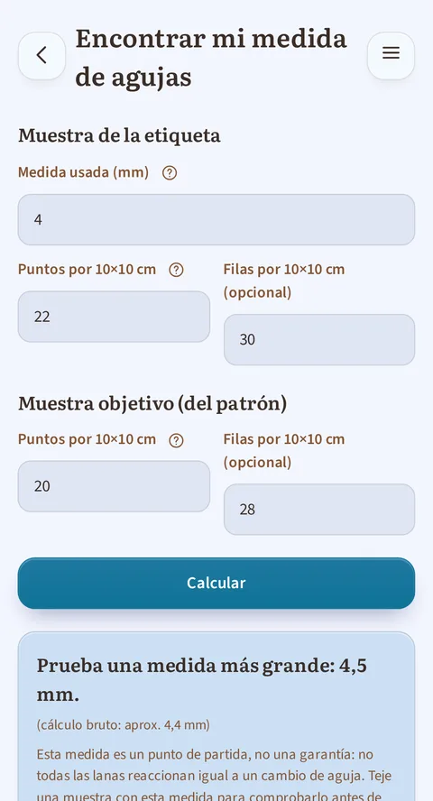

*Encontrar mi medida de agujas, con los campos rellenados: lo que dice la etiqueta de tu ovillo, la muestra que pide el patrón y, justo debajo, la respuesta de la app. En ganchillo, la misma pantalla habla de ganchillos.*

Estas herramientas funcionan sin estar ligadas a un proyecto concreto,
accesibles desde el inicio:
- **Calculadora de puntos**: responde en los dos sentidos. O le das un número
  de filas y te dice cómo repartir en ellas tus aumentos o disminuciones; o le
  das tu ritmo («cada 4 filas») y te dice cuántas filas necesitas para llegar a
  tu número de puntos objetivo, y en qué fila cae el último cambio. Un campo
  indica cuántos puntos añades o quitas cada vez: normalmente 1, o 2 en una
  manga donde aumentas un punto a cada lado. Cuando tu objetivo no se alcanza
  exacto, te propone las dos posibilidades que lo rodean en vez de redondear
  sin decirlo. En plano habla de filas; en redondo, de vueltas.
- **Contador libre**: uno o varios contadores independientes (+/−, un
  objetivo por alcanzar, reinicio), para todo lo que no pertenezca a
  un proyecto guardado.
- **Encontrar tu talla de agujas (o de ganchillo)**: introduces lo que
  viene escrito en la etiqueta del ovillo (talla de aguja recomendada
  y número de puntos por 10 × 10 cm, o 4 × 4 pulgadas) y luego la
  muestra que pide tu patrón, y la app te dice por qué talla empezar:
  una por encima, una por debajo, o la misma. También te avisa
  cuando la diferencia es demasiado grande para compensarla (esa lana
  no combina con ese patrón), y te recuerda siempre que te queda por
  tejer una muestra para comprobarlo: es un punto de partida, no una
  garantía. El campo de las filas es opcional.

## 7. Estadísticas

*El selector de arriba elige una ventana de observación (Mes, Trimestre, Semestre o Año), y toda la pantalla se ajusta a ella; aquí, la ventana Trimestre. La pestaña «Calendario», mostrada por defecto, muestra la cuadrícula y las nueve casillas numéricas.*

El selector de la parte superior de la pantalla ya no elige simplemente una
duración de visualización: elige una **ventana de observación** (Mes,
Trimestre, Semestre o Año). Todo lo que sigue se ajusta a ella, del tiempo
total a las nueve casillas numéricas. Justo debajo, un filtro
**Todo / Punto / Ganchillo** restringe
toda la pantalla a una sola técnica; no se memoriza y vuelve a «Todo» cada
vez que regresas a esta pantalla, igual que el panel lateral del lector.
Este filtro solo aparece si tus proyectos abarcan **las dos técnicas**: si
son todos de punto (o todos de ganchillo), no aportaría nada, así que no
ocupa espacio.

Un matiz cuando un filtro está activo: la casilla **Media por día activo**
muestra un guion. Los días contados pueden incluir jornadas en las que
avanzaste en la otra técnica (el registro solo guarda la fecha, no lo que
hiciste ese día), y dividir un tiempo entre esos días daría una cifra exacta
pero engañosa.

El resto de la pantalla se reparte en **dos pestañas**, que se cambian al
**tocar** (nunca al deslizar: la propia cuadrícula se desplaza
horizontalmente en Semestre y Año, para no confundir los dos gestos):
- **Calendario** (mostrada por defecto, la de la captura de arriba): la
  cuadrícula y las nueve casillas numéricas.
- **Ritmo**: las barras por periodo, y luego siete barras, una por día de
  la semana, y una frase que nombra tu día más constante en todo tu
  historial.

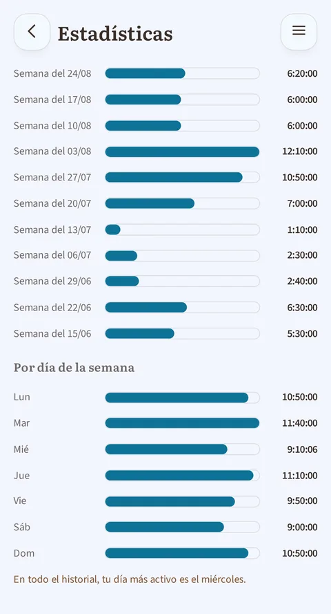

*La pestaña «Ritmo»: las barras del tiempo dedicado por periodo, las siete barras por día de la semana y la frase que nombra tu día más constante.*

La **cuadrícula** muestra una casilla por día, del primer día de tu semana
(arriba) al último (abajo), a lo largo de toda la ventana elegida; ese
primer día es lunes por defecto, o domingo si lo elegiste en Ajustes (§8).
Su color sigue el tono
de acento elegido en los ajustes (§8), y su intensidad depende de cuánto
tiempo tejiste o ganchillaste ese día, en cinco niveles: nada, menos de 30
minutos, de 30 minutos a 1 hora, de 1 a 2 horas, 2 horas o más. Los umbrales
son **fijos**: una casilla oscura siempre significa lo mismo, mes tras mes,
incluso en un trimestre más tranquilo de lo habitual. Un trazo más marcado
rodea las columnas de un mismo mes, para reconocerlas de un vistazo.

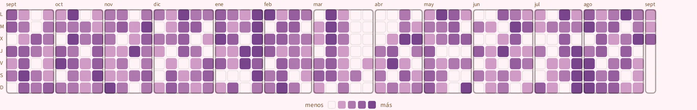

*La cuadrícula en la ventana Año: un año completo de un solo vistazo, una columna por semana y una casilla por día, con los marcos que separan los meses. Toca la imagen para ampliarla y leerla en detalle.*

Al tocar una casilla se **marca** (queda visiblemente seleccionada) y se
muestra, debajo de la cuadrícula, su fecha, su duración y, cuando más de un
proyecto avanzó ese día, la lista de cada uno con el tiempo que le
correspondió. Un segundo toque sobre la misma casilla la borra.

Lo que la **racha** cuenta son los días en los que registraste **al menos
una acción**: una sesión, cronometrada o añadida a mano, una fila marcada, un
contador de proyecto avanzado. Y abrir la aplicación sin hacer nada en ella
no cuenta: se necesita una acción **registrada**.

## 8. Ajustes

*La parte superior de ajustes: nombre, técnica por defecto, tema, color ambiental, primer día de la semana, idioma, unidades y moneda. Más abajo están la carpeta de copia de seguridad y la papelera.*

- **Perfil**: tu nombre (usado para el saludo en el inicio) y tu
  técnica por defecto (punto o ganchillo).
- **Apariencia**: tema claro, oscuro, o según el de tu dispositivo.
- **Color ambiental**: diez tonos propuestos de un toque, o cualquiera sobre
  el deslizador continuo. Mientras no hayas elegido nada, el color **sigue a
  tu tema** y cambia solo con el modo claro u oscuro; en cuanto eliges, tu
  elección manda y se mantiene igual en los dos modos. Ese tono colorea los
  botones, las selecciones, las barras de progreso y la cuadrícula de las
  estadísticas (§7).
- **Primer día de la semana**: lunes (por defecto) o domingo. Esta elección
  gobierna la cuadrícula calendario y las siete barras por día de la semana
  de la pantalla Estadísticas, así como el reinicio semanal del total «esta
  semana» en el inicio.
- **Idioma**: francés, inglés, alemán o español. Cada idioma aparece
  escrito en su propio idioma en la lista («Deutsch», «Español»), para
  que encuentres el tuyo con facilidad.
- **Unidades y moneda**:
  - **Métrico** (metros, gramos) o **imperial** (yardas, onzas,
    libras); todo sigue: la entrada de tus ovillos, los totales del
    stock, la muestra (10 × 10 cm o 4 × 4 pulgadas). Cambiar de
    sistema no modifica ninguna de tus cifras guardadas, solo te las
    muestra de nuevo en la otra unidad.
  - **Moneda** entre cinco (€, $, £, CHF, CA$). Ojo, es solo una
    etiqueta: los precios que ya has introducido **no se convierten**,
    se muestran con el otro símbolo, y la app te lo recuerda antes de
    confirmar.
  - Estos dos ajustes se te proponen ya **desde la primera pantalla**
    al abrir la app, rellenados de antemano según el idioma de tu
    dispositivo; puedes cambiarlos aquí en cualquier momento.
- **Datos**:
  - Exportación de tu stock, tus proyectos o tus patrones a hoja de
    cálculo (CSV), para consultarlos o guardarlos en otro sitio. Las
    columnas siguen tus ajustes actuales: longitudes y pesos en el
    sistema de unidades elegido, precios con el símbolo de la moneda
    elegida.
  - Una **papelera** universal: todo proyecto, lana o patrón eliminado
    acaba ahí y puedes restaurarlo en cualquier momento (hasta que la
    vacíes a propósito).
- **Carpeta {app}**: todo lo que tejes o haces a crochet solo existe dentro
  de esta app, en tu dispositivo, en ningún otro sitio. La carpeta de copia
  de seguridad guarda todo tu trabajo, escrito **de forma continua**
  (nunca tienes nada que activar ni en qué pensar), para recuperarlo si
  pierdes el dispositivo, si se rompe o si reinstalas la app. La eliges una
  sola vez, en el primer arranque; se cambia más adelante en Ajustes, con el
  botón **Cambiar de carpeta**.
  - **Una carpeta de copia sirve para un solo dispositivo.** Ponerla en
    una carpeta sincronizada para tener una copia en otro sitio es buena
    idea; usarla desde un teléfono **y** una tableta no lo es: cada uno
    borraría el trabajo del otro. Un segundo dispositivo necesita su
    propia carpeta.
- **Contribuir**: enlace al código fuente (la app es de código abierto), y
  otros dos enlaces en el mismo bloque de los ajustes:
  - **Apoyar a {app}** lleva a una página de donaciones, **libre**: no se
    desbloquea nada a cambio, ninguna función queda reservada a quien
    dona.
  - **Sugerir una mejora** te abre una forma de enviar un comentario.

### Qué pasa en el primer arranque

Por orden, la primera vez que abres {app}: la pantalla de bienvenida te pide
tu nombre, tu técnica, tu idioma, tu tema, tus unidades y tu moneda; después
llega la pantalla de la carpeta de copia de seguridad, descrita justo arriba.
A continuación te saludan tres mensajitos, **una sola vez cada uno**: no
volverás a verlos.

- Una **bienvenida**, en el centro de la pantalla de inicio en cuanto tu
  carpeta de copia de seguridad está lista: te dice que todo está preparado y
  te invita a abrir los proyectos y los patrones de ejemplo para hacerte a la
  app. Su botón la cierra, y no vuelve.
- Un **aviso sobre los patrones importados**, la primera vez que abres tu
  biblioteca de patrones: te recuerda que la app lee tu PDF por su cuenta y que
  a veces se equivoca (una vuelta saltada, dos tallas mezcladas, una tabla
  mal separada), y que un patrón importado se relee antes de seguirlo. Su botón
  «Entendido» lo cierra; «Cómo corregirlo» te abre la sección de esta guía que
  habla de tu biblioteca de patrones.
- Un **consejo de navegación**, la primera vez que abres un proyecto, vas a la
  biblioteca de patrones o vas al stock de lana, la primera de las tres: te
  explica que puedes deslizar hacia la derecha para volver atrás, y
  arrastrar con el dedo una fila de pestañas o de categorías más ancha que la
  pantalla. Aparece **una sola vez en total**, no una vez por pantalla; el
  botón «Entendido» la cierra.

## 9. Bajo el capó: lo que {app} te garantiza

- **Sin conexión por defecto**: ningún dato tuyo sale nunca del
  dispositivo, salvo la carpeta de copia de seguridad que **tú eliges**.
- **Sin cuenta, sin muro de pago**: todas las funciones anteriores son
  gratuitas, sin ninguna función esencial bloqueada.
- **Nada se pierde por error**: cada eliminación la puedes deshacer al
  instante, y de todos modos acaba en la papelera.
- **Pensada para que todo el mundo pueda leerla**: contrastes
  suficientes, botones lo bastante grandes para tocarlos con
  facilidad, compatible con lectores de pantalla.
- **Cómoda en cualquier pantalla**: en un teléfono pequeño nada se sale
  ni se corta; en una tableta, la app aprovecha el espacio: tus
  listas de proyectos y patrones se reparten en varias columnas en
  lugar de una sola pila larga, y el lector puede mantener el diagrama
  junto al texto. La app tiene en cuenta las zonas reservadas de la
  pantalla (barra de estado, muesca, barra de navegación): el
  contenido ya no se desliza debajo de ellas.
- **Una política de privacidad en claro**: desde la pantalla Acerca de, dice
  dónde viven tus datos, qué puede salir de tu teléfono y en qué casos, qué
  pasa si desinstalas la app, y quién responde de ello: el responsable y la
  dirección de contacto aparecen nombrados. Está escrita en tu idioma.
- **En cuatro idiomas**: francés, inglés, alemán y español.
