# Guide {app}

## L'esprit de {app}

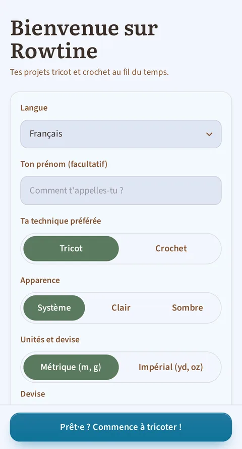

*La toute première ouverture : prénom, technique, langue et thème.*

{app} t'aide à garder tous tes projets de tricot et de crochet au même endroit :
ta laine, tes patrons adaptés à ta taille et ta progression. Elle est **gratuite,
libre et fonctionne hors ligne** : tes données restent sur ton appareil, pas sur
un serveur. Rien n'est jamais perdu par erreur : tout ce que tu supprimes se
retrouve dans une corbeille.

## 1. L'accueil : ton tableau de bord

*L'accueil : la tuile « Reprendre » ramène au dernier ouvrage travaillé, le tableau de bord résume l'essentiel jusqu'aux dernières sessions, et les trois outils sont à portée de pouce.*

En ouvrant l'app, tu retrouves :
- **Ton dernier projet**, avec un bouton **Reprendre** pour repartir directement
  là où tu en étais. C'est bien le dernier projet sur lequel tu as
  **réellement tricoté ou crocheté** (ta dernière session), pas simplement le dernier que tu as modifié, et la tuile t'indique le rang en cours.
- Un **récapitulatif** : combien de projets sont en cours, ton temps passé à
  tricoter ou crocheter cette semaine (avec le détail dans **Statistiques**),
  et ton **budget dépensé** : le total de tout ce que tu as payé pour ta
  laine depuis que tu utilises l'app, dans la devise que tu as choisie. Ce
  chiffre ne redescend jamais tout seul : consommer une pelote ou terminer un
  projet ne le fait pas baisser (seul un nouvel achat le fait monter) ; il ne
  peut baisser que si tu supprimes ou corriges toi-même une ligne d'achat
  dans le bloc « Achats et cadeaux » d'une fiche de laine (point 5). (Si tu as
  plusieurs devises, chacune a son propre total : l'app ne les mélange pas,
  faute de connaître un taux de change.) En touchant ce chiffre, tu ouvres
  l'écran **Dépenses**, décrit au point 5. Cette tuile n'apparaît pas tant
  qu'aucun achat n'a encore été enregistré (par exemple sur une app toute neuve) ; l'écran reste joignable par le menu à tout moment.
- Ce chiffre est différent de la **valeur de ton stock**, affichée dans
  l'écran **Stock de laine** (point 5) : celle-là suit ce que tu as
  actuellement dans tes placards et baisse quand tu utilises une pelote. Les
  deux chiffres cohabitent volontairement : l'un raconte ce que tu as
  dépensé, l'autre ce qu'il te reste.
- Les **dernières sessions** : dès que tu as tricoté ou crocheté au moins une
  fois, une tuile liste tes deux sessions les plus récentes : le nom du projet, le jour (« Hier », « Il y a 3 jours »…) et la durée. Un appui dessus ouvre
  l'écran **Sessions** (point 2), qui rassemble tout ton historique.
- Tous tes projets, **groupés par statut** (en cours, à faire, en pause, terminé,
  abandonné), avec un bouton pour tout voir ou replier la liste.
- Sur une carte de projet, une **icône vegan** signale les projets dont toutes les
  laines sont vegan (elle reste affichée sur les projets terminés). Elle n'apparaît
  que si le projet a au moins une laine et qu'elles portent toutes l'étiquette Vegan.
- Sur un projet **Terminé**, la tuile affiche sa **date de fin** juste après la technique et la taille (« Tricot · M · Terminé le 15/07/2026 ») dès qu'une date a été saisie. Elle se renseigne toute seule quand tu marques le projet Terminé (voir point 2), et n'apparaît jamais sur un projet Abandonné.
- Un accès rapide aux **outils** (calculateur de mailles, compteur libre, aide
  aiguilles/crochet) et au bouton **+ Créer un projet**.
- Enfin, **le menu en haut à droite** mène à tout moment au stock de laines, à
  la bibliothèque de patrons, aux statistiques, **aux sessions**, aux dépenses,
  à ce guide, aux réglages et à l'écran À propos. Il est présent sur tous les
  écrans : où que tu sois dans l'app, tu peux repartir ailleurs sans revenir à
  l'accueil.

## 2. Tes projets, le cœur de l'app

*La fiche d'un projet : sa progression globale, le bouton « Suivre le patron », puis une tuile par section avec sa propre avancée et sa case « faite ». Le chrono flotte en bas de tous les onglets.*

### Créer, modifier, supprimer

Un projet se crée en quelques secondes : nom, technique (tricot ou crochet),
patron associé (ou « Patron libre » si tu n'en utilises pas). Si tu choisis un
patron existant, l'app **préremplit** pour toi les tailles, les aiguilles ou le
crochet, la jauge et le type : tu n'as plus qu'à ajuster. Un projet supprimé n'est **jamais
perdu tout de suite** : tu peux toujours l'annuler juste après, ou le restaurer
plus tard depuis la corbeille (réglages).

Tu peux aussi noter le **prix du patron** si tu l'as acheté, ou appuyer sur **Gratuit** si tu l'as téléchargé sans payer. Ce prix appartient au **patron**,
pas au projet : si tu tricotes trois fois le même modèle, il ne compte qu'une
seule fois dans tes dépenses. Laisser le champ vide, c'est simplement ne rien
déclarer. Si ton projet utilise le « Patron libre », ce champ n'apparaît même
pas : il est commun à tous tes projets sans patron, il ne peut donc pas avoir
de prix à lui.

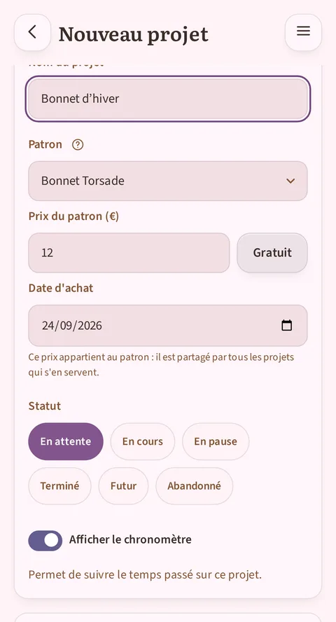

*Sous le choix du patron : son prix, un bouton « Gratuit » et la date d'achat, pré-remplie à aujourd'hui.*

### La fiche projet, à onglets

- **Sections** : les étapes de ton ouvrage (devant, dos, manche…), avec un badge
  de statut (à faire / commencé / en cours / terminée) et, quand le patron a un
  diagramme, un aperçu du diagramme associé.
- **Détails** : toutes les infos du projet (technique, tailles, aiguilles ou crochet, jauge, dates de début/fin, ta note en étoiles et une note personnelle). La date de fin se renseigne toute seule quand tu passes le
  projet à Terminé ; et si tu préfères la saisir toi-même, taper une date de fin termine le projet à ta place. Les deux se répondent, sans jamais s'écraser l'une l'autre.
  Tu y vois aussi le **coût du projet** : le prix des laines que tu lui as réservées ou
  déjà tricotées, et entre parenthèses le prix du patron, que tu ne paies qu'une fois,
  même si tu tricotes le même patron trois fois. Si une laine n'a pas de prix noté, l'app
  te le dit au lieu de faire comme si elle était gratuite.
- **Galerie** : tes photos du projet, plus les photos d'origine du patron en
  dessous. Tu choisis laquelle sert de **photo de couverture** (par défaut,
  la première photo du patron). Tape sur une photo pour l'ouvrir en plein
  écran : tu peux alors zoomer (pincer à deux doigts ou double-tap) pour
  étudier un détail de maille, te déplacer dans l'image agrandie, puis
  refermer avec le bouton ×.
- **Sessions** : l'historique de tes sessions de tricot/crochet, avec la durée de
  chacune, et la possibilité d'ajouter une session
  manuellement (si tu as tricoté sans l'app ouverte). La session en cours
  s'y voit aussi, en direct.
- **Stats** : les chiffres de ce projet-là (temps total, nombre de sessions, pelotes
  utilisées, période, meilleure série de jours actifs) et sa grille calendaire, puis
  le bouton **Partager**, qui ouvre le composeur de badge décrit un peu plus bas.

### Travailler en direct : la session

Partout dans le projet, un **chrono** flotte en bas de l'écran : la même pastille
sur la fiche, quel que soit l'onglet, et dans le lecteur. Un chevron sur la
pastille ouvre un petit menu où « Masquer le chrono » le fait disparaître ; il
revient par le menu **Actions** (icône verticale à trois points) de la
fiche projet ou la case à cocher
« Chrono » du formulaire d'édition.
- Un seul chrono par projet, et il **ne se lance jamais tout seul** : c'est toi qui
  appuies dessus quand tu commences, et qui le remets en pause pour une
  interruption (le bouton affiche alors **Reprendre** avec le temps déjà compté).
- Pas de bouton **Arrêter** : la pause est le seul geste en cours de route. Le chrono accompagne tout ce que tu fais dans le projet, fiche, lecteur, édition ou correction, et son temps s'écrit au fur et à mesure : chaque pause (bouton,
  départ en correction, sortie du projet) verse le temps écoulé depuis la
  dernière écriture. Sortir du projet ou masquer le chrono clôt la session, et
  le confirme d'un « Temps enregistré » avec le total.
- Une fois lancé, il survit à tout : écran éteint, appli changée, appareil redémarré. Il retrouve toujours le fil.
- Dans le lecteur, tu **coches les rangs** au fur et à mesure, avec tes
  instructions affichées (jusqu'à 8 lignes visibles, reprise automatique là où tu
  en étais).
- Tu gères des **compteurs** multiples par projet (mailles, rangs, répétitions…),
  chacun avec un bouton + et − et une correction possible en cas d'erreur de
  frappe.
- La session vit dans l'onglet **Sessions** de la fiche projet : sa ligne
  apparaît dès le démarrage du chrono, son temps y défile, figé sous un badge « en pause » pendant une interruption. Une reprise moins de deux heures
  après la dernière écriture reprend la même ligne, où le temps se cumule ;
  au-delà, une nouvelle session commence.

### Toutes tes sessions, au même endroit

L'onglet Sessions d'une fiche projet trace tout le temps passé sur ce projet. Pour revoir tout ton
historique, tous projets confondus, le menu de l'app ouvre l'écran **Sessions**, entre Statistiques et Dépenses. Chaque session s'y affiche, de
la plus récente à la plus ancienne : le nom du projet, puis la date et la
durée. Un appui sur une ligne ouvre la fiche du projet concerné.

Cet écran ne fait que consulter : c'est sur la fiche du projet, dans son onglet
Sessions, qu'une session se rectifie ou s'efface. Pas de filtre, pas de regroupement : c'est une première version, volontairement simple.

### Partager un badge de ton projet

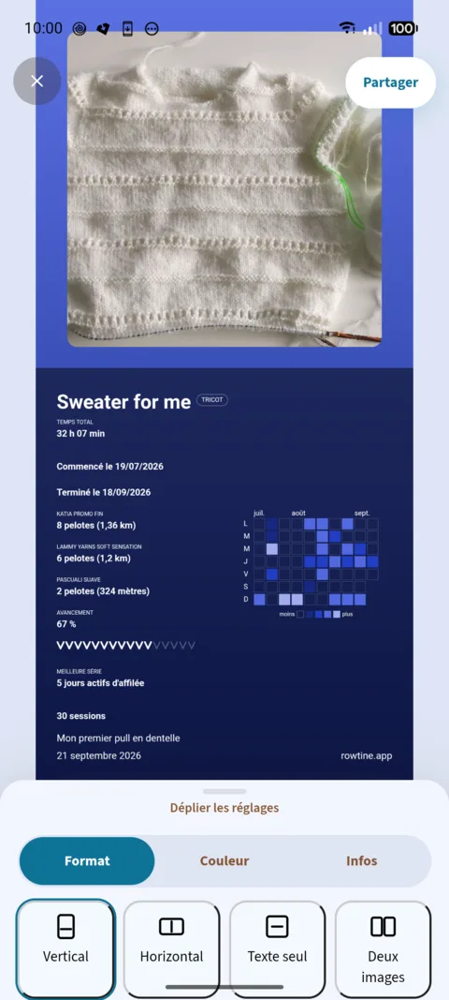

*L'écran de partage, ouvert depuis l'onglet Stats ou le menu de la fiche projet.*

Depuis l'onglet **Stats** d'un projet, le bouton **Partager** (ou l'entrée **Partager** du
menu de la fiche, en haut à droite, depuis n'importe quel onglet) compose une image à envoyer
à qui tu veux : ton ouvrage, ses chiffres, aux couleurs de ton choix. L'écran montre
par défaut l'image de couverture du projet et un tiroir de réglages en bas.

Le tiroir de réglages a trois onglets :
- **Format** : quatre gabarits. **Vertical** (la photo en haut, les chiffres dessous),
  **Horizontal** (la photo à gauche, les chiffres à droite), **Texte seul** (sans photo,
  utile pour un projet qui n'en a pas encore) et **Deux images** (deux photos côte à
  côte, par exemple un avant et un après). Si ton projet a une photo de couverture, le
  badge s'ouvre en Vertical avec elle ; sinon en Texte seul.
- **Couleur** : une palette de teintes, un bouton + pour en choisir une autre librement,
  et, au-dessus, les dernières couleurs que tu as réellement utilisées pour un badge.
- **Infos** : ce que le badge doit contenir. Chaque pastille montre la valeur réelle du
  projet (temps total, dates de début et de fin, laines utilisées avec leurs pelotes,
  avancement tant que le projet est en cours, meilleure série, nombre de sessions, technique crochet ou tricot) :
  appuie dessus pour l'inclure ou la retirer. La pastille **Carte calendaire** ajoute la
  grille des jours travaillés. Tu y choisis aussi la **langue** du texte du badge,
  indépendante de celle de l'app (pratique pour l'envoyer à quelqu'un qui ne parle pas la
  tienne), et une ligne de **texte libre**, 80 caractères au plus.

Pour changer une photo, appuie dessus sur l'aperçu : un bouton **Modifier** apparaît,
qui propose une photo du projet ou une image de ta galerie, le format (carré, horizontal
ou vertical), puis le recadrage.

Le bouton **Partager**, en haut de l'écran, génère l'image, l'enregistre dans la
**Galerie** du projet, puis ouvre le menu de partage de ton téléphone. Tu peux le
refermer sans rien envoyer : le badge reste dans la galerie. Et si tu changes un réglage
puis partages à nouveau, le badge précédent de cette même ouverture est remplacé, pas
dupliqué.

## 3. Le patron qui s'adapte à toi : le lecteur interactif

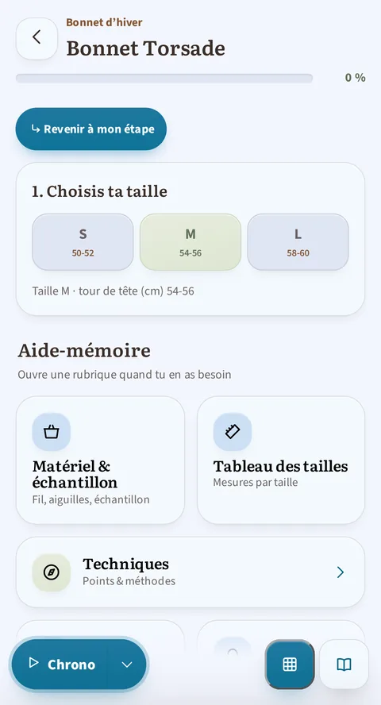

*En haut du lecteur : le sommaire des sections, puis le choix de la taille, à faire une fois pour tout le patron, et l'aide-mémoire (matériel, tableau des tailles, techniques, abréviations) à portée de main.*

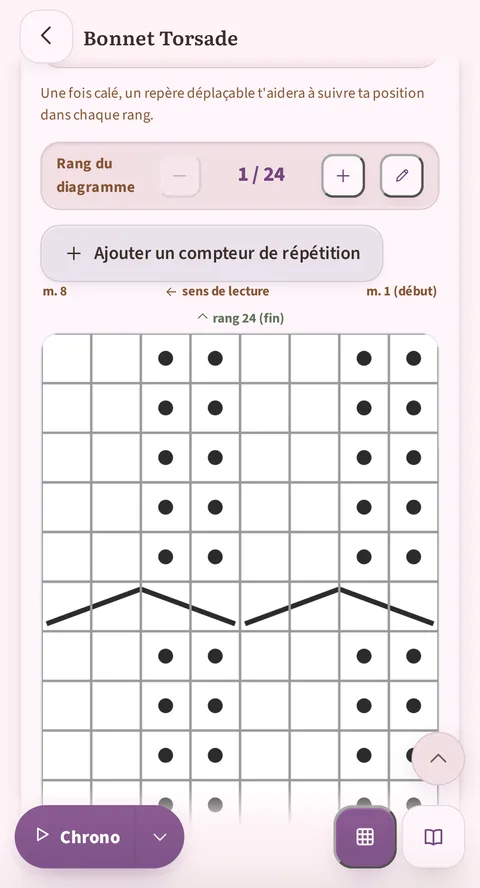

*Plus bas : le diagramme se suit rang par rang, avec son compteur « Rang du diagramme », son sens de lecture, et le chrono en bas d'écran.*

C'est la fonction phare de {app}. Quand un patron a été mis au format
« lecture guidée » (les 3 patrons d'exemple le sont, ainsi que tout patron
importé et vérifié), tu obtiens :

- **Le sélecteur de taille** : tu choisis ta taille une fois, et **tous les
  chiffres du patron se filtrent automatiquement** pour toi (mailles, rangs, longueurs) : chaque ligne affiche les chiffres de ta taille, sans les « 104 (108) 112… » à décoder.
- **Le suivi pas à pas** : chaque étape est cochable, avec une barre de
  progression globale et par section, et des compteurs de répétition intégrés
  (« − 3/12 + ») qui disparaissent tout seuls s'ils ne concernent pas ta taille.
- **Le diagramme interactif** : le diagramme du patron (extrait tel quel du PDF
  d'origine) avec une **bande qui suit le rang en cours**, les rangs déjà faits
  grisés, et un compteur « Rang X sur 52 ». Accessible directement dans la page
  ou via un bouton flottant, et l'état est partagé entre les sections qui
  utilisent le même diagramme.
- **L'aide-mémoire** : les abréviations du patron s'affichent en infobulle dès
  que tu les touches, sans quitter ton rang ; un panneau complet regroupe aussi
  les techniques (avec tutoriels vidéo), le matériel et l'échantillon, le
  tableau des tailles, la liste des abréviations, et les **conseils et astuces**
  donnés par le patron.
- **Le sommaire** : une rangée de puces, une par section, reste visible en haut
  du fil du lecteur. Un appui y amène directement à la section, et la puce de ta section active se marque d'elle-même : tu sais toujours où tu en es. Un
  patron d'une seule section ne l'affiche pas : il n'y aurait rien à résumer.
- Tu peux consulter un patron en lecture (aperçu depuis la bibliothèque) **ou**
  suivre ta progression réelle depuis un projet. Les deux accès existent, et ta progression est toujours sauvegardée.

### Le diagramme en plein écran, et comment bien le « caler »

C'est l'opération la plus technique de l'app, donc voici le détail.

Tape sur un diagramme (ou sur le bouton « agrandir » à côté) pour l'ouvrir en
plein écran : tu peux alors zoomer (pincer à deux doigts, double-tap, ou
boutons +/−) et te déplacer dedans pour lire chaque maille, avec les mêmes
boutons de suivi de rang que dans la page.

Le souci que le calage résout : le PDF d'origine a souvent des marges (texte,
espace blanc) autour du quadrillage du diagramme. Sans réglage, l'app ne sait pas où commence et où finit le quadrillage sur l'image, et la bande qui te montre « tu en es là » risquerait de tomber au mauvais endroit.

*Le mode calage : les deux lignes fléchées à faire glisser sur les bords du quadrillage, la consigne, et les trois boutons Réinitialiser / Annuler / Enregistrer.*

**Comment caler un diagramme, la première fois que tu l'ouvres :**

1. En plein écran, dans la barre du haut, appuie sur l'icône **Caler**
   (deux barres horizontales reliées par une flèche verticale). C'est la première icône après le titre, juste avant les boutons de zoom et de
   fermeture ; ce bouton n'a pas de texte, uniquement ce pictogramme.
2. Deux lignes fléchées apparaissent sur l'image, chacune avec une petite
   étiquette (« Haut du quadrillage » / « Bas du quadrillage »). Fais glisser
   chacune pour l'amener **exactement sur le bord du quadrillage** : la ligne
   « Bas du quadrillage » sur le tout **premier rang** du diagramme, celle
   « Haut du quadrillage » sur le tout **dernier**. (Ni sur le texte ou les marges autour, ni sur le bord de la photo elle-même : sur le quadrillage seul.)
3. Pendant que tu ajustes, une bande de repère reste affichée sur ton rang
   en cours : sers-t'en pour vérifier en direct que ça tombe juste, avant de
   valider.
4. Appuie sur **Enregistrer**. (« Annuler » abandonne le réglage en cours ;
   « Réinitialiser » retire le calage existant et repart de l'image entière.)

Une fois calé, le suivi de rang reste précis pour toute la suite de ton
ouvrage sur ce diagramme, dans **ce projet-là**. À savoir : le calage est mémorisé avec ta progression sur le projet, pas avec le patron lui-même. Si tu commences un deuxième projet à partir du même patron, il te faudra le
refaire une fois pour ce nouveau projet (l'opération ne prend que quelques
secondes).

**Et les diagrammes ronds ou carrés ?** Les grilles granny, rondes ou carrées, ne se calent pas avec deux lignes : le même bouton **Caler** ouvre alors un
**assistant guidé**, car c'est la forme du diagramme (son type, choisi dans la correction, section 4) qui décide. Il te fait placer l'une après l'autre les
deux limites du motif : la première, qui marque le bas du premier rang, puis l'extérieur du dernier rang. Chacune se déclare **Rond** ou **Carré**, se déplace et s'ajuste (boutons **Déplacer** et **Agrandir·Rétrécir**) pendant que le dessin défile et se grossit sous une loupe fixe. Quand les deux limites n'ont pas la
même forme, une étape de plus demande à partir de quel rang le motif change ;
un dernier écran laisse tout retoucher avant d'**Enregistrer**. Le résultat se
mémorise comme le calage linéaire : avec la progression du projet, diagramme
par diagramme. Et tant qu'un diagramme radial n'est pas calé, un bouton dans le fil du lecteur, « Placez le centre et les rayons du motif », te propose de t'y mettre.

*La limite déclarée ronde : la loupe suit la forme choisie, et les boutons Rond et Carré décident de la sienne à chaque étape.*

Une fois **enregistré**, le diagramme granny porte la progression comme les
grilles linéaires : les rangs déjà faits se retrouvent cerclés depuis le
centre, le rang en cours ressort dans un anneau plus épais, et la barre du
bas avance de rang en rang.

*Le résultat une fois calé : la progression se lit directement sur le diagramme, rang après rang.*

**Suivre ta position dans une ligne longue.**

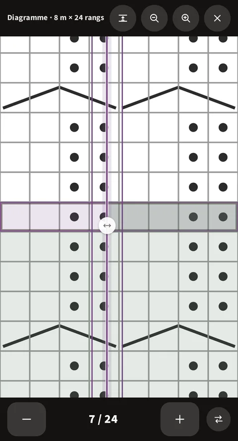

*La manette ronde, posée sur le rang en cours : à sa droite, la partie du rang déjà faite est teintée. Elle n'existe que sur cette ligne-là.*

Sur un diagramme très large, une fois zoomé, il est facile de perdre le fil de la
maille où tu en es. En plein écran, une **petite manette ronde** apparaît sur le rang en cours, et sur lui seul. Fais-la glisser de droite à
gauche (ou l'inverse) au fil de tes mailles : la portion du rang qu'elle laisse
derrière elle se teinte, pour représenter ce que tu as déjà tricoté.

Un bouton à côté du compteur de rang inverse le côté teinté (utile quand le rang
suivant se lit dans l'autre sens). La manette revient d'elle-même à sa place à
chaque nouveau rang, et ta position est gardée même si tu quittes l'app. La
première fois que tu ouvres un diagramme, un petit message te signale son
existence, pour ne pas passer à côté.

### Corriger une ligne sans quitter ton suivi

Tu suis ton patron, et une ligne est fausse : l'import l'a mal découpée, ou tu
veux la reformuler. Tu n'as pas à sortir du projet pour la réparer.

**Appuie sur la carte** qui porte la ligne. Un voile se pose dessus, avec deux
boutons : **Corriger** et **Fermer**. L'écran de correction s'ouvre alors directement **sur cette ligne-là** : tu n'as pas à la chercher dans tout le patron.

Le voile ne gêne pas ton tricot : il se retire tout seul au bout de trois
secondes, et un appui n'importe où ailleurs le fait partir. Appuyer sur une
autre carte l'y déplace. Et aucun appui sur un **contrôle** de la carte ne le
pose : cocher un rang ou toucher une abréviation déclenche l'action attendue.

**Ton chrono ne compte pas le temps de la correction.** S'il tourne quand tu
pars corriger, il se met **en pause**. Au retour, il **repart** tout seul. Le
temps passé dans l'éditeur n'entre pas dans tes statistiques de tricot.

Au retour, le lecteur te ramène sur la section que tu venais de corriger.
La correction se fait dans le même écran que celui décrit à la section 4
ci-dessous, avec tous ses outils.

### Sur tablette

Une tablette tenue à l'horizontale offre bien plus de largeur qu'un téléphone,
et {app} s'en sert à deux endroits : dans le lecteur de patron, et dans
l'écran des statistiques.

**Le lecteur, en deux volets.**

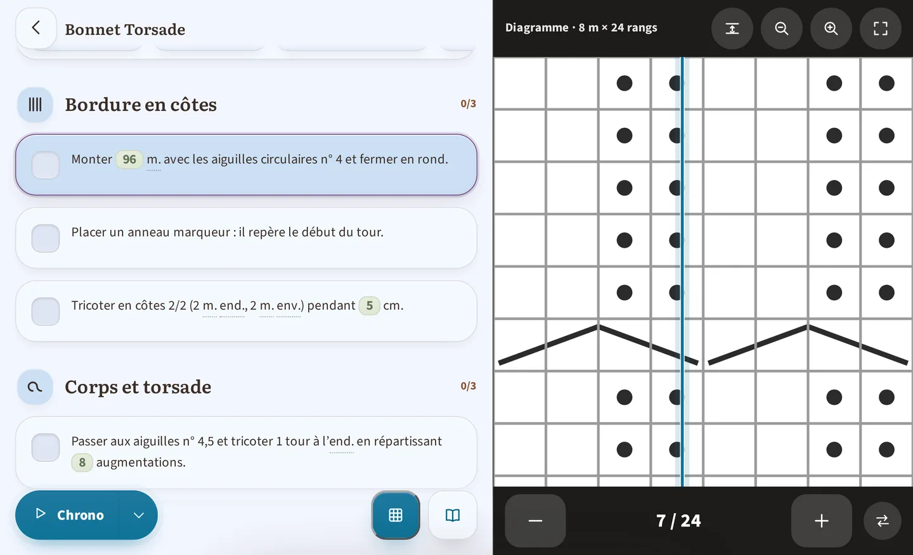

*Sur une tablette tenue à l'horizontale : les instructions à gauche, le diagramme affiché en permanence à droite, sans plus rien faire défiler entre les deux.*

Si tu tricotes sur une tablette tenue à l'horizontale, le lecteur se met tout seul **en deux colonnes**, tes instructions à gauche et un diagramme affiché en permanence à droite : plus besoin de faire défiler entre les deux. Tu gardes
la main dessus :

- Sur n'importe quel autre diagramme du patron, le bouton **Afficher à droite**
  le fait passer dans le volet (pratique quand un patron en contient
  plusieurs).
- Le bouton **Ramener dans le texte** referme le volet et remet le diagramme
  à sa place dans le fil, si tu préfères tout lire dans une seule colonne.
- À l'endroit du texte où se trouvait le diagramme, un renvoi te rappelle qu'il est **affiché à droite** : rien ne disparaît sans le dire.

Ce réglage ne vaut que le temps de ta consultation : en rouvrant le patron,
tu retrouves le volet avec le premier diagramme. Sur téléphone (ou sur une
tablette tenue à la verticale), le lecteur reste en une seule colonne, comme
avant. Un patron sans diagramme n'a pas de volet du tout. Le sommaire du lecteur reste, lui, en haut de la colonne des instructions, mêmes puces, même geste.

**Les statistiques, au large.**

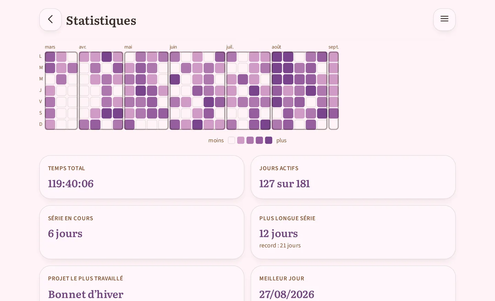

*Les statistiques sur une tablette tenue à l'horizontale, en fenêtre Semestre : la grille calendaire montre d'un coup les six derniers mois, quand un téléphone t'oblige à faire glisser du doigt, et les tuiles chiffrées se rangent deux par deux en dessous.*

L'écran **Statistiques** (point 7) profite lui aussi de la place : sa grille
calendaire et ses tuiles chiffrées s'étalent au lieu de se serrer, et sur les fenêtres les plus longues, Semestre ou Année, tu vois bien plus de semaines avant d'avoir à faire glisser la grille du doigt. Rien de plus à
régler : c'est le même écran, simplement plus à l'aise.

## 4. Ta bibliothèque de patrons

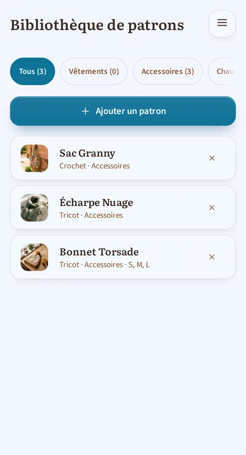

*La bibliothèque, avec les trois patrons de démonstration fournis à la première ouverture.*

*La fiche d'un patron, volontairement épurée : créer un projet, ou prévisualiser. (On accède à la correction de l'import depuis l'aperçu, ou depuis le menu d'un projet en cours qui utilise ce patron.)*

- **Importer un PDF** : dépose le PDF de ton patron, l'app le lit et **reconstruit automatiquement** les tailles, les rangs et les sections, sans connexion internet : rien ne quitte ton appareil. Le
  patron **rejoint ta bibliothèque**, et c'est là que ton travail commence :
  **prévois d'y passer un vrai moment**. Un import ne ressort presque jamais parfait du premier coup. C'est normal : les PDF de patrons sont tous mis en page différemment. Tu relis, tu vérifies et tu corriges **depuis l'aperçu
  de sa fiche**, autant de fois que tu veux, et c'est ce passage-là qui fait
  la différence entre un patron « à peu près » et un projet qui affiche les bons chiffres et les bonnes explications.
  (La lecture reconnaît aussi les grilles rondes et carrées des patrons granny, jamais parfaitement : la relecture reste de mise.)
- **Retrouver un patron** : les pastilles de catégorie en haut de la
  bibliothèque affichent **le nombre de patrons** de chacune, pour savoir d'un
  coup d'œil où chercher.
- **Corriger un patron** : un éditeur en plein écran te permet de retoucher un patron importé (texte, tailles, images). C'est une étape **à prévoir**, pas un rattrapage exceptionnel : la lecture automatique ne comprend jamais
  tout parfaitement, et un patron importé se reprend dans l'app avant d'être
  vraiment agréable à suivre. Tu peux y revenir autant de fois que tu veux, y
  compris longtemps après l'import. C'est l'autre opération technique de l'app, détaillée ci-dessous.
- **Le prix du patron** : la fiche d'un patron porte aussi son **prix**, que
  tu peux renseigner sans attendre d'avoir commencé un projet : dès qu'il est
  là, il s'affiche sur la fiche du patron (« Acheté 18,90 € le 07/08/2026 », ou simplement « Gratuit ») et il compte dans l'écran **Dépenses**.
- **Vue patron** : consultation en lecture simple pour les patrons sans mise en
  forme spéciale, ou les patrons saisis entièrement à la main.
- **3 patrons d'exemple** sont livrés avec l'app dès le premier lancement, pour
  découvrir toutes les fonctions sans rien importer.

### L'éditeur de correction, en détail

C'est l'opération la plus technique de l'app avec le calage des diagrammes
(ci-dessus) : voici comment elle marche vraiment.

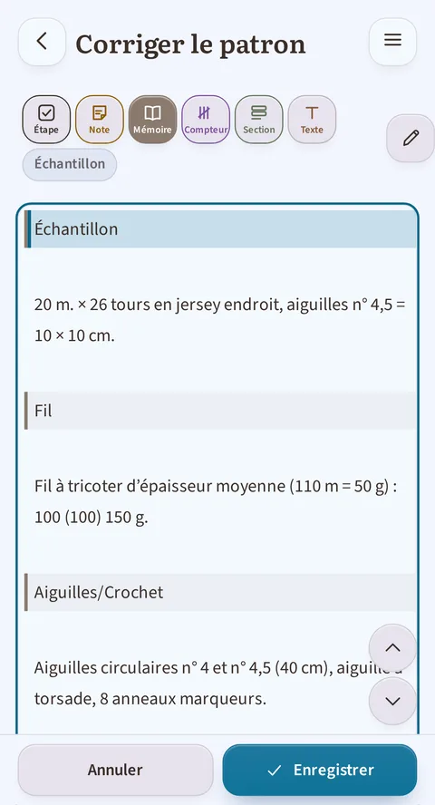

*Le curseur est sur une ligne d'aide-mémoire : le bouton « Aide mémoire… » est rempli, et « Échantillon », sa sous-catégorie, s'affiche en italique juste à côté.*

**Les tailles du patron, en tête d'écran.** Le premier champ de l'écran de
correction s'appelle **Tailles du patron**. C'est lui qui dit à l'app combien de
tailles ton patron propose : écris-les séparées par des virgules, « S, M, L ».
Ce nombre commande la largeur du tableau des tailles. Sans ce champ, un tableau
que l'import a mal découpé restait impossible à réparer.
Une conséquence à connaître : si tu **ajoutes** une taille, l'app ne remplit pas
les comptes de mailles de cette taille-là. Elle ne les invente pas : le patron ne les porte pas. Une ligne à trois tailles que tu passes à quatre s'affiche donc
« 10 (12) 14 () », la parenthèse vide étant la taille qui attend ses chiffres.
À toi de les saisir.

**Le principe.** Ton patron est constitué de lignes de texte, et **chaque
ligne porte une catégorie** qui dit à l'app à quoi elle sert : une case à cocher pendant le tricot, un titre de partie, ou une simple information de référence ? L'import automatique attribue déjà une catégorie à chaque ligne en arrivant. L'éditeur sert à corriger celles qu'il a mal devinées, et à
retoucher le texte si une phrase a été mal coupée.

**Les catégories possibles :**

| Catégorie | Ce que ça donne dans ton projet |
|---|---|
| **Étape** | Une case à cocher pendant le tricot ou le crochet, le cœur du suivi pas à pas. |
| **Compteur** | Une étape répétée, avec son propre compteur. Deux variantes : **Répétition** (refaire la ligne N fois) et **Cadence** (refaire la ligne tous les X rangs, N fois). |
| **Note** | Un texte informatif affiché à cet endroit-là, sans case à cocher. |
| **Section** | Un titre de partie (Devant, Manche, Col…), avec son icône automatique : c'est ce qui découpe ton patron dans l'onglet Sections. |
| **Aide-mémoire** | Une information de la fiche du patron (fil, aiguilles, tailles…), **pas** du suivi pas à pas. Huit sous-catégories : **Fil** (marque, matière, métrage, quantités), **Aiguilles/Crochet** (taille et type), **Échantillon** (la mesure de référence, ex. « 10 × 10 cm = 22 mailles »), **Matériel** (le reste : boutons, marqueurs…), **Conseils** (les recommandations du créateur), **Abréviations** (une par ligne), **Tailles** (le tableau des mesures finales, pas les instructions par taille, qui sont des Sections), **Techniques** (une technique expliquée). Ce sont ces blocs qui remplissent l'aide-mémoire du lecteur interactif (section 3 ci-dessus). |
| **Texte** | Un paragraphe simple, sans rôle particulier, généralement le texte d'introduction ou de conclusion du patron. |
| **Image** | Une photo ou un diagramme. |

**L'aide intégrée.** L'écran de correction contient sa propre aide, repliée en tête
d'écran sous le titre « Comment corriger le patron » : trois étapes, puis les mêmes
informations que le tableau ci-dessus (les catégories, et les huit sous-catégories
d'aide-mémoire). Tu peux la déplier à tout moment sans quitter ton travail, sans avoir à revenir sur ce guide en pleine correction. (Le guide, lui, se lit
*avant* d'ouvrir l'écran, pour savoir si tu veux t'y lancer.)

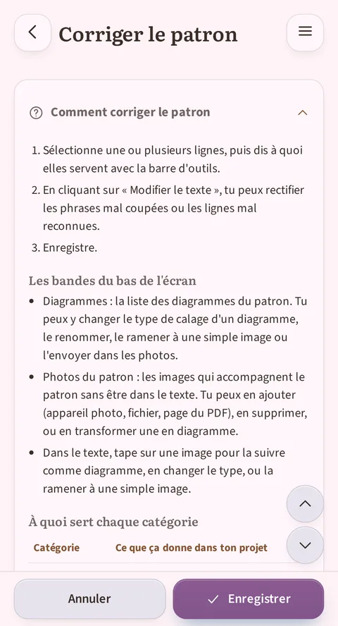

*L'aide « Comment corriger le patron » dépliée : ses 3 étapes, puis le début du tableau « À quoi sert chaque catégorie ».*

**Comment changer la catégorie d'une ligne :**

1. Place ton curseur sur la ligne (ou sélectionne plusieurs lignes à la
   fois). La barre d'outils juste au-dessus de l'éditeur affiche en surbrillance
   la catégorie déjà appliquée. Si c'est un aide-mémoire, sa **sous-catégorie** s'affiche en plus, en italique juste à côté de la barre (« Fil », « Échantillon »…) : c'est ce qui te dit dans quel bloc de la fiche du patron la ligne va atterrir.
2. Trois boutons compacts appliquent directement Étape (une case cochée), Note
   (un feuillet) ou Texte (un « T ») ; chacun affiche un court libellé sous
   l'icône. Trois autres boutons, plus larges, ouvrent un menu de
   sous-catégories, leurs points de suspension le signalent : **Compteur…**,
   **Section…**, **Aide mémoire…**. Appuie sur celui qui correspond à ce que doit
   devenir la ligne.
3. La couleur et le rendu de la ligne changent immédiatement pour confirmer.

**Envoyer du texte dans l'aide-mémoire.** Le menu **Aide mémoire…** ne se contente
pas de marquer la ligne : il **déplace** le texte sélectionné dans la rubrique
choisie, et tu le retrouves dans l'onglet correspondant de l'aide-mémoire du
lecteur. C'est la façon de ranger ce que l'import a laissé en vrac au fil du patron : un glossaire, une liste de matériel, un tableau de mesures.
Le geste ne déplace que cette sélection, jamais les lignes voisines ; et c'est toi qui juges de la rubrique : l'app range où tu lui dis de ranger.

**Catégoriser en plusieurs fois.** Si tu envoies une seconde sélection vers une
rubrique qui existe déjà, elle **s'ajoute** au bloc existant au lieu d'en créer
un second. Un glossaire éparpillé sur trois pages du patron se catégorise donc
en trois passes, sans rien réorganiser à la main.

**Ce que l'app sait découper toute seule.** En arrivant dans la rubrique, le texte
est mis en forme quand sa forme est reconnaissable. « m - maille(s) » devient une
entrée de glossaire, avec son abréviation d'un côté et sa définition de l'autre.
« Tour de poitrine 90 (100) 110 » devient une rangée du tableau des tailles, une
colonne par taille. Quand l'app ne sait pas découper une ligne, elle ne la jette
jamais : elle pose un **gabarit** aux bonnes colonnes, vide, que tu remplis à la
main.

**Deux façons de voir le texte.** Par défaut, l'éditeur affiche une **vue
enrichie** : les images apparaissent en miniature, les compteurs sous forme de pastilles, les rangs avec leur case à cocher : un aperçu proche de ce que tu verras en vrai. Le bouton **Modifier le texte** bascule vers le texte brut (le
balisage devient visible) et ouvre le clavier : utile pour corriger une
formulation, une faute de frappe, ou une phrase que l'import a mal coupée en
deux lignes.

**Réordonner sans couper-coller.** Deux flèches (monter/descendre) déplacent
la ligne où se trouve ton curseur, pratique si l'import a placé une étape ou
un titre de section au mauvais endroit.

**Transformer une photo en diagramme suivi (ou l'inverse).** Deux façons d'y
arriver : appuyer sur une image dans le texte, ou déplier le bandeau
**Diagrammes** en bas de l'éditeur. Ce bandeau liste chaque section du patron qui porte une image, diagrammes déjà suivis comme photos pas encore converties. Le nombre entre parenthèses, par exemple « Diagrammes (2) »,
compte toutes ces sections, photos comprises : il ne dit pas combien de
diagrammes sont déjà suivis. Pour une image pas encore convertie, un bouton **Suivre comme diagramme** ouvre un choix de type, chacun expliqué en clair : rangs standards, radial-carré, radial-rond ou tracé, pour l'adapter à la forme réelle de ton motif (un granny carré ne se lit pas comme des rangs
classiques). Pour une image déjà suivie comme diagramme, une étiquette
**Diagramme interactif** dit l'état actuel, à côté d'un bouton **Changer le
type** (même choix, pour corriger un type mal deviné) et d'un bouton **Juste une image** pour revenir à une simple photo, utile si l'import a raté un diagramme ou si tu veux au contraire qu'une simple photo reste une simple photo.

**Ajouter des images : trois portes.** Dans la galerie d'un patron, depuis sa fiche ou depuis l'éditeur de correction, le bouton **Ajouter une image**
propose trois sources : **Caméra ou galerie** (une feuille te laisse choisir
entre prendre une photo et piocher dans tes images), **Parcourir les fichiers**
(le sélecteur de ton appareil, pour une image rangée ailleurs), et **Depuis le PDF du patron** quand il existe : tu y choisis la page et l'app te la fait recadrer, seule source à passer par ce recadrage. Chaque image
rejoint la galerie du patron, prête à être insérée ou suivie.

**Le menu d'une image.** Dans le texte de l'éditeur, un appui sur une image
ouvre un petit menu immédiat : la **suivre comme diagramme** si elle ne l'est pas encore, ou **changer son type** sinon, la rabaisser au rang de simple illustration (**Juste une image**), ou l'**envoyer vers la galerie** du patron.
Dans la bande « Galerie du patron », chaque image se supprime, s'insère dans le texte ou se suit comme diagramme : les trois gestes au même endroit.

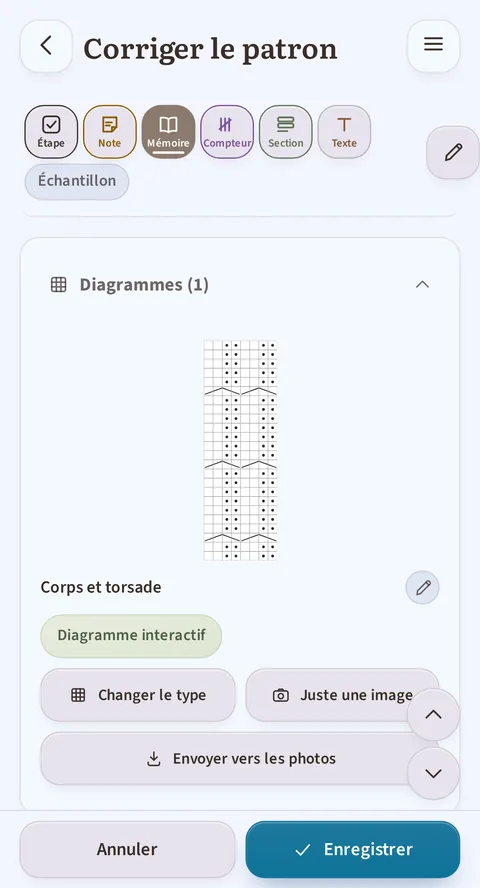

*La bande « Diagrammes (1) » dépliée : la section « Corps et torsade », son état actuel (« Diagramme interactif ») et les boutons « Changer le type » et « Juste une image ».*

**Enregistrer.** Les boutons **Annuler** / **Enregistrer** sont fixés en bas
de l'écran. Si tu essaies de quitter avec des modifications non enregistrées,
l'app t'arrête et te demande confirmation : rien ne se perd par erreur, ici non plus.

## 5. Ton stock de laine

*Le stock : les totaux en tête (pelotes, longueur, poids, valeur), puis une carte par laine avec son état, libre ou réservée par un projet.*

- **Ajouter une pelote** : marque, épaisseur (avec une aide pour comprendre les
  catégories d'épaisseur), composition (choisie dans une liste ; si ta matière
  n'y est pas, « Autre » te laisse la saisir, et elle est ensuite proposée
  comme les autres), couleur (choisie sur une palette, avec un sélecteur de
  teinte personnalisée si besoin), quantité, prix, longueur et poids par
  pelote, plus la date d'achat et le numéro de bain.
  **Dès que tu enregistres, l'app note aussitôt l'achat correspondant** et ton
  budget dépensé (point 1) monte du montant indiqué. La date proposée est celle
  du jour : si tu as acheté cette laine il y a plus longtemps, corrige-la
  directement dans le formulaire. (Ces deux champs n'apparaissent qu'à la
  création. Sur une fiche déjà enregistrée, c'est le bloc **Achats et cadeaux**
  qui prend le relais, avec une ligne par acquisition.)
- **Les laines qui ne sont pas d'une seule couleur** : un champ **Type de
  coloris** (uni, dégradé, auto-rayant, moucheté, teint main) et un champ
  **Description du coloris** (« bleu, vert, jaune moucheté de noir ») complètent la pastille de couleur : une seule teinte ne suffit pas à décrire une laine multicolore. Le type de coloris se retrouve dans la recherche et dans
  l'export tableur.
- **Les caractéristiques de ta laine** : huit étiquettes à cocher, en deux groupes qui
  ne veulent pas dire la même chose. Un **engagement**, c'est ce que tu sais toi-même
  de ta laine ; une **certification**, c'est un label délivré par un organisme
  extérieur.
  - **Engagements** : Vegan · Recyclée · Éthique · Sans mulesing.
  - **Certifications** : Sans substances nocives (OEKO-TEX) · Fibres biologiques
    (GOTS) · Bien-être des moutons (RWS) · Recyclé certifié (GRS).
  - **L'origine se déduit toute seule** de la composition, sans rien cocher : « Fibre
    animale », « Fibre végétale », « Fibre synthétique », « Mélange animal et
    végétal ». Quand l'app ne peut pas conclure pour toutes les fibres saisies, elle le dit (« Origine incomplète ») au lieu de deviner : c'est volontaire.
  - **L'avertissement vegan** : si tu coches Vegan sur une laine qui contient une
    fibre animale, l'app te le signale (« Cette laine contient une fibre animale :
    … Le label vegan paraît contradictoire : vérifie la composition. ») sans
    t'empêcher d'enregistrer : elle te prévient, elle ne décide pas à ta place.
  - **Retrouver tes laines** : ces étiquettes se retrouvent dans le filtre du
    stock (critère « Label ») et dans la recherche par texte.
  - Ces caractéristiques sortent aussi dans l'**export tableur**.

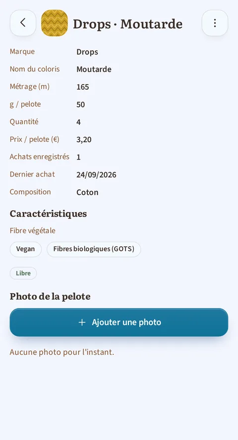

*La fiche d'une laine : sa composition, la mention « Fibre végétale », et ses deux étiquettes « Vegan » et « Fibres biologiques (GOTS) ».*

- **Le récapitulatif** en haut de l'écran : nombre de pelotes, longueur et
  poids cumulés (qui basculent tout seuls en km et en kg quand les totaux
  deviennent importants), et la valeur totale de ton stock.
- **Rechercher, filtrer, trier** : un champ de recherche et les boutons
  **Filtrer** et **Trier** en haut du stock. Filtrer ouvre une fenêtre à deux
  niveaux : la liste de six critères (**Marque**, **Label**, **Épaisseur**, **Poids de pelote**, **Couleur**, **Composition**), puis, pour le critère touché, ses valeurs. Un seul choix par critère, mais les critères se
  cumulent ; une pastille sur le bouton Filtrer compte les filtres actifs, et
  **Réinitialiser** les efface d'un geste. Trier propose **Marque** (le
  défaut), **Épaisseur** ou **Date d'achat**. Rien de tout cela ne se
  mémorise : chaque retour sur le stock repart sans filtre, trié par marque.
  Liste ou grille visuelle, au choix.
- **Modifier, dupliquer ou supprimer** une fiche depuis le menu **Actions**
  (icône verticale à trois points) de sa carte. « Dupliquer » est pratique
  pour la même laine dans un autre coloris :
  tout est repris, tu n'as plus qu'à changer la couleur.
- **Le pool de pelotes** : tu vois d'un coup d'œil, pour chaque laine, combien
  de pelotes sont **réservées** à un projet et combien sont **libres**. Tu ne
  peux pas descendre la quantité en dessous de ce qui est déjà réservé (l'app
  te dit combien de pelotes sont retenues) ; et elle t'avertit si restaurer un projet depuis la corbeille remet en cause tes réserves de laine. Le projet revient quand même, avec une réservation réduite et un message qui te l'explique.
- **Fiche détail** d'une laine : récapitulatif complet (pelotes, mètres,
  projets qui l'utilisent), et un bloc **Achats et cadeaux** qui garde la
  trace de chaque acquisition de cette laine :
  - Chaque ligne porte une quantité, un prix, une date et un bain de
    teinture, et précise si c'était un **achat** ou un **cadeau** (un cadeau
    ne compte jamais dans ton budget dépensé). Les trois lignes les plus
    récentes sont visibles tout de suite, le reste se déplie d'un geste.
  - Tu peux **ajouter, modifier ou supprimer** une ligne à tout moment.
  - **Augmenter la quantité** d'une laine depuis sa fiche te propose
    d'enregistrer l'achat correspondant, daté du jour : tu peux l'accepter,
    le marquer comme cadeau, ou l'ignorer si tu ne veux pas le garder.
    **Diminuer une quantité, en revanche, ne touche jamais à ton budget** : seule une augmentation peut créer un achat.
  - Si le nombre de pelotes de ta fiche ne correspond pas à ce que
    l'historique a enregistré (par exemple après une correction manuelle du
    stock), une alerte te le signale et un bouton **Corriger** te propose les
    deux solutions : ajouter l'achat qui manque, ou ajuster la quantité
    affichée.
  - Un achat garde son libellé même si tu supprimes définitivement la fiche
    de la laine : aucun achat de laine ne disparaît, il reste visible dans
    l'écran **Dépenses**.

### L'écran Dépenses

*Les menus Année et Type en haut, le total avec sa ventilation laine / patrons, puis le détail par mois.*

Accessible en touchant le budget dépensé sur l'accueil (point 1), cet écran récapitule tout ce que tu as payé pour ton tricot, la **laine** comme les **patrons** :
- Le **total dépensé**, par devise si tu en as utilisé plusieurs. Tant que tu
  n'as noté aucun prix de patron, ce total reste exactement celui que tu
  connais ; dès qu'un patron y figure, il se ventile en deux sous-lignes : ce
  qui est parti en laine, ce qui est parti en patrons.
- Deux menus en haut : **Année** n'affiche que l'année choisie (ou « Toutes
  les années »), **Type** n'affiche qu'une catégorie (ou tout). Les totaux se
  recalculent en conséquence. Les achats dont tu n'as pas noté la date se
  retrouvent sous « Date inconnue », qui s'ajoute au menu Année quand il y en a.
- Une **répartition par année puis par mois**, laine et patrons mêlés dans
  l'ordre du calendrier : tu vois d'un coup d'œil ce qu'un mois t'a coûté.
- Dès qu'un patron figure dans la liste, chaque ligne porte en plus son
  étiquette, **Laine** ou **Patron**. Un patron que tu as déclaré gratuit
  apparaît avec la mention **Gratuit** : c'est la trace que tu as vérifié,
  pas un oubli.
- La **liste complète** de tous tes achats et cadeaux, y compris ceux dont la
  fiche de laine a été supprimée depuis (repérables par la mention « Laine
  supprimée »).
- La possibilité de **supprimer** une ligne de laine directement depuis cet
  écran, en te laissant l'**annuler** juste après si c'était une erreur. Une
  ligne de patron, elle, se modifie depuis la fiche du patron : un appui
  dessus t'y emmène.

> **À savoir** : un achat de laine survit à la suppression de sa fiche et reste visible ici. Le prix d'un patron, lui, appartient au patron : si tu
> supprimes le patron, sa dépense s'en va avec lui.

## 6. Outils indépendants

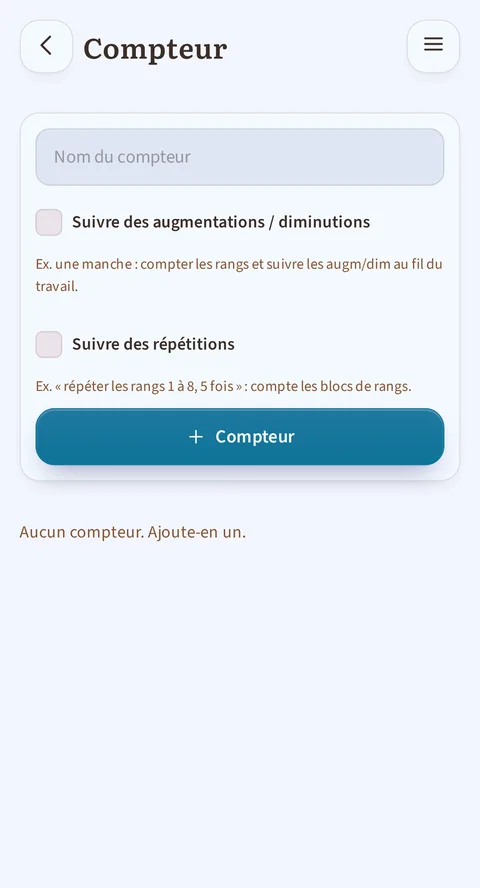

*Le compteur libre, utilisable sans projet : on le nomme, et on choisit s'il suit des augmentations/diminutions ou des répétitions.*

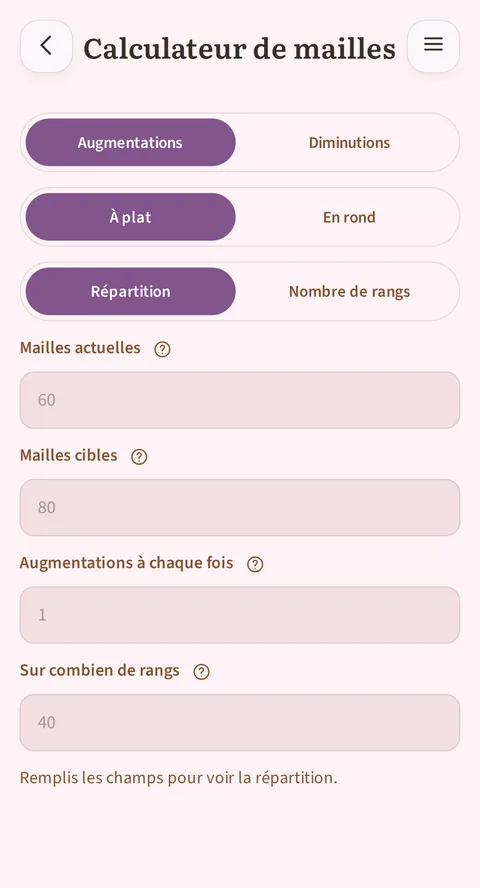

*Le calculateur de mailles : répartir des augmentations ou des diminutions sur un nombre de rangs, ou trouver combien de rangs il faut à une cadence donnée, à plat ou en rond.*

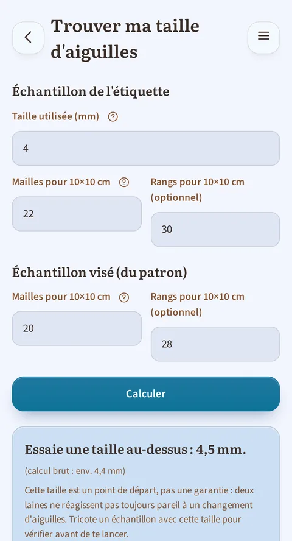

*Trouver ma taille d'aiguilles, champs remplis : ce qui est écrit sur l'étiquette de la pelote, l'échantillon demandé par le patron, puis la réponse de l'app juste en dessous. En crochet, le même écran parle de crochets.*

Ces outils fonctionnent sans être liés à un projet précis, accessibles depuis
l'accueil :
- **Calculateur de mailles** : il répond dans les deux sens. Soit tu lui donnes
  un nombre de rangs et il te dit comment y répartir tes augmentations ou tes
  diminutions ; soit tu lui donnes ta cadence (« tous les 4 rangs ») et il te
  dit combien de rangs il te faut pour atteindre ton nombre de mailles cible,
  et à quel rang tombe le dernier changement. Un champ indique combien de mailles tu ajoutes ou retires à chaque fois : 1 le plus souvent, 2 pour une manche où l'on augmente d'une maille de chaque côté. Quand ta cible n'est pas
  atteignable pile, il te propose les deux possibilités qui l'encadrent plutôt
  que d'arrondir sans le dire. À plat il parle en rangs, en rond en tours.
- **Compteur libre** : un ou plusieurs compteurs indépendants (+/−, objectif à
  atteindre, remise à zéro), pour tout ce qui ne relève pas d'un projet
  enregistré.
- **Trouver ma taille d'aiguilles (ou de crochet)** : tu donnes ce qui est
  écrit sur l'étiquette de ta pelote (taille d'aiguilles conseillée et nombre
  de mailles pour 10 × 10 cm, ou 4 × 4 pouces) puis l'échantillon demandé par
  ton patron, et l'app te dit par quelle taille commencer : une au-dessus, une en dessous, ou la même. Elle te prévient aussi quand l'écart est trop grand
  pour être rattrapé (cette laine n'ira pas avec ce patron), et rappelle
  toujours qu'un échantillon reste à tricoter pour vérifier : c'est un point
  de départ, pas une garantie. Le champ des rangs est facultatif.

## 7. Statistiques

*Le sélecteur du haut choisit une fenêtre d'observation (Mois, Trimestre, Semestre ou Année), et tout l'écran s'y soumet ; ici, la fenêtre Trimestre. L'onglet « Calendrier », affiché ici par défaut, montre la grille et les neuf tuiles chiffrées.*

Le sélecteur en haut de l'écran ne choisit plus une simple durée d'affichage :
il choisit une **fenêtre d'observation** (Mois, Trimestre, Semestre ou Année). Tout ce qui suit s'y soumet, du temps total aux neuf tuiles chiffrées. Juste en dessous, un filtre
**Tout / Tricot / Crochet** restreint l'écran entier à une seule technique ;
il n'est pas mémorisé et repart sur « Tout » chaque fois que tu reviens sur
cet écran, comme le volet du lecteur. Ce filtre ne s'affiche que si tes projets couvrent **les deux techniques** : s'ils sont tous du tricot (ou
tous du crochet), il n'apporterait rien et n'occupe donc pas de place.

Une nuance quand un filtre est actif : la tuile **Moyenne par jour actif**
affiche un tiret. Les jours comptés peuvent inclure des journées où tu as avancé dans l'autre technique (le journal ne retient que la date, pas ce que tu y as fait), et diviser un temps par ces jours-là donnerait un chiffre exact mais trompeur.

Le reste de l'écran se partage en **deux onglets**, qui se changent au
**toucher** (jamais au balayage : la grille elle-même défile horizontalement en Semestre et Année, pour ne pas confondre les deux gestes) :
- **Calendrier** (affiché par défaut, celui de la capture ci-dessus) : la
  grille et les neuf tuiles chiffrées.
- **Rythme** : les barres par période, puis sept barres, une par jour de la semaine, et une phrase qui dit ton jour le plus assidu sur tout ton
  historique.

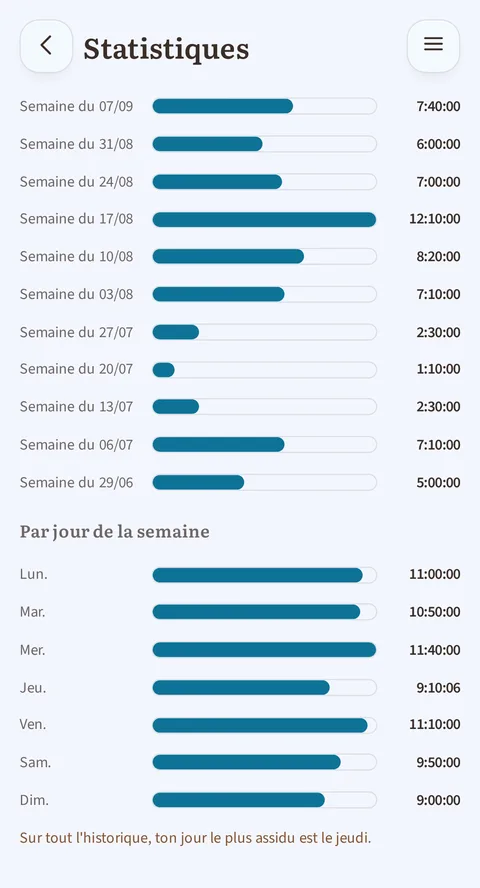

*L'onglet « Rythme » : les barres du temps passé par période, les sept barres par jour de la semaine, et la phrase qui nomme ton jour le plus assidu.*

La **grille** affiche une case par jour, du premier jour de ta semaine (en haut) au dernier (en bas), sur toute la fenêtre choisie ; ce premier jour est lundi par défaut, ou dimanche si tu l'as choisi dans les Réglages (§8). Sa couleur suit la
teinte d'accent choisie dans les réglages (§8), et son intensité dépend du temps tricoté ce jour-là, à cinq niveaux : rien, moins de 30 minutes, de 30 minutes à 1 heure, de 1 à 2 heures, 2 heures et plus. Les seuils sont
**fixes** : une case foncée veut toujours dire la même chose, d'un mois à
l'autre, même un trimestre plus calme que d'habitude. Un trait plus marqué
entoure les colonnes d'un même mois, pour les repérer d'un coup d'œil.

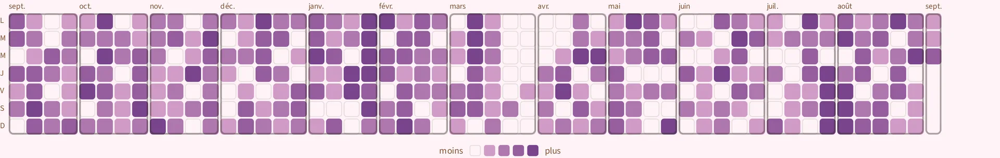

*La grille en fenêtre Année : une année complète d'un seul coup d'œil, une colonne par semaine et une case par jour, avec les cadres qui séparent les mois. Touche l'image pour l'agrandir et la lire en détail.*

Appuyer sur une case la **marque** (elle reste visiblement sélectionnée) et
affiche, sous la grille, sa date, sa durée et, quand plusieurs projets ont avancé ce jour-là, la liste de chacun avec le temps qui lui revient. Un second appui sur la même case l'efface.

Ce que la **série** compte, ce sont les jours où tu as enregistré **au moins une action** : une session chronométrée ou ajoutée à la main, un rang coché, un compteur de projet avancé. Et ouvrir l'application sans rien y faire ne compte pas : il faut une action **enregistrée**.

## 8. Réglages

*Le haut des réglages : prénom, technique par défaut, thème, couleur d'ambiance, premier jour de la semaine, langue, unités et devise. Plus bas se trouvent le dossier de sauvegarde et la corbeille.*

- **Profil** : ton prénom (utilisé pour te saluer sur l'accueil) et ta
  technique par défaut (tricot ou crochet).
- **Apparence** : thème clair, sombre, ou aligné sur celui de ton appareil.
- **Couleur d'ambiance** : dix teintes proposées d'un appui, ou n'importe
  laquelle sur le curseur continu. Tant que tu n'as rien choisi, la couleur **suit ton thème** et change d'elle-même avec le mode clair ou sombre ;
  dès que tu choisis, ton choix prime et reste le même dans les deux modes.
  Cette teinte colore les boutons, les sélections, les barres de progression et
  la grille des statistiques (§7).
- **Premier jour de la semaine** : lundi (par défaut) ou dimanche. Ce choix
  gouverne la grille calendaire et les sept barres par jour de semaine de
  l'écran Statistiques, ainsi que la remise à zéro du total « cette semaine »
  sur l'accueil.
- **Langue** : français, anglais, allemand ou espagnol. Chaque langue est
  écrite dans sa propre langue dans la liste (« Deutsch », « Español »), pour
  que tout le monde retrouve sa langue avec facilité.
- **Unités et devise** :
  - **Métrique** (mètres, grammes) ou **impérial** (yards, onces, livres) ; tout suit : la saisie de tes pelotes, les totaux du stock, l'échantillon
    (10 × 10 cm ou 4 × 4 pouces). Changer de système ne modifie pas tes
    chiffres enregistrés, il les réaffiche dans l'autre unité.
  - **Devise** parmi cinq (€, $, £, CHF, $ CA). Attention, c'est une simple
    étiquette : les prix déjà saisis **ne sont pas convertis** et s'affichent avec l'autre symbole ; l'app te le rappelle avant de valider.
  - Ces deux réglages te sont proposés **dès le premier écran** à l'ouverture
    de l'app, pré-remplis d'après la langue de ton appareil ; tu peux les
    changer à tout moment ici.
- **Données** :
  - Export de ton stock, de tes projets ou de tes patrons en tableur (CSV),
    pour les consulter ou les sauvegarder ailleurs. Les colonnes suivent tes
    réglages : longueurs et poids dans ton système d'unités, prix avec le
    symbole de ta devise.
  - **Corbeille** universelle : tout projet, laine ou patron supprimé s'y
    retrouve et peut être restauré à tout moment (jusqu'à vidage volontaire).
- **Dossier {app}** : tout ce que tu tricotes ou crochètes n'existe que dans cette app, sur ton appareil, nulle part ailleurs. Le dossier de sauvegarde en garde une copie, écrite **en continu** (tu n'as jamais rien à déclencher ni à y penser), pour la retrouver si tu perds ton appareil, s'il casse
  ou si tu réinstalles l'app. Tu le désignes une seule fois, au tout premier
  lancement ; il se change plus tard depuis les Réglages, bouton **Changer de
  dossier**.
  - **Un dossier de sauvegarde ne sert qu'à un seul appareil.** Le poser dans un
    dossier synchronisé pour en avoir une copie ailleurs est une bonne idée ; t'en servir depuis un téléphone **et** une tablette n'en est pas une : chacun effacerait le travail de l'autre. Pour un second appareil, il lui faut son propre
    dossier.
- **Contribuer** : lien vers le code source (l'app est open source), et deux autres
  liens dans le même bloc des réglages :
  - **Soutenir {app}** mène à une page de dons, **libre** : rien n'est déverrouillé
    en échange, aucune fonction n'est réservée à qui donne.
  - **Suggérer une amélioration** t'ouvre un moyen d'envoyer une remarque.

### Ce qui se passe au tout premier lancement

Dans l'ordre, la première fois que tu ouvres {app} : l'écran de bienvenue te
demande ton prénom, ta technique, ta langue, ton thème, tes unités et ta devise ;
puis l'écran du dossier de sauvegarde, décrit juste au-dessus. Ensuite, trois petits messages t'accueillent, **une seule fois chacun** : tu ne les reverras plus.

- Un **mot de bienvenue**, posé au milieu de l'accueil dès que ton dossier de
  sauvegarde est en place : il te dit que tout est prêt et t'invite à ouvrir les
  projets et les patrons d'exemple pour te faire la main. Son bouton le referme,
  et il ne revient pas.
- Un **avertissement sur les patrons importés**, la première fois que tu ouvres
  ta bibliothèque de patrons : il te rappelle que l'app lit ton PDF toute
  seule et qu'elle se trompe parfois (un rang sauté, deux tailles mélangées, un tableau mal découpé), et qu'un patron importé se relit avant d'être suivi.
  Son bouton « C'est compris » le referme ; « Comment corriger » t'ouvre
  la section de ce guide qui parle de ta bibliothèque de patrons.
- Une **astuce de navigation**, la première fois que tu ouvres un projet, que
  tu vas dans la bibliothèque de patrons ou que tu vas dans le stock de laine,
  la première des trois : elle t'explique que tu peux balayer l'écran vers la
  droite pour revenir en arrière, et faire glisser du doigt une bande
  d'onglets ou de catégories trop large pour l'écran. Elle n'apparaît qu'**une
  seule fois en tout**, pas une fois par écran ; le bouton « C'est compris »
  la referme.

## 9. Sous le capot : ce que {app} te garantit

- **Hors ligne par défaut** : aucune de tes données ne quitte ton appareil,
  sauf le dossier de sauvegarde que **tu choisis toi-même**.
- **Pas de compte, pas de paywall** : toutes les fonctions ci-dessus sont
  gratuites, sans fonction cœur verrouillée.
- **Rien ne se perd par erreur** : chaque suppression est annulable dans
  l'instant, et retombe de toute façon dans la corbeille.
- **Pensée pour être lisible par tout le monde** : contrastes suffisants,
  boutons assez grands pour être touchés facilement, compatible avec les
  lecteurs d'écran.
- **À l'aise sur tous les écrans** : sur un petit téléphone, rien ne déborde ni
  ne se coupe ; sur une tablette, l'app profite de la place : tes listes de projets et de patrons s'affichent sur plusieurs colonnes au lieu d'une seule
  longue pile, et le lecteur peut garder le diagramme à côté du texte. L'app
  tient compte des zones réservées de ton écran (barre d'état, encoche, barre
  de navigation) : le contenu ne se glisse plus dessous.
- **Une politique de confidentialité en clair** : depuis l'écran À propos, elle
  dit où vivent tes données, ce qui peut sortir de ton téléphone et dans quels
  cas, ce qu'il advient si tu désinstalles l'app, et qui en répond : le responsable et l'adresse de contact y sont nommés. Elle est écrite dans ta
  langue.
- **En quatre langues** : français, anglais, allemand et espagnol.
